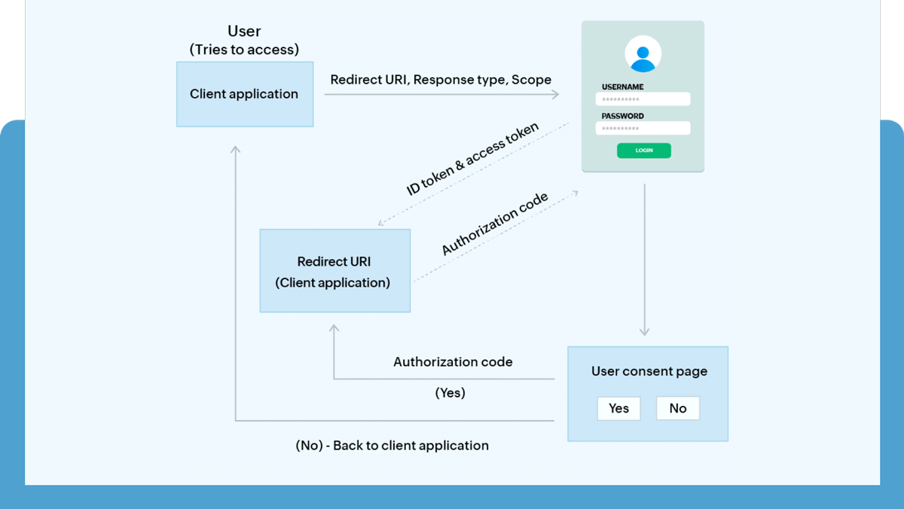

# Introduction

> Keycloak 을 활용한 Client, Resource Server 의 전반적인 작동 원리를 알아본다.
{: .prompt-info }



`application.yml` 설정은 [여기](../2023-07-28/2023-07-28-resourceserver.md)  에서 확인할 수 있다.

## 테스트

> Keycloak 로그인 -> 토큰 발급 -> 서버에 자원 요청
{: .prompt-info }

`Postman` 을 사용해서 로그인 후, 헤더에 access token 값을 넣어서 보내면 된다. 어떤 방식을 사용해도 상관없다. 

현재 OAuth 2.0 강좌를 수강하는 입장에서 배움의 자세로 `RestTemplate` 을 사용해서 HTTP 요청을 보내는 걸 따라해본다.

```java
/**
 * AccessToken 은 Keycloak 로그인 후, Local Storage 에 저장되는 상황이다.
 * 해당 토큰을 사용해서 서버에 요청을 보낸다.
 * /
@GetMapping("/photos")
public List<Photo> photos(AccessToken accessToken) {
    HttpHeaders httpHeaders = new HttpHeaders();
    httpHeaders.add("Authorization", "Bearer " + accessToken.getToken());
    HttpEntity<?> entity = new HttpEntity<>(httpHeaders);

    // 서버 URL
    int resourceServerPort = 8088;
    String url = "http://localhost:" + resourceServerPort + "/photos";

    // port: 8088 인 인가 서버로 요청을 보낸다.
    // .exchange 메서드를 사용해 통신 결과를 ResponseEntity 에 담을 수 있다.
    ResponseEntity<List<Photo>> response = restTemplate.exchange(url, HttpMethod.GET, entity, new ParameterizedTypeReference<>() {
    });

    return response.getBody();
}
```

> 인가 서버를 따로 둔 경우, 인가 서버에 로그인이 되었을 때 어노테이션을 사용해서 access token 을 쉽게 가져올 수 있다. 
{: .prompt-warning }

```java
@GetMapping("/token")
public OAuth2AccessToken token(@RegisteredOAuth2AuthorizedClient("keycloak") OAuth2AuthorizedClient oAuth2AuthorizedClient) {
    return oAuth2AuthorizedClient.getAccessToken();
}
```

GET 요청을 보내는 간단한 스크립트이다. 

```javascript
function photos() {
    fetch("/photos?token=" + localStorage.getItem("access_token"),
        {
            method: "GET",
            headers: {
                "Content-Type": "application/json",
            },
        })
        .then(response => {
            response.json().then(function (data) {
                for (const prop in data) {
                    // 화면에 정보를 뿌려준다.
                }
            })
        })
        .catch((error) => console.log("error:", error));
}
```


## 출처
1. https://www.manageengine.com/products/self-service-password/openid-connect-oidcexplained.html
2. 인프런-정수원 강사님의 OAuth 2.0 강좌