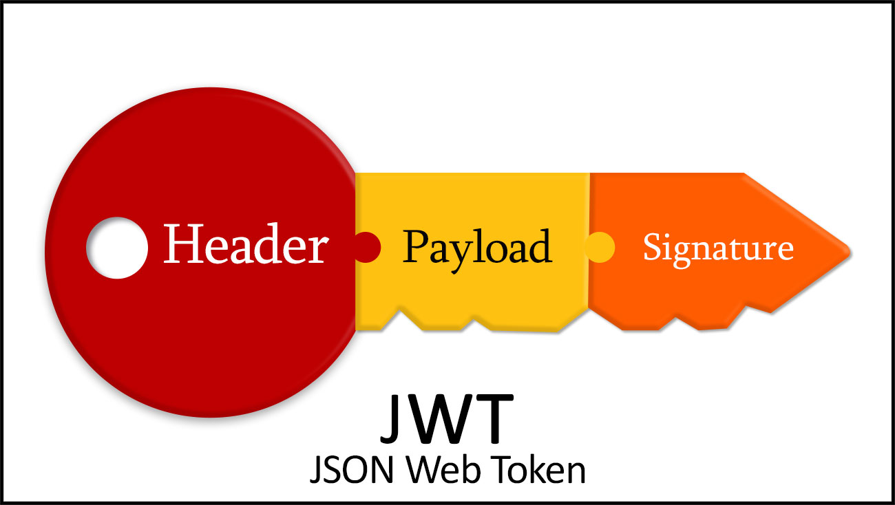
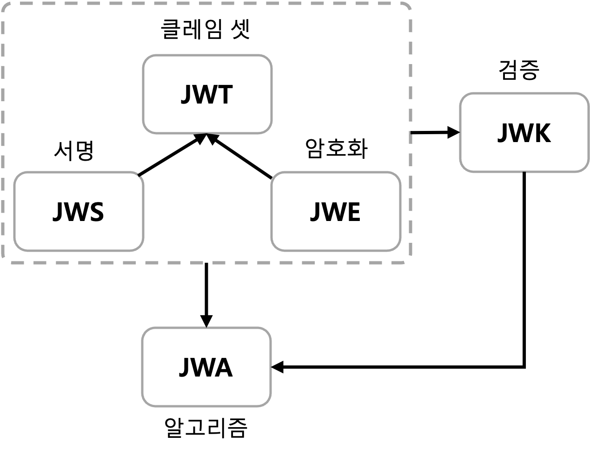
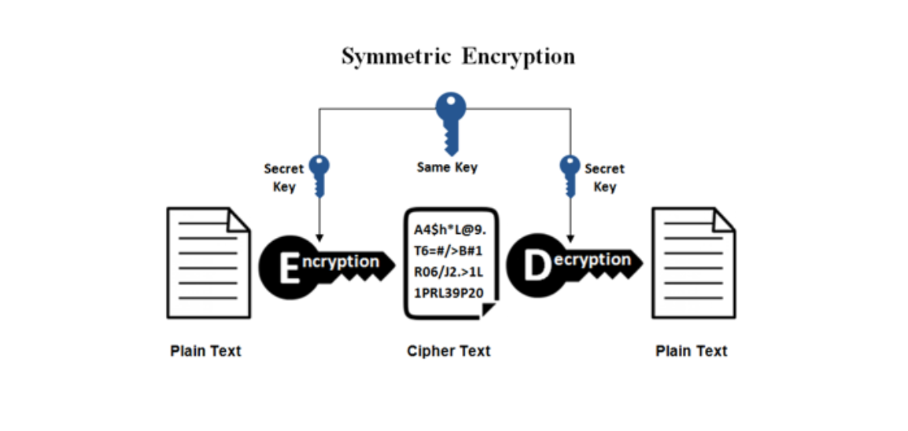
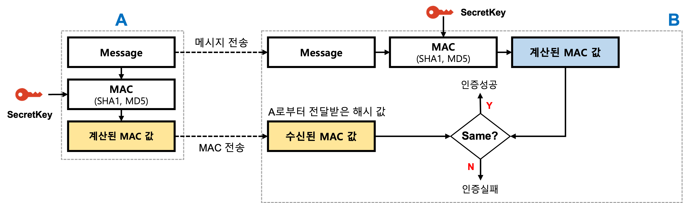
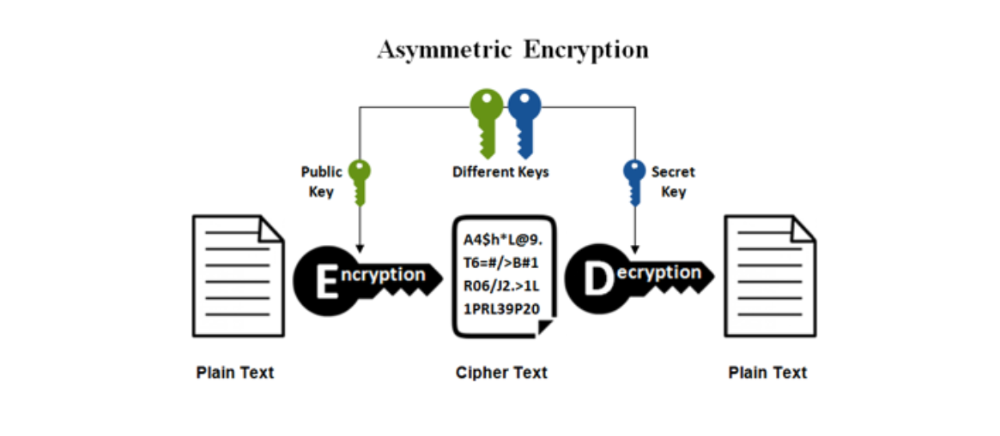
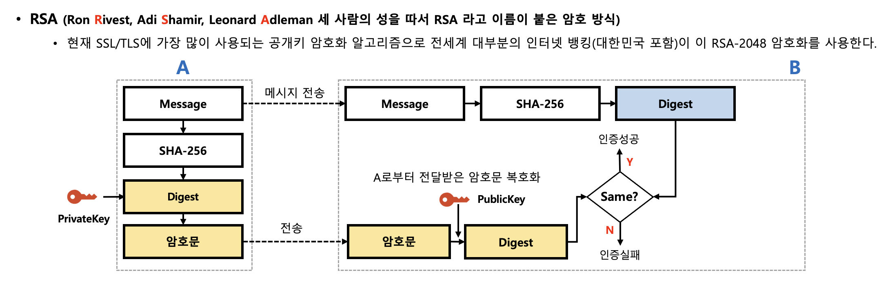
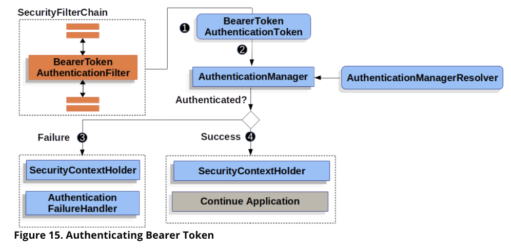

# JWT 의 구조



> jwt 는 일종의 인터페이스이다. signature 가 완료된 것은 jws 이다. <br/>
> [IETF RFC 7519](https://datatracker.ietf.org/doc/html/rfc7519) 에서 매우 자세한 내용을 확인할 수 있다. 
{: .prompt-tip }



면접에서 이 질문을 받았다면 어떻게 대답하는게 좋을까?

> 질문 1 - Session 과 JWT 의 차이점에 대해서 알고 계신대로 설명해주세요. <br/>
> 질문 2 - JWT 를 사용하는 이유가 무엇일까요? 그리고 사용 시 유의해야하는 점도 있을까요? <br/>
> 질문 2 - 소규모 서비스, 대규모 서비스에서 각각 어떤 걸 사용하는게 운영 상 유리할까요?
{: .prompt-warning }

구글에서 검색 시 오래걸리지 않아 찾을 수 있는 정보이다. 여기서는 JWT 암호화 과정에 초점을 맞춘다.


## JWS - 암호화 알고리즘

> 질문 1 - 비대칭키, 대칭키 암호화 방식에 대해서 알고 계신대로 설명해주세요.
{: .prompt-warning }

### 대칭키 

> HS256, HS512
{: .prompt-info }



`SECRET_KEY` 하나로 암호화, 복호화를 하게 된다. 즉, 보낸 사람, 받는 사람이 동일한 키를 남에게 들키지 않고 조심스럽게 주고 받는 상황에서만 안전하다.

당연한 소리지만 클라이언트는 요청을 보내기만 할 뿐, 사용자가 암호화, 복호화 과정을 거칠 순 없다. 따라서 모든 과정을 서버에서 처리해야 한다.

`SECRET_KEY` 가 탈취된다면, 제 3자가 JWT 를 만들어 요청을 보내는 상황에서 서버는 이를 악의적인 공격인지 파악할 수가 없다. 따라서 전자서명에서는 비대칭키(= 공개키) 방식을 채택한다. 여담으로 글을 찾아보니 비대칭키 알고리즘이 사용됨에 따라서 온라인 전자상거래가 가능해졌다고 한다. 불안해하지 않고 내 돈 보낼 수 있게 된 것이다.

아래 예제 코드를 통해 대칭키를 활용하여 JWS 를 생성하는 과정을 살펴보자.

```java
// client, server 가 공유하는 SECRET_KEY 이다.
SecureRandom random = new SecureRandom();
byte[] sharedSecret = new byte[32];
random.nextBytes(sharedSecret);

// 대칭키로 JWT 에 sign 할 객체를 만든다.
// MAC 는 Message Authentication Code 이다.
JWSSigner signer = new MACSigner(sharedSecret);

// Claim 들을 등록해서 JWT 를 생성한다.
JWTClaimsSet claimsSet = new JWTClaimsSet.Builder()
    .subject("alice")
    .issuer("https://c2id.com")
    .expirationTime(new Date(new Date().getTime() + 60 * 1000))
    .build();

// JWS Header 에는 어떤 알고리즘을 사용해서 암호화 할 것인지를 반드시 명시해야한다.
// "alg": "HS256"
// 을 등록하는 과정이다.
SignedJWT signedJWT = new SignedJWT(new JWSHeader(JWSAlgorithm.HS256), claimsSet);

// 만들어진 JWT 에 HMAC SHA-256(HS256) 알고리즘으로 서명을 추가한다.
signedJWT.sign(signer);

// String 타입으로 JWS 를 변경해서 클라이언트에게 전송한다.
// 예시) 
// eyJhbGciOiJIUzI1NiJ9.SGVsbG8sIHdvcmxkIQ.onO9Ihudz3WkiauDO2Uhyuz0Y18UASXlSc1eS0NkWyA
String s = signedJWT.serialize();

// 클라이언트 측에서 검증을 위한 준비를 한다.
signedJWT = SignedJWT.parse(s);

JWSVerifier verifier = new MACVerifier(sharedSecret);

assertTrue(signedJWT.verify(verifier));

// Retrieve / verify the JWT claims according to the app requirements
assertEquals("alice", signedJWT.getJWTClaimsSet().getSubject());
assertEquals("https://c2id.com", signedJWT.getJWTClaimsSet().getIssuer());
assertTrue(new Date().before(signedJWT.getJWTClaimsSet().getExpirationTime()));
```

`MAC` 에 관한 추가 설명 첨부



### 비대칭키

> RS256, RS512
{: .prompt-info }



`PUBLIC_KEY`, `SECRET_KEY` 가 존재한다. 

(절대 노출되면 안되는) `SECRET_KEY` 를 사용해서 서버에서 JWS 를 생성한다. 

그리고 공개된 `PUBLIC_KEY` 를 사용해서 사용자, 제3자 누구든 토큰을 검증할 수 있다. `Micro Services` 구축에 참 유용하게 쓰일 것 같지 않은가?

OAuth 2.0, OpenID Connect Protocol, Keycloak, Okta 등 비대칭키가 사용된다. 중요한 데이터를 주고 받을 때는 비대칭키 방식을 사용하자. 초반에는 대칭키에 비해서 암호화, 복호화 작업에 시간이 걸리는 성능 이슈가 있었지만 최근엔 많이 빨라졌다고 한다.



아래 예제 코드를 통해 비대칭키를 활용하여 JWS 를 생성하는 과정을 살펴보자.

```java
import java.util.Date;

import com.nimbusds.jose.*;
import com.nimbusds.jose.crypto.*;
import com.nimbusds.jose.jwk.*;
import com.nimbusds.jose.jwk.gen.*;
import com.nimbusds.jwt.*;


// RSA signatures require a public and private RSA key pair, the public key 
// must be made known to the JWS recipient in order to verify the signatures
RSAKey rsaJWK = new RSAKeyGenerator(2048)
    .keyID("123")
    .generate();
RSAKey rsaPublicJWK = rsaJWK.toPublicJWK();

// Create RSA-signer with the private key
JWSSigner signer = new RSASSASigner(rsaJWK);

// Prepare JWT with claims set
JWTClaimsSet claimsSet = new JWTClaimsSet.Builder()
    .subject("alice")
    .issuer("https://c2id.com")
    .expirationTime(new Date(new Date().getTime() + 60 * 1000))
    .build();

SignedJWT signedJWT = new SignedJWT(
    new JWSHeader.Builder(JWSAlgorithm.RS256).keyID(rsaJWK.getKeyID()).build(),
    claimsSet);

// Compute the RSA signature
signedJWT.sign(signer);

// To serialize to compact form, produces something like
// eyJhbGciOiJSUzI1NiJ9.SW4gUlNBIHdlIHRydXN0IQ.IRMQENi4nJyp4er2L
// mZq3ivwoAjqa1uUkSBKFIX7ATndFF5ivnt-m8uApHO4kfIFOrW7w2Ezmlg3Qd
// maXlS9DhN0nUk_hGI3amEjkKd0BWYCB8vfUbUv0XGjQip78AI4z1PrFRNidm7
// -jPDm5Iq0SZnjKjCNS5Q15fokXZc8u0A
String s = signedJWT.serialize();

// On the consumer side, parse the JWS and verify its RSA signature
signedJWT = SignedJWT.parse(s);

JWSVerifier verifier = new RSASSAVerifier(rsaPublicJWK);
assertTrue(signedJWT.verify(verifier));

// Retrieve / verify the JWT claims according to the app requirements
assertEquals("alice", signedJWT.getJWTClaimsSet().getSubject());
assertEquals("https://c2id.com", signedJWT.getJWTClaimsSet().getIssuer());
assertTrue(new Date().before(signedJWT.getJWTClaimsSet().getExpirationTime()));
```


## 스프링 시큐리티에서 JWT 인증 방식의 구조

> Filter -> Authentication Manager -> Authentication Provider -> 
> Authentication -> Security Context
{: .prompt-info }



스프링 시큐리티에서 모든 처리는 filter 를 거친다. 인증 및 인가 과정에서 거부당한 요청은 filter 선에서 정리되어 컨트롤러까지 전달되지 않는다. 

`BearerTokenAuthenticationToken` 를 살펴보면, 일단 요청을 `Authentication` 객체로 감싼 다음에 `SecurityContext` 에 저장한다. 

자세한 내용은 아래 코드 블럭을 참고한다.

```java
@Override
	protected void doFilterInternal(HttpServletRequest request, HttpServletResponse response, FilterChain filterChain)
			throws ServletException, IOException {
		String token;
		try {
			token = this.bearerTokenResolver.resolve(request);
		}
		catch (OAuth2AuthenticationException invalid) {
			this.logger.trace("Sending to authentication entry point since failed to resolve bearer token", invalid);
			this.authenticationEntryPoint.commence(request, response, invalid);
			return;
		}
		if (token == null) {
			this.logger.trace("Did not process request since did not find bearer token");
			filterChain.doFilter(request, response);
			return;
		}

		BearerTokenAuthenticationToken authenticationRequest = new BearerTokenAuthenticationToken(token);
		authenticationRequest.setDetails(this.authenticationDetailsSource.buildDetails(request));

		try {
			AuthenticationManager authenticationManager = this.authenticationManagerResolver.resolve(request);
			Authentication authenticationResult = authenticationManager.authenticate(authenticationRequest);
			SecurityContext context = this.securityContextHolderStrategy.createEmptyContext();
			context.setAuthentication(authenticationResult);
			this.securityContextHolderStrategy.setContext(context);
			this.securityContextRepository.saveContext(context, request, response);
			if (this.logger.isDebugEnabled()) {
				this.logger.debug(LogMessage.format("Set SecurityContextHolder to %s", authenticationResult));
			}
			filterChain.doFilter(request, response);
		}
		catch (AuthenticationException failed) {
			this.securityContextHolderStrategy.clearContext();
			this.logger.trace("Failed to process authentication request", failed);
			this.authenticationFailureHandler.onAuthenticationFailure(request, response, failed);
		}
	}
```

해당 객체는 `JwtAuthenticationProvider` 로 전달된다.

관련 코드는 아래 코드 블럭을 참고한다.

```java
@Override
	public Authentication authenticate(Authentication authentication) throws AuthenticationException {
		BearerTokenAuthenticationToken bearer = (BearerTokenAuthenticationToken) authentication;
		Jwt jwt = getJwt(bearer);
		AbstractAuthenticationToken token = this.jwtAuthenticationConverter.convert(jwt);
		if (token.getDetails() == null) {
			token.setDetails(bearer.getDetails());
		}
		this.logger.debug("Authenticated token");
		return token;
	}
```

아직 검증은 시작하지 않았다. 암호화되어 있는 JWT 를 복호화 시켜서 검증해야 한다. 해당 작업은 `JwtDecoder` 에서 진행된다. `Keycloak`, `Okta` 와 같은 인가 서버를 분리했다면 `jwk-set-uri` 에 작성한 주소로 토큰을 전송해서 검증한다.


`JwtDecoders.class` 를 참고한다.

```java
public static <T extends JwtDecoder> T fromIssuerLocation(String issuer) {
    Assert.hasText(issuer, "issuer cannot be empty");
    NimbusJwtDecoder jwtDecoder = NimbusJwtDecoder.withIssuerLocation(issuer).build();
    OAuth2TokenValidator<Jwt> jwtValidator = JwtValidators.createDefaultWithIssuer(issuer);
    jwtDecoder.setJwtValidator(jwtValidator);
    return (T) jwtDecoder;
}

// ...

private static JwtDecoder withProviderConfiguration(Map<String, Object> configuration, String issuer) {
    JwtDecoderProviderConfigurationUtils.validateIssuer(configuration, issuer);
    OAuth2TokenValidator<Jwt> jwtValidator = JwtValidators.createDefaultWithIssuer(issuer);
    String jwkSetUri = configuration.get("jwks_uri").toString();
    NimbusJwtDecoder jwtDecoder = NimbusJwtDecoder.withJwkSetUri(jwkSetUri)
            .jwtProcessorCustomizer(JwtDecoderProviderConfigurationUtils::addJWSAlgorithms).build();
    jwtDecoder.setJwtValidator(jwtValidator);
    return jwtDecoder;
}

```

여기서 눈에 띄는 건 `NimbusJWTDecoder` 이다. [여기](https://github.com/Connect2id/Nimbus-JWT) 에 간단하게 내용이 적혀있다.

- Apache 2.0 이 제공하는 오픈소스 라이브러리로서 JWT 를 생성하거나 검증하는데 사용된다.
- 모든 형태의 JWS 와 JWE 를 지원한다. 
- OAuth 2.0 의 Access Token, OpenID Connect 의 identity token 에 사용된다. 어떻게 사용되는지는 [여기](https://connect2id.com/products/nimbus-jose-jwt/examples) 에서 샘플 코드를 제공한다. 

스프링 부트 서버에서 모든 작업을 다 처리하지 않고, 인가 서버를 분리한다면 다음과 같은 흐름으로 요약된다. 


## 출처
1. https://velog.io/@dae-hwa/JWTJSON-Web-Token-%EC%95%8C%EC%95%84%EB%B3%B4%EA%B8%B0
2. https://connect2id.com/products/nimbus-jose-jwt/algorithm-selection-guide
3. https://velog.io/@curiosity806/JWT-Json-Web-Token
4. https://ssungkang.tistory.com/entry/WEB-Authentication-2-JWT
5. https://velog.io/@gs0351/%EB%8C%80%EC%B9%AD%ED%82%A4-vs-%EA%B3%B5%EA%B0%9C%ED%82%A4%EB%B9%84%EB%8C%80%EC%B9%AD%ED%82%A4
6. https://connect2id.com/products/nimbus-jose-jwt/examples/jwt-with-hmac
7. https://kangwoojin.github.io/programing/spring-security-basic-bearer-token-authentication-filter/
8. 인프런-정수원 강사님의 OAuth 2.0 강의


[OIDC 테스트]()