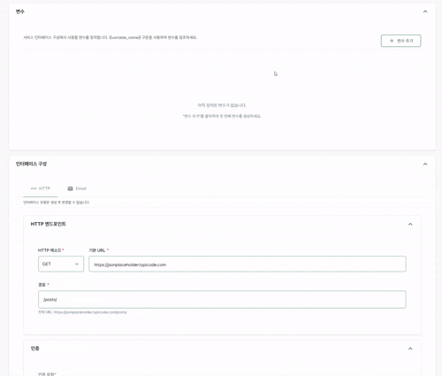

.

# H사 자동화 프로젝트

## 프로젝트 개요

기존에 H사에 납품된 자동화 프로젝트 및 다른 ERP 프로그램을 통합 API 게이트웨이로 관리하기 위한 프로젝트

## 프로젝트 기간

2025.09 - 2025.12

## 역할

- 역할 및 권한 적용
- 다국어 적용
- 공통 코드
- 감사 로그

## 아키텍쳐 정리

[구조를 정리한 링크](https://multi-tenant-presentation.vercel.app)

## 상세 역할

### 변수 태그

note: 변수 참조 동작 구조, context 적용한 방식

### 역할 및 권한 적용

note: 캐시 적용, aop 어노테이션 동작

.png)

.png)

.png)

.png)

.png)

### 다국어 적용

note: 캐시 적용, i18n 을 라이브러리 사용하지 않고 직접 구현한 내용

.png)

%60%20Resolution%20Flow.png)

.png)

.png)

### 공통 코드

note: 캐시 적용

.png)

.png)

### 감사 로그

note: AOP 적용 방식, capture 동작 원리, coroutines 와의 thread 충돌 문제

- 공통 모듈만을 포함한 프로젝트 생성 후 배포
- 

### GitHub Action 통한 배포 

