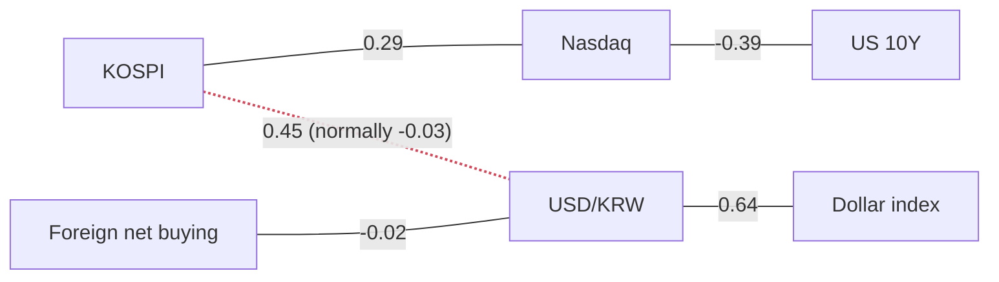

> **이 글의 독자**: 시장 데이터를 처음 읽어보는 개발자·투자자. 용어는 처음 나올 때 설명합니다.
>
> **이 글의 숫자는 어디서 왔나**: 제가 직접 만든 파이썬 파이프라인이 매일 아침 FRED(미국 세인트루이스 연준의 공개 데이터 서버)와 네이버 금융에서 원자료를 받아 계산한 값입니다. **뉴스 기사에 적힌 숫자는 이 글에 단 하나도 들어가지 않습니다.** 기사는 "왜 움직였나"를 설명할 때만 쓰고, "얼마나 움직였나"는 전부 계산된 값입니다. 이 규칙을 사람 눈으로 지키는 건 불가능해서, 글에 등장하는 모든 숫자 토큰이 계산 결과 JSON 안에 실재하는지 기계적으로 대조하는 검사기를 따로 만들어 돌립니다.
>
> **투자 권유가 아닙니다.**

## 오늘 딱 하나만 기억한다면

**코스피와 원/달러 환율이 하루 단위로 같은 방향으로 움직이기 시작했습니다. 원래 그러면 안 되는 조합입니다.**

최근 60거래일로 측정한 코스피와 원/달러 환율의 상관계수는 **+0.45**입니다. 지난 1년 평균은 **−0.03**이었습니다. 부호가 뒤집혔습니다.

교과서가 말하는 정상 상태는 이렇습니다. 한국은 외국인 지분이 큰 소규모 개방 시장입니다. 글로벌 위험 선호가 꺾이면 외국인은 한국 주식을 팔고, **그 대금을 달러로 바꿔서** 나갑니다. 두 다리가 같은 방향으로 밉니다 — 코스피는 내리고 원/달러는 오릅니다. 위험 선호가 돌아오면 반대로 갑니다. 그래서 이 둘은 **음(−)의 상관**이어야 하고, 실제로 파이프라인이 계산한 1년 기준값 −0.03도 (약하지만) 그 부호를 지지합니다.

**여기서 반대로 읽기 쉬운 지점이 하나 있습니다.** 상관계수는 **일간 변화율**끼리 잰 값입니다. "같은 날 같은 방향으로 움직였다"는 뜻이지, "기간 전체로 같이 올랐다"는 뜻이 아닙니다. 실제 원/달러는 20일간 **−3.99%**, 60일간 **−9.13%**입니다. 즉 **원화는 강해졌습니다**. 두 문장은 동시에 참입니다. **한 달 동안 원화는 계속 강해졌고, 그러면서도 코스피가 오른 날에는 원/달러가 같이 오르는 경향을 보였습니다.** 뒤집힌 것은 **하루하루의 연동 방향**이지 원화의 추세가 아닙니다.

이 뒤집힘이 오늘 지도에서 유일하게 빨간 선이 그어진 관계이고, 코스피가 하루에 **+0.23%** 올랐다는 사실보다 훨씬 중요합니다.

## 한국 시장

| | 종가 | 1일 | 20일 | z | 고점 대비 | 기준일 |
|---|---|---|---|---|---|---|
| 코스피 | 6,835.80 | ▲ +0.23% | +9.24% | +0.04 | −25.00% | 2026-09-01 |
| 코스닥 | 821.25 | ▼ −1.56% | +11.38% | −0.74 | −33.02% | 2026-09-01 |
| 원/달러 | 1,379.41 | ▼ −0.13% | −3.99% | −0.24 | −11.35% | 2026-08-28 |
| 코스닥/코스피 비율 | 0.1201 | ▼ −1.79% | +1.96% | −1.10 | −52.75% | 2026-09-01 |

**z가 뭔가요.** z-스코어는 "지금 값이 과거 평균에서 표준편차 몇 개만큼 떨어져 있나"입니다. 0이면 평균, +2면 꽤 이례적으로 높음. 이 글의 z는 **직전 756거래일(약 3년)** 분포를 기준으로 계산합니다. 예외가 하나 있는데, 아래 수급 표의 z는 **직전 252거래일(약 1년)** 기준입니다. 수급은 이미 "하루치 순매수"라는 변화량이라 다른 계열과 같은 방식으로 재지 않습니다.

**원/달러가 내렸다 = 원화가 강해졌다.** 달러 하나를 사는 데 필요한 원화가 줄었다는 뜻입니다. 원화는 20일간 **−3.99%**, 그리고 최근 1년 범위에서 **아래에서 2% 지점**에 있습니다. 1년 저점을 긁고 있는 셈입니다.

> **이 "몇 % 지점"은 백분위가 아닙니다.**
> 파이프라인이 계산하는 `pct_rank`는 **최근 1년 구간의 최저값과 최고값 사이에서 지금 값이 어디쯤인지**를 0~1로 나타낸 값입니다(min-max 위치). "하위 2%에 해당하는 관측치"라는 뜻의 백분위(percentile)가 아니고, 3년도 아닌 **1년** 창입니다. 분포가 한쪽으로 몰려 있으면 두 값은 크게 달라집니다. z-스코어(756일, 분포 기준)와 헷갈리면 안 됩니다.

**아무도 안 보는 숫자는 변동성입니다.** 코스피의 20일 실현 변동성은 **0.454**, 연율로 **45.4%**입니다. 나스닥은 **0.151**, S&P 500은 **0.095**입니다. 코스피는 나스닥의 세 배, S&P의 다섯 배 가까운 속도로 흔들리고 있습니다. z가 +0.04라 "완벽하게 평균"처럼 보이지만, 그건 **지금 위치**가 평균이라는 뜻이지 **가는 길**이 평온하다는 뜻이 아닙니다. 이 속도로 움직이는 시리즈의 z가 0 근처라면, 최근에 양쪽으로 크게 벗어났다가 지나가는 중일 가능성이 높습니다.

### 수급: "다 팔고 있다"고 쓰면 틀립니다

| 코스피 순매수 | 당일 | 5일 | 20일 | z |
|---|---|---|---|---|
| 외국인 | −4,919 | −19,693 | −78,355 | +0.09 |
| 기관 | −6,340 | −16,657 | −37,466 | −0.66 |
| 개인 | −5,398 | −44,245 | −19,567 | −0.37 |

*(네이버가 제공하는 단위, 억 원.)*

세 주체가 전부 순매도입니다. 여기서 **"시장 참여자가 모두 팔고 있다"고 쓰고 싶어지는데, 그건 논리적으로 불가능한 문장입니다.** 주식은 누가 팔면 반드시 누가 삽니다. 매도 총량과 매수 총량은 항상 같습니다.

네이버가 나눠서 보여주는 주체는 외국인·기관·개인 **세 개뿐**입니다. 하지만 실제 수급 통계에는 넷째 주체 **기타법인**이 있고, 이 피드는 그걸 따로 떼어주지 않습니다. 오늘 세 주체의 당일 순매도 합계는 약 **−16,657억 원**인데, 그만큼을 보이지 않는 곳에서 누군가가 받아냈다는 뜻이고, 정황상 그건 기타법인입니다.

**자사주 매입이 가장 유력한 후보입니다.** 자사주 매입은 정의상 "법인이 자기 주식을 사는 것" — 정확히 이 데이터가 분리해주지 않는 그 칸입니다. 그래서 정직한 서술은 이렇습니다: **"외국인이 4,919억 팔았고 법인이 받았다."** "시장이 버려지고 있다"가 아닙니다.

외국인의 20일 누적 **−78,355억**은 절대값으로는 큰 수지만 z가 **+0.09**입니다. 지난 1년 기준으로 보면 이 정도 속도의 외국인 매도는 **평범합니다**. 오히려 이례적인 쪽은 기관의 z **−0.66**입니다.

### 개별 종목

| | 종가 | 1일 | 20일 | 코스피 대비(20일) | z |
|---|---|---|---|---|---|
| 삼성전자 | 261,000 | ▲ +0.38% | +8.98% | −0.27%p | +0.05 |
| SK하이닉스 | 1,693,000 | ▲ +1.14% | +8.04% | −1.20%p | +0.17 |
| 현대차 | 400,500 | ▼ −0.74% | +1.91% | −7.33%p | −0.29 |
| POSCO홀딩스 | 341,000 | ▲ +0.74% | +12.36% | +3.11%p | +0.25 |
| LG화학 | 282,000 | ▲ +0.71% | +14.17% | +4.93%p | +0.24 |

**이번 구간을 끌고 있는 건 반도체가 아닙니다.** 삼성전자와 SK하이닉스 둘 다 20일 수익률이 지수보다 **낮습니다**(하이닉스는 1.20%p 뒤짐). 반대로 LG화학이 +4.93%p, POSCO홀딩스가 +3.11%p 앞섭니다. 오르는 지수 안에서 벌어진 **소재·화학 순환매**이지 칩 랠리가 아닙니다.

가장 뒤처진 건 현대차로 지수 대비 **−7.33%p**입니다. 원화가 20일간 **−3.99%** 강해진 것과 정확히 맞물리는 모양입니다. 현대차는 달러로 벌어서 원화로 실적을 적습니다. 차가 한 대도 덜 팔리지 않아도, 원화가 강해지는 것만으로 원화 환산 이익이 줄어듭니다.

길게 보면 이야기가 또 다릅니다. 연초 대비 SK하이닉스 **+160.06%**, 삼성전자 **+117.68%**, 코스피 **+62.21%**. 그런데 코스닥은 **−11.26%**입니다. 한 나라에 두 개의 시장이 있고, 두 시장의 올해는 정반대입니다.

## 원화로 벌었나, 달러로 벌었나

같은 코스피를 원화로 들고 있던 사람과 달러로 들고 있던 사람의 성적표는 다릅니다. 환율이 사이에 끼기 때문입니다.

두 시리즈(코스피 종가, 원/달러)가 **둘 다 값이 있는 날만 골라** 정렬하면 공통 거래일이 **1,177일**(2026-08-28까지)입니다. 그 공통 20세션 기준으로 코스피는 원화로 **+21.37%**, 달러로 **+25.30%**였습니다. 같은 구간 원/달러는 **3.13%** 하락(원화 강세)했고, 이것이 **+3.24%**의 환율 기여로 복리 계산되어 두 수익률 사이에 **+3.93%p**의 차이를 만듭니다.

> **읽어야 하는 건 "차이"이지 "수준"이 아닙니다.**
> 위 표의 한국 섹션은 코스피 20일 수익률을 **+9.24%**라고 적었는데, 여기서는 **+21.37%**라고 적혀 있습니다. 둘 다 맞습니다. 그리고 그 차이가 이 글에서 제일 실용적인 교훈입니다.
>
> 단독 20일 사다리는 **코스피가 거래한 20일**을 셉니다(8/3 → 9/1). 정렬된 20일 사다리는 **두 시리즈가 모두 값을 가진 20행**을 셉니다. 조인이 "코스피는 열렸지만 FRED가 아직 발표하지 않은 날"을 전부 떨어뜨리기 때문에, 같은 "20일"이 달력상으로는 더 뒤까지 거슬러 올라갑니다(7/30 → 8/28). 시작 가격이 다릅니다.
>
> 그래서 규칙은 이렇습니다. **환율 정렬 블록은 두 통화 수익률의 "차이"를 인용할 때만 쓰고, 어느 한쪽의 "수준"에는 절대 쓰지 않습니다.** +3.93%p 차이는 견고합니다 — 같은 두 시리즈, 같은 날짜니까요. +21.37%라는 수준은 견고하지 않습니다. 공통 구간이 어디서 시작하느냐에 따라 달라지고, 이번엔 유난히 낮은 지점에서 시작했습니다.
>
> 그리고 **단독 코스피 행과 단독 "달러 환산 코스피" 행을 짝지어 비교하는 것은 금지입니다.** 둘은 애초에 날짜 인덱스가 다릅니다. 그렇게 하면 "+9.24% vs +25.30%"가 나오고, 존재하지 않는 16%p짜리 환율 효과를 발명하게 됩니다. 저는 실제로 한 번 그렇게 썼다가 고쳤습니다.

## 미국 시장

| | 값 | 1일 | 20일 | z | 기준일 |
|---|---|---|---|---|---|
| 미국 10년물 | 4.73% | ▲ +6bp | −2bp | +1.09 | 2026-08-28 |
| 미국 2년물 | 4.34% | ▲ +14bp | +6bp | **+2.47** | 2026-08-28 |
| 10년−2년 스프레드 | +0.41%p | ▲ +2bp | −4bp | +0.52 | 2026-08-31 |
| 10년 기대인플레이션 | 2.31% | +0bp | +4bp | 0.00 | 2026-08-31 |
| 10년 실질금리 | 2.42% | ▲ +8bp | −5bp | +1.77 | 2026-08-28 |
| 광의 달러지수 | 118.75 | ▲ +0.33% | −0.80% | +1.10 | 2026-08-28 |
| WTI 유가 | $83.90 | ▼ −2.83% | +3.70% | −1.13 | 2026-08-25 |
| VIX | 14.43 | ▼ −0.55% | −9.76% | −0.10 | 2026-08-28 |
| 하이일드 스프레드 | 2.60%p | ▼ −3bp | −25bp | −0.40 | 2026-08-28 |
| 나스닥 종합 | 26,370.89 | ▼ −0.12% | +1.76% | −0.17 | 2026-08-31 |
| S&P 500 | 7,686.14 | ▼ −0.33% | +1.13% | −0.43 | 2026-08-31 |
| 실효 연방기금금리 | 3.63% | 0bp | 0bp | +0.08 | 2026-08-28 |

> **bp와 %를 섞으면 안 됩니다.**
> 금리와 스프레드는 **%포인트(bp)**로, 가격은 **%**로 적습니다. 1bp = 0.01%p입니다. 그래서 위 표의 **"+6bp"는 6퍼센트가 아니라 0.06%포인트**입니다. 10년물이 4.67%에서 4.73%가 됐다는 뜻이지, 4.73%가 6% 올랐다는 뜻이 아닙니다.
>
> 파이프라인 내부에서도 이 구분은 코드로 강제됩니다. 금리 계열은 `unit: "pp"`로 표시되고 **차분(diff)**으로 계산합니다. 가격 계열은 `unit: "pct"`로 표시되고 **퍼센트 변화율**로 계산합니다. 금리에 퍼센트 변화율을 쓰면 두 가지가 망가집니다. (1) 제로금리 시절 0.5%에서의 6bp는 +12%로 읽히고, 4.3%에서의 똑같은 6bp는 +1.4%로 읽힙니다 — 금리 레짐이 다르면 비교 자체가 불가능해집니다. (2) 10년−2년 스프레드처럼 **0을 넘나드는 계열**은 퍼센트 변화율이 아예 정의되지 않습니다(0으로 나눔). 이건 편의상의 구분이 아니라 계산 정합성 문제입니다.

미국 10년물(4.73%)과 2년물(4.34%) 모두 최근 1년 범위에서 **아래에서부터 97% 지점**, 즉 1년 고점 바로 아래에 있습니다. 다시 말하지만 이건 범위 안의 위치이지 분포상의 백분위가 아닙니다. 2년물의 z **+2.47**은 오늘 데이터 전체에서 어느 방향으로든 가장 늘어나 있는 값입니다.

### 10년물을 둘로 쪼개기

명목 국채 금리는 두 개의 합입니다.

- **기대인플레이션(breakeven)** — 채권시장이 앞으로 10년 평균 물가상승률을 얼마로 보는가. 일반 국채와 물가연동 국채의 손익이 정확히 같아지는(break even) 지점의 인플레이션이라 이 이름입니다.
- **실질금리(real yield)** — 나머지. 물가를 걷어내고 대출자가 요구하는 진짜 돈값입니다.

오늘은 나눗셈이 딱 떨어집니다: **4.73% = 2.42%(실질) + 2.31%(기대인플레)**, 잔차 0. 분해가 신뢰할 만하다는 뜻입니다.

**연초 대비 10년물은 55bp 올랐는데, 그중 49bp가 실질금리입니다. 기대인플레이션은 6bp밖에 안 올랐습니다.**

이 구분이 성장주를 들고 있는 사람에게는 전부입니다. 금리가 **기대인플레 때문에** 오르는 건 주식에 대체로 중립입니다 — 물가가 오르면 명목 이익도 같이 오르니까요. 금리가 **실질금리 때문에** 오르는 건 순수한 할인율 인상이고, 가치가 먼 미래 이익에 몰려 있는 자산의 밸류에이션을 그대로 눌러버립니다. 그게 나스닥입니다. 그리고 제조업 껍데기를 쓴 장기 듀레이션 자산인 한국 반도체이기도 합니다.

20일 그림은 반대 방향으로 좀 순합니다. 분해가 쓰는 **공통 달력** 기준으로 10년물은 20일간 **−2bp**이고, 그 내역은 실질금리 **−5bp**, 기대인플레 **+3bp**입니다. 세 숫자가 정확히 맞아떨어집니다.

이게 왜 중요하냐면, 10년물·실질금리·기대인플레는 **각자 다른 날짜까지 발표되기 때문**입니다. 각 계열의 단독 20일 변화를 따로 가져와서 더하면 합이 맞지 않습니다. 그래서 분해는 세 계열이 **모두 값을 가진 날짜**만 골라 한 번에 계산하고, 그 블록에서 통째로 읽어야 합니다. (위 표의 기대인플레 행에 적힌 **+4bp**는 그 계열 **단독**의 20일 변화로, 8/31까지 자기 달력으로 잰 값입니다. 여기 **+3bp**와의 1bp 차이는 모순이 아니라 달력 차이입니다 — 그리고 딱 이 정도 크기의 오차가 진짜 오류를 가려줍니다.)

최근 압력은 완화됐지만 연간 추세가 뒤집힌 건 아닙니다.

### 신용시장은 걱정하지 않습니다

**하이일드 스프레드(High-yield OAS)**는 투기등급 회사채를 들기 위해 국채 대비 추가로 요구하는 금리입니다. 시장이 매기는 기업 부도 위험의 가격이고, 보통 **주가가 떨어지기 전에 먼저 벌어집니다**. 그래서 볼 가치가 있습니다.

지금 **2.60%p**, 20일간 **−25bp**, 그리고 1년 범위의 **정확히 최저점**(0% 지점)입니다. 신용시장은 기업 스트레스를 사실상 0으로 매기고 있습니다.

> **같은 z라도 무게가 같지 않습니다.**
> 이 글의 모든 z-스코어는 동일하게 **756거래일** 창을 씁니다. 다른 건 그 창 **바깥에** 얼마나 많은 역사가 남아 있느냐입니다.
>
> 하이일드 스프레드는 전체 관측치가 **785개**뿐입니다 — FRED가 라이선스 제한 때문에 롤링 윈도우로만 제공합니다. 즉 756일이라는 비교 기준이 **사실상 이 시리즈의 전부**입니다. 표본 밖 맥락이 거의 없습니다. 그래서 z **−0.40**은 "역사적으로 평범하다"가 아니라 **"내가 볼 수 있는 유일한 역사 안에서 평범하다"**로 읽어야 합니다.
>
> 반면 미국 10년물의 **동일한** 756일 창은 **16,150개** 관측치 중 한 조각입니다. 페이지 위에서 두 z는 똑같이 생겼지만, 실을 수 있는 무게는 다릅니다. 계산 결과에 `n_obs`를 항상 같이 실어두는 이유입니다.

### 홈 바이어스의 대가는 지불받고 있나

20일 기준 나스닥 **+1.76%**(8/31까지), 코스피 **+9.24%**(9/1까지 — 한 세션 더 많아 완전히 정렬된 비교는 아닙니다). 한국의 압승입니다. 다만 앞에서 본 대로 **세 배 가까운 변동성**을 지불하고 얻은 승리입니다. 나스닥은 같은 20일 동안 S&P를 **+0.64%p** 앞섰는데, 이건 늘 보던 듀레이션 정렬이고 특별할 게 없습니다.

고점 대비 낙폭이 나머지 절반을 말해줍니다. 나스닥 **−2.67%**, S&P **−1.45%** — 사실상 신고가 근처입니다. 코스피 **−25.00%**, 코스닥 **−33.02%** — 자기 고점에서 아주 멀리 있습니다.

## 오늘 실제로 연결되어 있는 것들

상관관계는 직전 구간에 대해 측정한 값이며 인과 주장이 아닙니다. 빨간 점선은 1년 기준값에서 관계가 깨졌다는 표시입니다.

**선에 화살표가 없는 건 의도한 것입니다.** 상관관계에는 방향이 없습니다. 두 값이 같이 움직였다는 말일 뿐, 어느 쪽이 먼저 움직였는지는 말해주지 않습니다. 화살표를 그리면 이 데이터가 지지하지 않는 인과를 주장하게 되고, 처음 보는 사람은 그 화살표를 믿어버립니다.

### 깨진 연결: 코스피 ↔ 원/달러

측정값 **+0.45**, 1년 기준값 **−0.03**, 임계값 0.35를 넘겼고 부호까지 뒤집혔습니다.

**분명히 말하면**: 오늘 데이터에서 코스피와 원/달러는 **하루 단위로 같은 방향으로** 움직였습니다. 원래는 반대로 움직여야 하는 조합입니다. 그리고 이건 **기간 전체로는 원화가 강해지는 동안** 벌어진 일입니다 — 원/달러 20일 **−3.99%**, 60일 **−9.13%**. 서로 다른 두 문장이고 둘 다 맞습니다. 부호가 뒤집힌 것은 하루하루의 연동이지 원화의 추세가 아닙니다. **"코스피가 오르면서 원화가 약해졌다"로 뭉뚱그리면 사다리가 말하는 것과 정반대가 됩니다.** 표준적인 위험선호/위험회피 스토리는 지금의 한국을 설명하지 못합니다.

**가장 그럴듯한 설명, 단 사실이 아니라 가설로**: 원화를 움직이는 주된 힘이 더 이상 위험 심리가 아닐 수 있습니다. 한국의 수출이 충분히 강하게 돌아가면, 수출업체가 달러를 원화로 바꾸는 흐름 자체가 **기계적이고 연속적인 원화 수요**가 됩니다. 누가 오늘 위험을 좋아하든 말든 상관없이 발생하는 수요입니다. 여기에 주식 관련 달러 유입이 얹히면, 환율은 글로벌 공포가 아니라 무역·자본 흐름에 반응하기 시작합니다.

이게 맞다면 상관관계는 **좋은 이유로** 깨진 것이고, 수출 호조가 이어지는 동안 계속 깨져 있을 것입니다. 다만 저는 이걸 계산 결과로 증명할 수 없습니다. 가설로만 들고 있어야 합니다.

적어도 모순되지는 않는 정황: **외국인 수급 ↔ 원/달러** 연결이 **−0.02**로, 1년 기준값 **−0.23**에서 거의 사라졌습니다. 외국인의 주식 매도가 환율을 움직이는 힘을 잃었다는 뜻이고, 무역 흐름이 주도권을 가져갔다면 정확히 그렇게 보일 것입니다.

### 잘 유지되고 있는 연결

- **원/달러 ↔ 달러지수: +0.64 (기준값 +0.63)** — 교과서대로 양의 상관. 달러가 세계적으로 강해지면 원화에 대해서도 강해집니다.
- **나스닥 ↔ 미국 10년물: −0.39 (기준값 −0.13)** — 교과서대로 음의 상관이고, 평소보다 **더 강합니다**. 금리가 오르면 나스닥이 내린다 — 위 금리 분해 섹션에서 본 할인율 메커니즘이 상관계수로 그대로 보입니다. 시장이 연준에 집중하고 있다는 신호로 읽힙니다.
- **코스피 ↔ 나스닥: +0.29 (기준값 +0.13)** — 예상대로 양의 상관이고 평소보다 촘촘합니다. 한국이 미국 기술주를 평소보다 바짝 따라가고 있습니다.

## 사이클 어디쯤인가

- **완화 사이클이 아니고, 시장도 더 이상 그런 척하지 않습니다.** 실효 연방기금금리는 **3.63%**에서 20일째 그대로지만, 기대는 2년물에 실려 있고 그 z가 **+2.47**입니다. 직전 756일 분포 기준으로 2.5 표준편차에 살짝 못 미치는 위치입니다.
- **6~24개월 포지션의 위험은 인플레 위험이 아니라 실질금리 위험입니다.** 위의 49bp/6bp 분해, 그리고 기대인플레의 z가 **0.00**이라는 사실이 그렇게 말합니다. 장기 듀레이션 주식은 아직 여기에 다 반영되지 않았습니다.
- **싼 게 없습니다.** S&P는 고점 대비 **−1.45%**, 나스닥 **−2.67%**, VIX는 1년 범위의 아래에서 5% 지점, 하이일드 스프레드는 1년 **최저점**. 안일함의 극단에 있을 수 있는 지표는 전부 극단에 있습니다.
- **한국만 예외인데, 그게 답이 아니라 질문입니다.** 고점 대비 **−25.00%**인데 연초 대비 **+62.21%**이고 실현 변동성이 45.4%인 시장은, 올해 이미 격렬한 왕복을 한 번 한 시장입니다. **떨어진 뒤라서 싼 것과 실제로 싼 것은 다릅니다.**
- **지금 제가 실제로 하는 것: 기다립니다. 그것도 의도적으로.** FOMC가 **9월 17일 03:00 KST**에 있습니다. 표에서 가장 큰 불확실성 하나를 정리해주는 이벤트가 2주 앞입니다. 지금 장기 듀레이션 포지션을 새로 잡는다는 건, 그냥 보고 나서 결정해도 되는 금리 결정을 안 보고 오늘의 안일함 프리미엄까지 얹어서 사겠다는 뜻입니다. **기다리는 것도 포지션입니다.** z=+2.47짜리 단기물을 앞에 두고 2주짜리 이항 이벤트를 현금으로 통과하는 건, 견해의 부재가 아니라 견해의 한 표현입니다.
- **생각을 바꾸게 만들 사건**: 분해가 깨지는 것 — 실질금리가 아니라 **기대인플레이션이 튀는** 경우. 그건 다른 문제이고 다른 대응이 필요합니다.

## 오늘의 용어: 상관계수

**상관계수(correlation)**는 두 값이 얼마나 같이 움직이는지를 −1과 +1 사이 숫자로 나타낸 것입니다. +1은 완벽하게 같이, −1은 완벽하게 반대로, 0은 관계 없음.

오늘 이 글의 헤드라인이 가격 변동이 아니라 **상관계수의 부호가 바뀐 것**이라는 점이 중요합니다. 상관계수는 시장이 **"무엇이 자기를 움직이는가"에 대한 생각을 바꿨다**는 사실을, 화면에 뜨는 어떤 가격에도 아직 드러나지 않은 시점에 알아채게 해주는 도구입니다.

동시에 금융에서 가장 과신되는 숫자이기도 합니다. 초심자가 자주 틀리는 지점 네 가지:

1. **인과가 아닙니다.** 같이 움직였다는 것뿐입니다. 세 번째 요인이 둘 다 밀고 있을 수 있습니다.
2. **선형 관계만 봅니다.** 뚜렷한 곡선 관계도 상관계수는 0으로 계산합니다.
3. **가장 믿고 싶은 순간에 가장 불안정합니다.** 위기가 오면 분산투자로 묶어놨던 자산들의 상관이 일제히 +1로 수렴합니다.
4. **창 길이에 따라 완전히 달라집니다.** 오늘의 +0.45는 60일 창의 값이고, 같은 데이터의 1년 기준값은 −0.03입니다. 창을 밝히지 않은 상관계수는 정보가 아닙니다.

## 데이터가 늦는 것은 고장이 아닙니다

이 글의 표에는 기준일이 제각각 붙어 있습니다. 원/달러, 미국 10년물·2년물, 실질금리, 달러지수, VIX, 하이일드 스프레드, 실효 연방기금금리가 **2026-08-28** 기준이고, WTI는 **2026-08-25** 기준입니다. 10년−2년 스프레드와 기대인플레이션만 **2026-08-31**까지 나왔습니다.

**FRED는 시리즈마다 다른 속도로 발표합니다.** 그래서 지연 목록이 길게 나오는 건 정상 동작이지 파이프라인이 깨진 게 아닙니다. 다만 침묵하면 안 됩니다. 그래서 파이프라인은 지연된 시리즈를 전부 이름으로 나열하고, 표의 모든 행에 자기 기준일을 붙입니다.

이게 왜 중요한지 오늘 실례가 있습니다. 8월 31일에 지정학적 긴장으로 유가가 올랐는데, **이 글의 WTI 숫자는 그걸 반영하지 않습니다.** 8월 25일까지만 발표됐기 때문입니다. z **−1.13**을 보고 "유가가 싸고 조용하다"로 읽으면 안 됩니다. **"엿새 전에는 싸고 조용했다"**가 정확한 독해입니다. 지연된 시리즈를 조용히 출력하는 대신 이름을 부르는 이유가 이겁니다.

그리고 어제 제가 스스로 던졌던 질문 하나 — "달러지수가 98.55냐 99.65냐"는 오늘 **질문 자체가 해소됐습니다.** 이 파이프라인은 언론이 인용한 달러 수치를 아예 쓰지 않습니다. FRED의 **DTWEXBGS**(연준 광의 무역가중 달러지수)를 추적하고, 그 값은 **118.75**(2026-08-28 기준)입니다. 애초에 다른 바스켓의 다른 지수라서, 두 언론 숫자 중 무엇도 서로 맞춰질 수 없었습니다. 여기 적힌 98.55와 99.65는 **폐기하기 위해 적은 숫자**이고, 이 글에서 계산에 쓰이지 않은 유일한 숫자들입니다.

## 내일 확인할 것

1. 코스피 ↔ 원/달러 상관이 **+0.35 임계값 위에 머물렀는가**, 아니면 −0.03 기준값 쪽으로 돌아갔는가. 하루면 노이즈, 일주일이면 레짐입니다.
2. 미국 2년물이 8/28 이후 발표되면 **4.34% 위를 지켰는가**, 아니면 +14bp가 되돌려졌는가. 8/31의 10년−2년 스프레드 확대는 되돌림 쪽 힌트입니다.
3. 코스닥의 **−1.56%**와 코스닥/코스피 비율의 z **−1.10**이 계속 악화됐는가. 대형주만 오르면서 비율이 계속 내려간다면, 코스피의 **+9.24%**는 몇몇 수출주 이야기이지 한국 시장의 회복이 아닙니다.

## 출처

**숫자** — 전부 자체 파이썬 파이프라인이 계산해 JSON으로 저장한 값입니다.

| 항목 | 원자료 |
|---|---|
| 코스피, 코스닥, 개별 종목, 투자자 수급 | 네이버 금융 |
| 원/달러 | FRED `DEXKOUS` |
| 달러 환산 코스피 | 네이버 / FRED, 계산값 |
| 미국 10년·2년물, 10년−2년, 기대인플레, 실질금리 | FRED `DGS10`, `DGS2`, `T10Y2Y`, `T10YIE`, `DFII10` |
| 광의 달러지수 | FRED `DTWEXBGS` |
| WTI, VIX, 하이일드 스프레드 | FRED `DCOILWTICO`, `VIXCLS`, `BAMLH0A0HYM2` |
| 나스닥, S&P 500, 실효 연방기금금리 | FRED `NASDAQCOM`, `SP500`, `DFF` |

**서술 참고용 — 이 글의 어떤 숫자도 아래에서 오지 않았습니다.** 한국 8월 수출 실적 발표(9/1), 삼성전자·SK하이닉스 자사주 매입 발표(8/31), 잭슨홀 발언 이후 미국 단기금리 재평가(8/28 이후), 8/31 지정학 긴장에 따른 유가 상승 — 각각 Korea Times, CNBC, Bloomberg, Yahoo Finance, Korea Herald 보도.

> **주의**
> 모든 수치는 FRED와 네이버 금융 원자료로부터 이 파이프라인이 직접 계산한 값입니다. 언론 보도는 서술에만 쓰였고 숫자로는 쓰이지 않았습니다. 여러 시리즈가 설계상 지연되어 있습니다(위 섹션 참고). 투자 권유가 아니며, 실행 전에 모든 수치를 다시 확인하시기 바랍니다.
