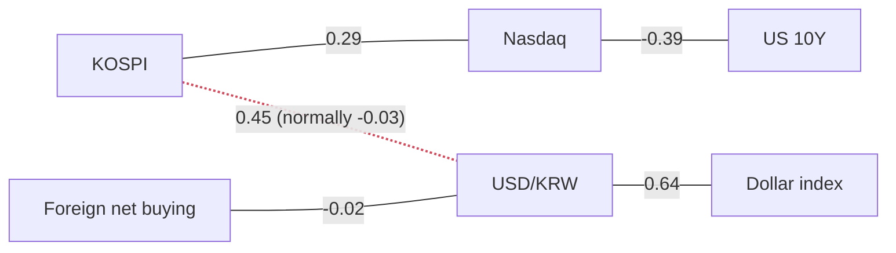

> **이 글의 독자**: 시장 데이터를 처음 읽어보는 개발자·투자자. 용어는 처음 나올 때 설명합니다.
>
> **이 글의 숫자는 어디서 왔나**: 제가 만든 파이썬 파이프라인이 FRED(미국 세인트루이스 연준의 공개 데이터 서버)와 네이버 금융에서 원자료를 받아 계산한 값입니다. **뉴스 기사에 적힌 숫자는 이 글에 단 하나도 들어가지 않습니다.** 기사는 "왜 움직였나"에만 쓰고, "얼마나 움직였나"는 전부 계산된 값입니다. 글에 등장하는 모든 숫자를 계산 결과 JSON과 기계적으로 대조하는 검사기도 따로 돌립니다.
>
> **투자 권유가 아닙니다.**

## 오늘 딱 하나만 기억한다면

**어제 글이 "이것만 바뀌면 내 생각을 바꾼다"고 스스로 적어둔 조건이, 하루 만에 충족됐습니다.**

어제 글은 6~24개월 관점의 위험이 *실질금리* 위험이지 인플레이션 위험이 아니라고 판단하면서, 마지막에 이렇게 적었습니다 — *"내 생각을 바꿀 수 있는 건 분해가 깨지는 것, 즉 실질금리가 아니라 기대인플레이션이 튀는 경우다."*

9월 1일 미국 10년 기대인플레이션이 **+4bp** 올라 **2.35%**가 됐고, z는 **+1.74** — 오늘 미국·한국 데이터 전체에서 가장 늘어난 값입니다. 그리고 최근 20거래일 기준으로 10년물의 **+5bp** 상승이 **기대인플레이션 +4bp + 실질금리 +1bp**로 쪼개집니다. 어제 같은 창에서는 **실질 −5bp / 기대 +3bp**였습니다. 구성이 뒤집혔습니다.

그 다음 장에서 코스피는 **−3.99%** 떨어졌습니다.

## 한국 시장

| | 종가 | 1일 | 20일 | z | 고점 대비 | 기준일 |
|---|---|---|---|---|---|---|
| 코스피 | 6,562.72 | ▼ −3.99% | +3.20% | **−1.91** | −28.00% | 2026-09-02 |
| 코스닥 | 803.98 | ▼ −2.10% | +2.98% | −0.99 | −34.43% | 2026-09-02 |
| 원/달러 | 1,379.41 | ▼ −0.13% | −3.99% | −0.24 | −11.35% | 2026-08-28 |
| 코스닥/코스피 비율 | 0.1225 | ▲ +1.97% | −0.22% | **+1.40** | −51.82% | 2026-09-02 |

**z가 뭔가요.** z-스코어는 "오늘의 하루 변동이 과거 분포에서 표준편차 몇 개만큼 벗어났나"입니다. 0이면 평균적인 날, ±2면 상당히 이례적인 날. 이 글의 z는 (수급 z 하나만 빼고) 전부 **직전 756거래일(약 3년)** 분포 기준이고, 오늘 자신은 분포에서 제외합니다 — 하루의 폭락이 자기가 비교될 표준편차를 스스로 부풀리지 못하게 하려고요.

**z −1.91은 헤드라인이 아니라 실제로 큰 날입니다.** 최근 3년 코스피 일간 변동 중 약 97%보다 큰 하락이었다는 뜻입니다. 지수는 **273포인트**를 반납했고, 20일 수익률은 어제 **+9.24%**에서 **+3.20%**로 내려앉았습니다. 한 장에 한 달치 상승분의 2/3가 사라졌습니다. 연초 대비로는 여전히 **+55.73%**입니다(어제 +62.21%).

20일 실현 변동성은 **0.479**, 연율 **47.9%**입니다. 나스닥은 **0.124**, S&P 500은 **0.074**. 코스피는 나스닥의 약 **4배**, S&P의 약 **6배** 속도로 흔들리고 있습니다. 지수 위치 자체는 1년 범위에서 **아래에서부터 57% 지점** — 평범합니다. 평범하지 않은 건 거기까지 온 경로입니다.

### 수급: "다 팔았다"고 쓰면 틀립니다

| 코스피 순매수 (억 원) | 당일 | 5일 | 20일 | z (최근 1년 기준) |
|---|---|---|---|---|
| 외국인 | −19,095 | −37,689 | −93,783 | −0.62 |
| 기관 | **−20,439** | −44,657 | −52,466 | **−1.77** |
| 개인 | **+23,029** | +1,241 | −4,729 | +0.80 |

**오늘은 이 이야기의 가장 깨끗한 판본입니다.** 외국인과 기관이 합쳐 **−39,534억** 팔았고, 개인이 **+23,029억** 받았습니다. 기관 z **−1.77**은 오늘 지표 전체에서 절댓값 두 번째로 큰 값입니다 — 최근 1년 기준으로 평범한 매도가 아니라 이례적으로 무거운 매도였다는 뜻입니다.

세 주체 합계는 **−16,505억**이고, 이 숫자는 0이 되지 않습니다. 원래 안 됩니다. 네이버가 나눠 보여주는 건 개인·외국인·기관 셋인데, 실제 수급에는 넷째 주체 **기타법인**이 있고 이 피드는 그걸 떼어주지 않습니다. **주식은 누가 팔면 반드시 누가 삽니다.** 그래서 정직한 문장은 *"기관과 외국인이 개인·법인 매수를 향해 무겁게 팔았다"*이고, *"모두 팔았다"*는 산술적으로 불가능한 문장입니다.

> **수급 z만 창이 다릅니다.** 순매수는 이미 그 자체가 일별 순액이라, **252일(1년) 창, 오늘 포함** 기준으로 계산합니다. 나머지 모든 z는 756일, 오늘 제외입니다. 수급 z는 "최근 1년 기준", 다른 z는 "최근 3년 기준"으로 읽어주세요.

### 종목별 상대강도

| | 종가 | 1일 | 20일 | 코스피 대비(20일) | z | 연초 대비 |
|---|---|---|---|---|---|---|
| 삼성전자 | 250,500 | ▼ −4.02% | +4.37% | **+1.17%p** | −1.36 | +108.9% |
| SK하이닉스 | 1,613,000 | ▼ −4.73% | +2.28% | −0.92%p | −1.26 | +147.8% |
| 현대차 | 378,000 | ▼ −5.62% | −3.69% | **−6.90%p** | **−1.91** | +27.5% |
| POSCO홀딩스 | 330,000 | ▼ −3.23% | +5.43% | +2.23%p | −1.08 | +8.2% |
| LG화학 | 269,000 | ▼ −4.61% | +4.87% | +1.67%p | −1.42 | **−19.2%** |

**아무도 피하지 못했고, 서로 간의 격차가 좁습니다.** 다섯 종목 전부 3~6% 하락했고, 넷은 20일 기준으로 지수와 3%p 안쪽에 몰려 있습니다. **다 같이 빠지면서 종목 간 분산이 줄어드는 모양**은 업종 순환매가 아니라 지수·매크로 충격의 서명입니다. 어제 이 표에서는 소재·화학으로의 순환매가 읽혔는데, 오늘은 거의 사라졌습니다 — 삼성전자가 지수 대비 **−0.27%p**에서 **+1.17%p**로, LG화학이 **+4.93%p**에서 **+1.67%p**로 이동했습니다.

**현대차는 여전히 명확한 열위**입니다. 20일 상대강도 **−6.90%p**, z **−1.91** — 지수 자체의 z와 같은, 한국 지표 중 최악입니다. 현대차는 달러로 벌고 원화로 보고합니다. 원/달러는 20일 **−3.99%**이고 1년 범위에서 **아래에서부터 2% 지점**에 있습니다. 원화가 강하면 차가 한 대도 덜 팔리지 않아도 보고이익이 먼저 줄어듭니다.

두 사실을 같이 들고 있어야 합니다. LG화학은 연초 대비 **−19.2%**인데 최근 한 달은 지수보다 **+1.67%p** 앞섰고, SK하이닉스는 연초 대비 **+147.8%**인데 최근 한 달은 지수보다 살짝 뒤집니다. 20일 상대강도와 1년 수익률은 서로 다른 질문에 답하는 숫자입니다.

### 나는 실제로 돈을 벌었나

**어제와 같습니다. 그리고 같은 이유가 기계적입니다.** 환율 정렬 블록은 여전히 **2026-08-28**에서 끝납니다 — 원/달러가 그 뒤로 발표되지 않았기 때문입니다. 두 시계열이 **공유하는 1,177거래일** 기준으로 코스피는 원화로 **+21.37%**, 달러로 **+25.30%**였고, 같은 창에서 원/달러는 **−3.13%**였습니다. 달러 보유자가 **+3.93%p** 더 벌었습니다.

> **위 표의 +3.20%와 왜 다른가.**
> 표의 20일은 **코스피 거래일 20일**을 세고 9월 2일까지, 즉 오늘의 −3.99%를 포함합니다. 정렬 블록의 20일은 코스피와 환율이 **둘 다 있는 날 20개**를 세고, FRED가 발표하지 않은 날은 조인에서 빠지므로 달력상 더 과거까지 거슬러 올라가 **8월 28일에서 멈춥니다** — 오늘 하락 이전입니다. 둘 다 각자의 창에서는 맞는 숫자입니다.
>
> **정렬 블록은 두 통화 수익률의 "차이"를 인용할 때만 쓰고, 어느 한쪽의 "수준"에는 쓰지 않습니다.** +3.93%p라는 차이는 같은 두 시계열을 같은 날짜로 잰 값이라 견고합니다. +21.37%라는 수준은 공유 창이 어디서 시작하느냐에 따라 달라집니다.

## 미국 시장

| | 수준 | 1일 | 20일 | z | 기준일 |
|---|---|---|---|---|---|
| 미 10년물 | 4.75% | ▲ +2bp | +5bp | +0.36 | 2026-08-31 |
| 미 2년물 | 4.34% | +0bp | +9bp | +0.01 | 2026-08-31 |
| 10-2년 스프레드 | +0.40%p | ▼ −1bp | −3bp | −0.32 | 2026-09-01 |
| 10년 기대인플레이션 | 2.35% | ▲ +4bp | +12bp | **+1.74** | 2026-09-01 |
| 10년 실질금리 | 2.44% | ▲ +2bp | +1bp | +0.43 | 2026-08-31 |
| 달러지수(광의) | 118.75 | ▲ +0.33% | −0.80% | +1.10 | 2026-08-28 |
| WTI 유가 | $83.90 | ▼ −2.83% | +3.70% | −1.13 | 2026-08-25 |
| VIX | 14.92 | ▲ +3.40% | −5.93% | +0.37 | 2026-08-31 |
| 하이일드 스프레드 | 2.63%p | ▲ +3bp | −15bp | +0.46 | 2026-08-31 |
| 나스닥 종합 | 26,099.77 | ▼ −1.03% | −1.83% | −0.88 | 2026-09-01 |
| S&P 500 | 7,631.47 | ▼ −0.71% | −1.36% | −0.84 | 2026-09-01 |
| 실효 연방기금금리 | 3.63% | +0bp | +0bp | +0.08 | 2026-08-31 |

**금리는 %포인트로 적습니다. "+4bp"는 4%가 아니라 0.04%포인트입니다.** 금리 계열은 퍼센트 변화율이 아니라 차분(bp)으로 계산합니다. 4.3%에서의 6bp와 0.5%에서의 6bp는 퍼센트로 재면 1.4%와 12%로 전혀 다른 숫자가 되는데, 채권시장이 bp로 말하는 이유가 바로 그것입니다.

10년물 4.75%는 1년 범위에서 **아래에서부터 100% 지점** — 1년 고점입니다. 실질금리는 **96%**, 2년물은 **97%**. 이건 범위 안의 위치이지 분포상의 백분위가 아닙니다.

**나스닥이 주도권을 놓았습니다.** 나스닥 **−1.03%**, S&P **−0.71%**. 20일 기준으로 나스닥이 S&P에 **−0.47%p 뒤집니다** — 어제는 **+0.64%p 앞섰습니다**. 듀레이션이 긴 지수가 넓은 지수에 뒤지기 시작하면, 보통 원인은 할인율입니다.

### 10년물을 둘로 쪼개면 — 그리고 오늘 편이 바뀌었습니다

명목 국채금리는 두 개가 더해진 값입니다. **기대인플레이션**은 채권시장이 향후 10년 평균 물가상승률을 얼마로 보는지 — 일반 국채와 물가연동국채가 정확히 손익분기가 되는 지점입니다. **실질금리**는 나머지, 즉 물가를 뺀 뒤 대주가 요구하는 진짜 돈값입니다.

오늘 분해는 정확히 맞습니다: **4.75% = 실질 2.44% + 기대 2.31%**, 잔차 **+0.00%p**.

**20일 기준으로 명목 10년물은 +5bp이고, 그건 기대인플레이션 +4bp에 실질금리 +1bp입니다.** 어제 같은 창은 실질 −5bp, 기대 +3bp였습니다. 10년물이 오르는 이유가 "돈값이 비싸져서"에서 "물가가 더 오를 것 같아서"로 넘어갔습니다.

**이게 중요하고, 어제와 반대 방향으로 중요합니다.** 실질금리가 올라서 금리가 오르면 그건 순수한 할인율 상승이고, 가치가 먼 미래 이익에 있는 자산의 멀티플을 직접 압축합니다 — 나스닥, 그리고 제조업 외형을 쓴 장기 듀레이션 시클리컬인 한국 반도체가 여기 해당합니다. 반면 **기대인플레이션**이 올라서 금리가 오르면 주식 전체로는 상대적으로 중립에 가깝습니다. 명목 이익도 물가와 함께 오르니까요. 좋은 소식이라는 뜻은 아닙니다 — **다른 문제**이고, 할인율이 아니라 연준의 반응함수가 중심에 오는 문제입니다.

분해는 `decomposition` 블록에서만 읽습니다. 위 표의 10년물·실질금리·기대인플레이션 개별 행은 FRED에서 서로 다른 발표 일정으로 나오기 때문에, 그 셋을 더하면 맞지 않습니다.

### 신용은 거의 반응하지 않았습니다

**하이일드 스프레드**는 투기등급 회사채를 국채 대신 들고 있으려면 얼마를 더 받아야 하는가 — 시장이 매기는 기업 부도 위험의 가격입니다. 주식보다 **먼저** 벌어지는 성질이 있어서 볼 값이 있습니다. **+3bp** 올라 **2.63%p**, 20일로는 여전히 **−15bp**이고 1년 범위에서 **아래에서부터 3% 지점**입니다. 신용시장은 주식의 하락을 인지했지만 거의 아무 가격도 매기지 않았습니다.

> **신뢰도 주의 — z는 읽고, 그다음 할인해서 읽으세요.**
> 이 글의 z는 (수급 z만 빼고) 전부 같은 756거래일 창을 씁니다. 다른 건 그 창 **밖에** 역사가 얼마나 남아 있느냐입니다. 이 시계열은 전체 관측치가 **786개**뿐 — 756일 창보다 겨우 30개 많습니다. FRED가 라이선스 제약으로 최근 구간만 제공하기 때문입니다. 즉 이 시리즈의 "3년 분포"는 사실상 전체 역사이고, z **+0.46**은 표본 밖 맥락이 거의 없습니다. 반면 미 10년물의 동일한 756일 창은 **16,151개** 관측치 중 얇은 한 조각입니다. 두 z를 같은 무게로 읽으면 안 됩니다.

## 오늘 실제로 연결된 것

상관계수는 최근 구간에서 측정한 값이며 인과 주장이 아닙니다. 빨간 점선은 1년 평균에서 벗어난 관계입니다.

**선에 화살표가 없는 건 의도한 것입니다.** 상관계수에는 방향이 없습니다. 두 값이 같이 움직였다는 것만 말하고, 어느 쪽이 먼저 움직였는지는 절대 말하지 않습니다. 화살표를 그리면 데이터가 지지하지 않는 인과를 주장하게 되고, 처음 보는 사람은 그 화살표를 믿습니다.

### 깨진 관계: 코스피 ↔ 원/달러 — 여전히 빨간색이지만, 하루 묵은 값입니다

**교과서가 말하는 정상 상태.** 한국은 외국인 지분이 큰 소규모 개방 시장입니다. 글로벌 위험 선호가 꺾이면 외국인은 한국 주식을 팔고 **그 대금을 달러로 바꿔** 나갑니다. 두 다리가 같은 방향으로 밉니다 — 코스피는 내리고 원/달러는 오릅니다. 그래서 둘은 **음(−)의 상관**이어야 하고, 파이프라인이 계산한 1년 기준값 **−0.03**도 (약하지만) 그 부호를 지지합니다.

**데이터가 보여주는 것.** 60일 상관계수는 **+0.45**, 0.35 임계를 넘었고 부호가 뒤집혔습니다.

**성립하지 않고 있습니다 — 그런데 오늘의 값은 어제의 값입니다.** 원/달러가 8월 28일 이후 발표되지 않았기 때문에, 오늘 JSON의 이 숫자는 어제 JSON과 **소수점까지 완전히 동일한 +0.451314**입니다. 확인된 게 아니라 **다시 측정되지 않은** 것입니다. 원/달러가 걸린 다른 관계들도 전부 얼어 있습니다(달러지수 +0.640485, 외국인 수급 −0.021269, 둘 다 어제와 동일). 실제로 움직인 두 쌍은 시계열이 발표된 쪽입니다 — 코스피↔나스닥 +0.291335 → +0.288338, 나스닥↔10년물 −0.393501 → −0.394975.

**저는 얼어 있는 숫자를 확인처럼 포장하지 않겠습니다.** 대신 오늘이 추가한 것은 이 상관계수가 아직 볼 수 없는 데이터 한 점입니다: 코스피가 3.99% 빠지는 동안 외국인이 19,095억을 팔았습니다. 그 와중에 원화가 약해졌다면 교과서 관계는 조용히 복구되는 중이고, 다음 환율 발표가 그걸 보여줄 것입니다. 원화가 버텼거나 오히려 강해졌다면 이 단절은 구조적입니다. **이번 주 나올 숫자 중 원/달러 발표가 가장 정보량이 많습니다.**

**가설은 여전히 가설입니다.** 어제 글은 원화가 위험 선호에 반응하기를 멈추고 수출업체의 달러 환전에 반응하기 시작했다고 봤습니다 — 공포와 무관하게 기계적·연속적으로 들어오는 원화 수요라는 이야기입니다. 오늘 데이터가 이걸 반박하지는 않고, 외국인 수급↔원화 연결이 1년 평균 −0.23 대비 **−0.02**라는 것도 여전히 "외국인 매도가 환율을 거의 못 움직인다"고 말합니다. 하지만 저는 이걸 `metrics.json`으로 증명할 수 없고, 오늘 같은 장이 바로 그 가설을 깨뜨릴 만한 스트레스 테스트입니다.

### 유지되고 있는 관계

- **원/달러 ↔ 달러지수: +0.64, 평균 +0.63.** 교과서대로, 안정적 — 다만 이것도 8월 28일에 얼어 있습니다.
- **나스닥 ↔ 미 10년물: −0.39, 평균 −0.14.** 예상대로 음의 관계이고 평균의 거의 3배로 강합니다. 금리가 오르면 나스닥이 내립니다. 평소보다 열심히 작동하고 있고, 시장의 관심이 금리에 쏠려 있다는 뜻입니다.
- **코스피 ↔ 나스닥: +0.29, 평균 +0.13.** 양의 관계이고 평균보다 촘촘합니다. 오늘 아주 살짝 **내려갔습니다**(+0.291 → +0.288) — 코스피 4% 하락 대 나스닥 1% 하락이 이 연결을 더 조이지는 않았습니다.

## 지금 사이클 어디인가

- **오늘 바뀐 건 위험의 크기가 아니라 성격입니다.** 어제의 판단은 실질금리 위험이었습니다 — 10년물의 연초 대비 55bp 상승 중 49bp가 실질금리였으니까요. 최근 20일은 기대 +4bp 대 실질 +1bp입니다. 연초 대비로는 여전히 실질금리 우위(**총 +57bp 중 실질 +51bp, 기대 +10bp**)이므로 이건 한 해의 반전이 아니라 **주변부의 변화**입니다 — 다만 어제 글이 지켜보겠다고 명시한 바로 그 변화입니다.
- **기대인플레이션이 주도하는 금리는 실질금리가 주도하는 금리와 다른 대응이 필요합니다.** 실질금리 위험은 주식 듀레이션을 줄여서 대응합니다. 기대인플레이션 위험은 연준이 그걸 어떻게 처리하는지를 보고 대응합니다 — 기대인플레이션을 향해 금리를 올리는 연준은 결국 한 걸음 뒤에 실질금리 문제를 만들어내니까요. **9월 17일** 점도표가 어제보다 더 중요해졌습니다.
- **미국에 싼 건 없고, 미국은 별로 움직이지도 않았습니다.** S&P는 고점 대비 **−2.15%**, 나스닥 **−3.67%**, VIX는 1년 범위 **아래에서부터 8% 지점**, 하이일드 스프레드는 **3% 지점**. 나스닥 1% 하락은 이 그림을 흔들지 못했습니다.
- **한국은 오늘 이후 진짜로 다른 질문이 됐습니다.** 고점 대비 **−28.00%**, 연초 대비 **+55.73%**, 실현 변동성 **47.9%** — 양방향으로 격렬한 한 해를 보내는 시장입니다. 오늘 하락은 자기 고점 대비로는 더 싸게 만들었고, 들고 있기는 조금도 더 쉽게 만들지 않았습니다.
- **제가 실제로 할 일: 여전히 기다립니다. 어제보다 이유가 하나 늘었습니다.** FOMC는 **9월 17일 03:00 KST**에 나오고, 이제 질문이 하나 더 붙었습니다 — 연준이 오르는 기대인플레이션을 "올려서 눌러야 할 것"으로 읽는지. 2주입니다. **기다리는 것도 포지션이고**, 이번 2주는 결정될 대상이 줄어든 게 아니라 커진 2주입니다.
- **지금 제 생각을 바꿀 수 있는 건 신용입니다.** 하이일드 스프레드가 1년 범위의 3% 지점이라는 건 아무 스트레스도 가격에 없다는 뜻입니다. 진짜 확대 — 오늘의 3bp가 아니라 25bp 이상 — 가 나오면, 주식의 이번 움직임이 재평가가 아니라 무언가의 시작이라는 신호입니다. (25bp는 제가 정한 기준선이고, 계산된 값이 아닙니다.)

## 오늘의 용어: 기대인플레이션(breakeven)

위의 "오늘 딱 하나"가 전부 이 숫자 위에 서 있습니다.

**기대인플레이션은 일반 국채 금리와 물가연동국채 금리의 차이**이고, 그 차이가 곧 채권시장이 스스로 내놓은 물가 전망입니다. 이름이 문자 그대로입니다: 물가가 정확히 그 값만큼 오르면 두 채권의 수익이 같아져 **손익분기(breakeven)**가 됩니다.

**비유하자면 같은 공사를 두 업자가 견적 내는 것**과 같습니다. 한 명은 자재 포함 **1,000만원 고정**으로 부르고 자재비 상승을 자기가 먹습니다. 다른 한 명은 **700만원 + 자재 실비**로 부릅니다. 철값이 어떻게 될지는 몰라도, 두 견적이 같아지는 자재비는 계산할 수 있습니다 — **300만원**. 그게 기대인플레이션이고, 두 업자가 말로 밝히지 않은 철값 전망이 가격에서 드러난 값입니다. 고정 견적이 1,100만원으로 오르면 업자가 탐욕스러워진 게 아니라, 철값을 400만원으로 보게 된 겁니다.

여기서 중요한 건 항등식입니다:

$$\text{명목금리} = \text{실질금리} + \text{기대인플레이션}$$

**같은 헤드라인 움직임이 어느 쪽이 움직였느냐에 따라 정반대를 뜻합니다.** "10년물이 4.75% 찍었다"는 기사만으로는 아무것도 알 수 없습니다. 실질금리가 올랐다면 돈값이 비싸진 것이고 성장주 멀티플이 직접 압축됩니다. 기대인플레이션이 올랐다면 주식 전체로는 상대적으로 중립이고, 대신 연준이 무엇을 할지가 문제가 됩니다.

**초보가 자주 틀리는 것 세 가지:**

1. **헤드라인은 그대로인데 구성이 뒤집히는 경우.** 명목금리가 가만히 있어도 아래 구성이 바뀔 수 있습니다. 1면 숫자는 같은데 전혀 다른 시장입니다. 오늘이 정확히 그 사례입니다.
2. **기대인플레이션 상승 + 매파적 연준.** 가장 불편한 조합입니다. 시장이 "연준이 물가를 못 잡을 것"으로 본다는 뜻이고, 그래서 연준이 증명하려 금리를 올리면 인플레이션 문제가 한 걸음 뒤에 실질금리 문제로 바뀝니다.
3. **이건 전망이고, 전망은 틀립니다.** 2.35%는 다른 누구의 예측보다 더 믿어야 할 숫자가 아닙니다. 시장이 **그렇게 포지션을 잡고 있다**는 뜻이고, 그래서 데이터가 예상을 벗어나면 격렬하게 움직입니다.

> 참고로 기대인플레이션에는 유동성 프리미엄과 인플레이션 위험 프리미엄이 조금 섞여 있어 순수한 기대값은 아닙니다. "시장의 물가 전망 + 약간의 노이즈"로 읽는 게 맞습니다.

## 가격을 움직인 뉴스

**1. 특정 촉매 없는 한국 대형주 급락 (9/2 KST).** 보도는 전날 미국 하락 이후 반도체·자동차 대형주에 대한 외국인·기관 매도를 원인으로 지목하며, 한국 고유의 이벤트를 꼽지 않습니다. *움직인 가격:* 코스피 **−3.99%**, 추적 5종목 전부 **−3.23% ~ −5.62%**, 코스닥 **−2.10%**, 기관 순매도 **−20,439억**(z −1.77). **국내 촉매가 없다는 것 자체가 요점입니다** — 다섯 종목의 분산이 함께 줄어드는 건 순환매가 아니라 지수 수준 충격의 모양입니다.

**2. 미국이 재평가한 것은 실질금리가 아니라 기대인플레이션 (9/1).** 관세 전가와 에너지가 원인으로 지목되며, 관세로 인한 물가 상승을 일시적으로 볼지에 대해 연준 위원들의 공개 입장이 갈려 있습니다. *움직인 가격:* 10년 기대인플레이션 **+4bp → 2.35%**, z **+1.74** — 미국 지표 중 절댓값 최대 — 대비 실질금리 **+2bp**. 이 글의 헤드라인이고, 추론이 아니라 측정된 값입니다.

**3. 나스닥이 주도권을 놓았습니다 (9/1).** *움직인 가격:* 나스닥 **−1.03%** 대 S&P **−0.71%**, 20일 스프레드가 어제 **+0.64%p**에서 **−0.47%p**로. 듀레이션 긴 지수가 넓은 지수에 뒤지는 것은 위 분해 섹션의 메커니즘이 가격에 나타난 것입니다.

*(유가는 의도적으로 빠졌습니다. 이 파이프라인의 WTI는 **2026-08-25**까지만 발표됐고, 그 이후에 일어난 어떤 일도 말할 수 없습니다.)*

## 앞으로 볼 일정

- [ ] **다음 1~2 거래일 — 원/달러 발표.** 경제지표는 아니지만, 깨진 코스피↔원화 관계가 국면 전환인지 2주짜리 노이즈인지를 결정하는 숫자입니다. 이번 주 나올 어떤 것보다 정보량이 많습니다.
- [ ] **9/4 21:30 KST** (미 동부 9/4 08:30) — 미국 8월 고용보고서. 기대인플레이션이 오르는 중에 약한 고용이 나오는 조합이 불편합니다. 오르는 물가 기대를 향해 금리를 내려야 한다는 뜻이 되니까요.
- [ ] **9/17 03:00 KST** (미 동부 9/16 14:00) — FOMC 결정과 **점도표**. 날짜 환산에 주의: 미 동부 9월 16일 14시는 서울 9월 **17일** 03시입니다. 점도표가 이제 "연준이 기대인플레이션을 향해 올릴 것인가"에 답해야 합니다.
- [ ] **9월 중순** — 미국 8월 CPI. 기대인플레이션 z가 +1.74인 상태에서, 시장의 물가 전망이 데이터보다 앞서 있는지 뒤처져 있는지를 시험합니다.

## 내일 확인할 세 가지

1. **원/달러가 발표되면, 오늘 코스피 3.99% 하락에 원화가 약해졌는가?** 약해졌다면 코스피↔원화 상관은 −0.03 평균으로 돌아가야 하고, 이 단절은 2주짜리 노이즈였습니다. 외국인이 19,095억을 파는 4% 하락장에서도 원화가 버텼거나 강해졌다면 단절은 구조적입니다. 어제와 같은 질문이고, 기계적인 이유로 답이 미뤄졌으며, 여전히 이 파이프라인의 가장 중요한 산출물입니다.
2. **기대인플레이션의 +4bp가 이어졌는가, 아니면 9월 1일 하루였는가?** z +1.74는 하루입니다. 같은 방향으로 이틀만 더 가면 20일 분해가 +4/+1에서 한 해의 성격을 다시 쓰는 숫자로 바뀝니다.
3. **코스피의 −3.99%가 이어졌는가, 아니면 하루짜리 갭 하락이었는가?** 구체적으로: 실현 변동성이 **0.479**를 넘었는지, 그리고 개인의 **+23,029억** 매수가 유지됐는지. 개인이 격렬한 하루를 받아내는 건 흔하지만, 사흘을 받아내는 건 바닥이 생기는 방식이거나 많은 사람이 다치는 방식입니다.

## 데이터 출처

이 글의 모든 숫자는 `investment/_pipeline/run.py`가 계산해 `metrics/2026-09-02.json`에 저장한 값입니다. 생성 시각 2026-09-02T17:36:27+09:00, fetch 오류 없음.

| 계열 | 출처 |
|---|---|
| 코스피, 코스닥, 개별 종목, 투자자 수급 | 네이버 금융 |
| 원/달러 | FRED `DEXKOUS` |
| 달러 환산 코스피, 원화 환산 WTI | 네이버 / FRED, 계산값 |
| 미 10년물·2년물·스프레드·기대인플레이션·실질금리 | FRED `DGS10`, `DGS2`, `T10Y2Y`, `T10YIE`, `DFII10` |
| 달러지수(광의) | FRED `DTWEXBGS` |
| WTI, VIX, 하이일드 스프레드 | FRED `DCOILWTICO`, `VIXCLS`, `BAMLH0A0HYM2` |
| 나스닥, S&P 500, 실효 연방기금금리 | FRED `NASDAQCOM`, `SP500`, `DFF` |

**발표 지연은 고장이 아닙니다.** FRED는 계열마다 다른 지연을 두고 발표합니다. 오늘 지연된 계열은 다섯 개입니다 — **원/달러, 달러 환산 코스피, 달러지수는 2026-08-28**, **WTI와 원화 환산 WTI는 2026-08-25** 기준. 나머지는 8월 31일 또는 9월 1일까지 발표됐습니다. 어제는 열한 개였으니 연휴 뒤로 많이 따라잡았습니다. 각 표의 마지막 열에 계열별 기준일을 적어두었습니다.

**서술 참고용 — 이 글의 어떤 숫자도 아래에서 오지 않았습니다.** 9월 2일 한국 대형주 급락 보도, 미국 기대인플레이션 상승과 관세 전가에 대한 연준 위원들의 견해차 보도, 9월 1일 미국 장 마감 보도.

> **주의:** 모든 수치는 FRED와 네이버 금융 원자료를 이 파이프라인이 직접 계산한 값이며, 언론 보도는 서술에만 쓰고 숫자에는 쓰지 않았습니다. 투자 권유가 아닙니다. 다섯 계열은 설계상 지연되어 있으며(위 참조), 실제 판단 전에는 모든 수치를 다시 확인하시기 바랍니다.
