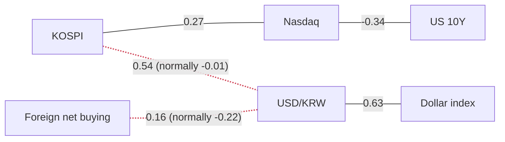

> **이 글의 숫자는 어디서 오는가.** 모든 수치는 FRED(미국 연준 세인트루이스 지부의 공개 데이터)와 네이버 금융에서 자동으로 받아와 계산한 것입니다. 뉴스 기사에 나온 숫자는 **단 하나도** 쓰지 않았습니다. 기사는 "왜 그렇게 움직였는가"를 설명할 때만 인용합니다. 숫자와 이야기를 섞으면 서로 다른 날짜의 데이터가 한 문장에 들어가고, 그러면 글 안에서 계산이 맞지 않게 됩니다.

> **먼저 고백할 것: 이 시리즈에 13일 공백이 있습니다.** 직전 글이 2026-09-03입니다. 오늘 숫자는 모두 오늘 것이지만, "지난 글의 질문에 답하기"는 13거래일 늦게 답하는 셈입니다. 매일 쓰는 기록의 가치는 연속성에서 나오는데, 이 항목에서 그 연속성은 끊겼습니다. 답할 수 없게 된 질문은 아래에서 그냥 "답할 수 없다"고 적었습니다.

---

## 오늘의 기준 시각

작성 시각 **2026-09-16 16:57 KST** (뉴욕 시각 **03:57 ET**).

- **한국 숫자는 종가입니다.** 서울 시장은 15:30에 닫고, 데이터는 16:57에 읽었습니다. 장중 스냅샷이 아니라 확정된 결과입니다.
- **미국 숫자는 전일 종가까지.** 나스닥·S&P500·장단기 스프레드·기대인플레이션은 **9월 15일**, 10년물·2년물·실질금리·VIX·하이일드 스프레드는 **9월 14일** 기준입니다. 뉴욕은 아직 오늘 장을 열지 않았습니다.
- **5개 시계열이 지연 상태입니다. 고장이 아니라 FRED의 정상적인 발표 시차입니다.** 원/달러와 달러 기준 코스피, 달러지수는 **9월 11일**까지, WTI 유가와 원화 기준 유가는 **9월 9일**까지입니다. 유가 지연은 오늘 특히 중요해서 아래에서 다시 짚습니다. 데이터 수집 오류는 없었습니다.

---

## 오늘의 한 가지

**2주 전에 "이것이 확인되면 판단을 바꾸겠다"고 적어둔 조건이, 반대 방향으로 움직였습니다. 그리고 오늘 밤 FOMC가 있습니다.**

9월 3일 글은 이렇게 적었습니다 — *미국 2년물 금리가 5거래일 동안 오른 **+22bp**를 되돌리고 1년 범위의 100% 자리에서 내려오면, 판단을 미국 강세 쪽으로 옮기겠다.*

13거래일이 지난 오늘, 2년물은 **4.65%**입니다. 20거래일 동안 **+48bp**, 5거래일 동안 **+28bp** 올랐고, 1년 범위 내 위치는 여전히 **100%**입니다. 10년물도 **4.97%**로 100%, 실질금리도 **2.60%**로 100%. **같은 금리 곡선 위의 세 점이 모두 1년 중 최고 자리에 동시에 올라앉아 있습니다.** 그것도 내일 새벽 **03:00 KST**에 FOMC 결정이 나오는 날에.

`bp`는 basis point, **0.01%포인트**입니다. 금리는 퍼센트가 아니라 bp로 읽습니다. 2년물이 20일간 +48bp 올랐다는 말은 +0.48%**포인트** 올랐다는 뜻이지 +48% 올랐다는 뜻이 아닙니다.

---

## 지난 글의 세 가지 질문

### 1. "2년물이 +22bp를 되돌렸나, 아니면 1년 범위 100%를 지켰나?"

**지켰고, 오히려 더 올렸습니다. 판단을 뒤집을 조건이 반대 방향으로 실패한 경우입니다.**

2년물 **4.65%**, 20일 **+48bp**, 5일 **+28bp**, 1년 범위 위치 **100%**. 연초 대비로는 **+118bp**입니다. 데이터가 직접 붙여주는 방향 표현은 1일·20일·연초 대비 모두 *"2년물 금리가 올랐다"*입니다.

다만 공백이 앗아간 것이 있습니다. **경로가 보이지 않습니다.** 꾸준히 오른 2년물과, 급등했다가 되돌리고 다시 오른 2년물은 20일 변화량이 똑같이 나옵니다. 그 차이는 쓰이지 않은 13일치 기록에만 남아 있었을 텐데, 그 기록이 없습니다.

### 2. "원/달러가 발표되면 코스피↔원화 상관계수는 어떻게 되나?"

**발표됐고, 그 단절은 진짜였습니다.**

원/달러 데이터가 **9월 11일**까지 따라잡았습니다(2주 멈춰 있던 것이 3거래일 지연으로). 코스피와 원/달러의 60일 상관계수는 **+0.54**, 1년 평균은 **−0.01**입니다. 질문을 만들게 했던 9월 초 세 번의 데이터는 모두 얼어붙은 같은 데이터로 **+0.45**를 반복하고 있었는데, **새 관측치가 들어오자 평균에서 더 멀어졌습니다.**

이것으로 가설 하나가 정리됩니다. 이 단절은 "멈춘 데이터를 계속 다시 계산해서 생긴 착시"가 아닙니다. 새 데이터에도 있습니다.

### 3. "코스피 반등이 종가까지 살아남았나, 종목 간 격차는 벌어진 채였나?"

**종가 질문은 영원히 답할 수 없습니다.** 오늘 데이터에는 기간별 변화율과 현재 수준만 있지, 과거 개별 세션의 기록이 없습니다. 9월 3일 장중 **+1.29%**가 종가까지 갔는지는 이 파일에 없고, 그날 글도 쓰이지 않았습니다. 그 세션은 그냥 사라졌습니다. 공백의 구체적인 대가입니다.

**격차 질문은 답할 수 있고, 벌어진 정도가 아니라 주도주가 바뀌었습니다.** SK하이닉스가 20일 기준 지수를 **+12.79%포인트** 앞서고, 현대차가 **−16.37%포인트** 뒤처집니다. 같은 5종목 바스켓 안에서 **29.16%포인트** 격차입니다. 9월 3일에는 LG화학이 **+11.00%포인트**로 선두, 현대차가 **−6.19%포인트**로 후미였는데, 오늘 LG화학은 **−1.93%포인트**로 사실상 지수와 같습니다.

다만 창을 먼저 보세요. 이 지표는 **직전 20거래일** 기준이라 오늘의 창과 9월 3일의 창은 일부만 겹칩니다. 순환이 일어난 것은 사실이지만 정확히 언제인지는 데이터에 없습니다.

---

## 한국

| | 수준 | 1일 | 20일 | z | 고점 대비 | 기준일 |
|---|---|---|---|---|---|---|
| 코스피 | 6,717.97 | ▲ +1.37% | +3.81% | +0.56 | −26.29% | 2026-09-16 |
| 코스닥 | 815.98 | ▲ +0.44% | −1.03% | +0.20 | −33.45% | 2026-09-16 |
| 원/달러 | 1,340.30 | ▼ −0.40% | −5.48% | −0.68 | −13.86% | 2026-09-11 |
| 코스닥/코스피 | 0.1215 | ▼ −0.92% | −4.66% | −0.52 | −52.23% | 2026-09-16 |

**`z`(z-스코어)를 읽는 법.** 오늘 하루 움직임이 **지난 3년(756거래일)** 하루 움직임 분포에서 얼마나 특이한지를 재는 값입니다. ±1 안쪽이면 평범한 날입니다. 오늘 코스피의 **+0.56**은 "평범한 상승일"이라는 뜻이지 "많이 올랐다"는 뜻이 아닙니다.

코스피는 연초 대비 **+59.41%**이면서 동시에 252거래일 고점 대비 **−26.29%**입니다. 두 사실이 같이 참이고, 이 조합이 한국 시장의 전부입니다. 1년 범위에서는 저점과 고점 사이 **59.5%** 지점, 즉 딱 중간쯤입니다.

> **1년 범위 내 위치**는 백분위(percentile)가 아닙니다. `(현재값 − 1년 최저) / (1년 최고 − 1년 최저)`, 즉 **최저점에서 최고점까지 몇 % 올라온 자리인가**입니다. 3년이 아니라 1년이고, 분포가 아니라 구간 위치입니다.

**폭이 좁고, 더 좁아지고 있습니다.** 코스닥은 연초 대비 **−11.83%**인데 코스피는 **+59.41%**입니다. 코스닥/코스피 비율은 20일 **−4.66%**, 연초 대비 **−44.69%**이고, 데이터가 붙인 방향 표현은 모든 구간에서 *"대형주가 소형주를 앞섰다"*입니다.

코스피의 실현변동성은 연율 **38.0%**, 나스닥은 **12.9%**입니다. 약 3배입니다. 이것은 전망이 아니라 **포지션 크기를 정할 때 쓰는 사실**입니다. 같은 금액을 넣어도 흔들리는 폭이 3배라는 뜻이니까요.

**오늘 보드에서 가장 극단적인 숫자는 환율입니다.** 원/달러의 1년 범위 내 위치가 **0.23%** — 1년 최저에서 겨우 0.2% 올라온 자리입니다. 이 지표로 보면 **원화는 1년 중 가장 강합니다.** 20일 **−5.48%**, 연초 대비 **−7.22%**(원/달러 기준). 데이터가 붙인 표현은 *"원화가 강해졌다"*이고, 그 결과로 명시된 것은 *"미국 자산의 원화 환산 가치가 줄고, 한국 수출기업의 원화 환산 이익이 압축된다"*입니다.

이 시계열은 관측치가 **11,352개**로 대단히 깁니다. 3년 채점 창이 전체 역사에서 얇은 조각이라는 뜻이고, 그만큼 z를 신뢰할 수 있습니다.

### 투자자별 순매수

| 코스피 (억 원) | 오늘 | 5일 | 20일 | z (지난 1년 기준) |
|---|---|---|---|---|
| 외국인 | −16,852 | −114,874 | −183,896 | −0.49 |
| 기관 | +12,145 | −15,749 | +2,731 | **+0.79** |
| 개인 | −11,797 | +49,627 | −123,864 | −0.60 |

외국인이 팔고 개인도 팔았으며, 기관이 샀습니다. 기관의 z **+0.79**가 오늘 자금 흐름 중 가장 큰 값입니다. 20일로 보면 외국인이 **−183,896억 원**을 빼갔고 기관은 **+2,731억 원**으로 거의 제자리입니다. 오늘 하루보다 이 외국인 이탈이 더 중요한 숫자입니다.

> **"모두가 팔고 있다"는 문장은 쓸 수 없습니다.** 네이버가 제공하는 세 주체(외국인·기관·개인) 합계는 0이 되지 않습니다. **기타법인**이 데이터에 없기 때문입니다. 누군가 판 주식은 반드시 누군가 샀습니다. "외국인이 많이 팔았다"고 써야 맞습니다.
>
> 그리고 이 표의 z만 **252일(1년) 기준**입니다. 이 글의 다른 모든 z는 3년 기준입니다.

### 종목별 상대강도

| | 수준 | 1일 | 20일 | 지수 대비(20일) | z | 고점 대비 |
|---|---|---|---|---|---|---|
| SK하이닉스 | 1,749,000 | ▲ +2.16% | +16.60% | **+12.79%p** | +0.42 | −40.08% |
| 삼성전자 | 252,500 | ▲ +0.80% | +2.02% | −1.79%p | +0.18 | −30.34% |
| POSCO홀딩스 | 326,500 | ▼ −1.66% | +2.03% | −1.78%p | −0.56 | −38.97% |
| LG화학 | 271,000 | ▲ +0.18% | +1.88% | −1.93%p | +0.08 | −36.90% |
| 현대차 | 362,000 | ▼ −2.03% | −12.56% | **−16.37%p** | −0.72 | −51.73% |

한 종목이 바스켓을 끌고 가고, 한 종목이 끌려 나가고 있습니다. 가운데 세 종목은 지수와 **2%포인트** 이내라 어느 쪽으로도 참여하지 않고 있습니다. 현대차의 고점 대비 **−51.73%**는 다섯 중 가장 깊습니다.

**"그래서 내가 실제로 돈을 벌었나?"** 이 차트가 답하는 질문입니다. 원화로 주식을 사는 한국 투자자와 달러로 사는 외국인은 **같은 지수에서 다른 수익**을 얻습니다.

**9월 11일까지 공유되는 1,186거래일** 기준으로, 코스피는 20일간 원화로 **+5.03%**, 달러로 **+10.98%**였고 같은 날짜의 원/달러는 **−5.37%**였습니다. 이 세 숫자는 정확히 맞아떨어집니다.

**여기서 가져갈 값은 "차이"입니다 — 달러 기준 투자자가 약 5.95%포인트 더 벌었습니다.** 각각의 수준을 따로 인용하면 안 됩니다. 이 계산은 두 시계열이 **공통으로 존재하는 날**만 골라 쓰기 때문에, 위 표의 코스피 20일 **+3.81%**과 여기의 **+5.03%**은 서로 다른 기간을 보고 있습니다. 같은 지수, 다른 창, 둘 다 맞습니다.

미국 자산을 들고 있는 한국 투자자에게는 같은 환율이 반대로 작용합니다. **원화가 이만큼 강하면 미국 계좌의 원화 환산 가치는 줄어듭니다.**

---

## 미국

| | 수준 | 1일 | 20일 | z | 1년 범위 위치 | 기준일 |
|---|---|---|---|---|---|---|
| 미국 10년물 | 4.97% | +1bp | +29bp | +0.16 | **100%** | 2026-09-14 |
| 미국 2년물 | 4.65% | +2bp | +48bp | +0.35 | **100%** | 2026-09-14 |
| 10년 실질금리 | 2.60% | 보합 | +19bp | −0.02 | **100%** | 2026-09-14 |
| 10년 기대인플레이션 | 2.38% | +1bp | +10bp | +0.43 | 62.5% | 2026-09-15 |
| 장단기 스프레드(10Y−2Y) | 0.33% | +1bp | −20bp | +0.24 | 12.8% | 2026-09-15 |
| 하이일드 스프레드 | 2.71% | +6bp | +1bp | +0.90 | 12.8% | 2026-09-14 |
| VIX | 17.10 | ▲ +7.95% | +12.57% | +0.91 | 20.6% | 2026-09-14 |
| 나스닥 | 25,981.57 | ▼ −0.78% | −2.49% | −0.68 | 82.3% | 2026-09-15 |
| S&P 500 | 7,585.73 | ▼ −0.45% | −2.06% | −0.55 | 85.3% | 2026-09-15 |
| 달러지수 | 118.21 | ▲ +0.11% | −0.82% | +0.39 | 17.3% | 2026-09-11 |
| WTI 유가 | $97.26 | ▲ +3.24% | +14.73% | **+1.26** | 70.7% | 2026-09-09 |
| 실효 연방기금금리 | 3.63% | 보합 | 보합 | +0.08 | 50.0% | 2026-09-14 |

**곡선 위의 모든 점이 올랐는데, 곡선은 평평해졌습니다.** 2년물이 20일간 **+48bp** 오르는 동안 10년물은 **+29bp** 올랐습니다. 짧은 쪽이 더 많이 올랐으니 둘의 차이인 장단기 스프레드는 **−20bp** 줄어 **0.33%**가 됐고, 1년 범위의 **12.8%** 자리입니다.

**짧은 쪽이 더 크게 움직인다는 것은, 시장의 논쟁이 "성장"이 아니라 "정책금리"에 있다는 뜻입니다.** 그리고 연준이 실제로 정하는 금리인 실효 연방기금금리는 **전혀 움직이지 않았습니다** — 1일 보합, 20일 보합, 연초 대비 **−1bp**. **지금 움직이는 것은 전부 "예상"입니다.**

### 10년물 분해 — 오늘의 핵심

명목 금리는 두 조각으로 나뉩니다.

- **기대인플레이션**: 채권시장이 예상하는 향후 물가상승률
- **실질금리**: 그것을 빼고 남는, 구매력 기준 수익률

**9월 14일 기준: 4.97% = 실질 2.60% + 기대인플레이션 2.37%**, 잔차 **−0.00%p**. 항등식이 정확히 닫힙니다.

**20일 변화: +29bp = 실질 +19bp + 기대인플레이션 +10bp.**

**상승분의 3분의 2가 실질금리이고, 주식 밸류에이션을 누르는 것은 바로 이쪽입니다.**

왜 그런가. 기대인플레이션이 올라서 금리가 오른 것이라면, 물가가 오르는 만큼 **기업 매출도 명목상 같이 오릅니다.** 할인율과 현금흐름이 같이 올라 일부 상쇄됩니다. 반면 실질금리가 올라서 오른 것이라면, **미래 현금흐름을 현재가치로 깎는 비율만 순수하게 커집니다.** 상쇄가 없습니다. 데이터가 실질금리에만 붙여놓은 결과 문구가 *"장기 듀레이션 주식에 직접적인 멀티플 압축"*인 이유입니다.

실질금리는 1년 범위 **100%** 자리에 있습니다. 나스닥은 20일 **−2.49%**, S&P500은 **−2.06%**이고, 나스닥↔10년물 상관계수는 **−0.34**(1년 평균 **−0.15**)로 정상 작동 중입니다. 메커니즘이 교과서대로 돌아가고 있습니다.

> 이 세 숫자는 **분해 전용 블록**에서만 가져와야 합니다. 명목·실질·기대인플레이션은 각각 발표 일정이 달라서, 따로 떨어진 표에서 빼면 합이 맞지 않습니다.

### 신용과 변동성 — 반대편 증거

**하이일드 스프레드**는 위험한 회사채를 사줄 때 국채보다 얼마나 더 요구하는가입니다. 넓으면 공포, 좁으면 자신감입니다.

오늘 **+6bp** 벌어져 **2.71%**, z **+0.90**. 그런데 20일로는 **+1bp**로 사실상 제자리이고, 1년 범위에서는 **12.8%** — 바닥 근처입니다.

이 z는 조심해서 읽어야 합니다. 이 시계열은 관측치가 **796개**인데 채점 창이 756거래일입니다. **즉 "3년 분포"가 사실상 전체 역사이고, 바깥에서 비교해줄 맥락이 거의 없습니다.** 10년물의 **16,160개**, 연방기금금리의 **26,374개**와 같은 무게로 읽으면 안 됩니다.

VIX는 오늘 **+7.95%** 올라 **17.10**, z **+0.91**이지만 1년 범위 위치는 **20.6%**입니다. **낮은 수준에서의 급한 하루 움직임**이지, 높은 수준이 아닙니다.

**신용시장과 변동성시장이 금리시장의 이야기를 뒷받침해주지 않고 있습니다.** 이 불일치가 강세론의 가장 강한 근거입니다.

### 유가 — 그리고 데이터가 아직 담지 못한 것

WTI는 **$97.26**, z **+1.26**으로 오늘 보드에서 절대값이 가장 큰 z입니다. 20일 **+14.73%**, 연초 대비 **+69.86%**.

**그런데 이 값은 9월 9일 기준이고 오늘은 9월 16일입니다.** 9월 중순까지의 언론 보도는 걸프 지역 공급 차질이 계속되고 있다고 전합니다 — 사우디 에너지 인프라 피격, 동서 송유관 폐쇄와 재가동 일정 불투명, 호르무즈 해협 통행 제약. **그 움직임은 이 데이터에 없고, 이 글에는 기사에 나온 유가 숫자를 한 개도 쓰지 않았습니다.** 위 수치는 일주일 묵은 스냅샷의 하한선으로 읽으세요.

원화 기준으로 같은 배럴은 20일 **+8.80%**인데 달러 기준은 **+14.73%**입니다. **차이만큼 원화 강세가 에너지 수입 부담을 흡수했습니다.** 데이터가 원화 기준 상승에 붙인 결과 문구는 *"한국의 에너지 수입 부담 증가"*이고, 달러 차트만 볼 때보다는 그 폭이 작습니다.

---

## 오늘 실제로 연결되어 있는 것

상관계수는 해당 기간의 측정값이며 인과관계 주장이 아닙니다. 빨간 점선은 1년 평균에서 관계가 끊어졌다는 뜻입니다.

정상 작동 중인 연결 세 개: 코스피↔나스닥 **+0.27**(평균 +0.13), 원/달러↔달러지수 **+0.63**(평균 +0.62), 나스닥↔10년물 **−0.34**(평균 −0.15).

### 끊어진 연결 1 — 코스피 ↔ 원/달러: +0.54 (평균 −0.01)

**교과서 메커니즘.** 외국인이 한국 주식을 사려면 먼저 원화를 사야 합니다. 그래서 자금이 들어오면 원화가 강해지고 지수도 오릅니다. 원/달러로 재면 **원/달러가 오른다 = 원화가 약해진다**이므로, 코스피와 원/달러의 상관계수는 **음수**여야 정상입니다. 평균이 **−0.01**로 약한 것을 보면 원래도 강한 관계는 아니지만, 적어도 양수는 아닙니다.

**지금은 성립하지 않습니다.** **+0.54**는 두 시계열의 **일간 변화**가 지난 60일 동안 같은 방향으로 움직였다는 뜻입니다.

> **여기서 반드시 구분해야 할 것.** 일간 변화의 상관관계는 "하루하루 같이 움직였는가"이지, "기간 전체로 어느 쪽으로 흘렀는가"가 **아닙니다.** 실제로 원/달러는 20일간 **−5.48%**이고 데이터가 붙인 표현은 *"원화가 강해졌다"*입니다. **원화는 이 기간에 강해졌고, 동시에 지수와 양의 상관을 보였습니다.** 둘 다 참이며, 이 둘을 한 문장으로 뭉개는 것이 이 프로젝트가 이미 한 번 저지른 실수입니다.

**가장 그럴듯한 설명(가설입니다).** 언론 보도는 반도체 수출 호조가 사상 최대 경상수지 흑자를 만들고, 수출기업이 달러를 원화로 바꾸며, 한국은행이 긴축 기조를 이어가고 있다고 전합니다. **하나의 요인이 지수와 통화를 동시에 같은 방향으로 밀면**, 자금 유출입 메커니즘 위에 세워진 상관관계는 뒤집힙니다. SK하이닉스 20일 **+16.60%**, 원화 1년 범위 **0.23%**라는 이 글의 숫자와 앞뒤가 맞는 이야기입니다. 다만 데이터가 재는 것은 상관관계이지 인과가 아니므로, 여기까지가 가설입니다.

### 끊어진 연결 2 — 외국인 순매수 ↔ 원/달러: +0.16 (평균 −0.22)

**교과서 메커니즘.** 외국인 순매수는 원화 매수를 동반하므로 원/달러를 **낮춰야** 합니다. 음의 상관이 정상이고, 평균 **−0.22**가 그것을 보여줍니다.

**지금은 부호가 뒤집혔습니다.** **+0.16** — 외국인이 **판** 날에 오히려 원화가 강해졌습니다.

**가설은 같은 것입니다.** 수출기업의 달러 환전 규모가 충분히 크면 주식 자금 채널을 압도합니다. 그러면 환율은 자본수지가 아니라 **무역수지**가 결정합니다. 20일간 외국인 **−183,896억 원** 순매도와 1년 최강 수준의 원화가 정확히 그 모습입니다. **이 두 개의 단절은 아마 두 개가 아니라 하나입니다.**

---

## 양쪽 모두의 논리

어느 쪽으로 기울기 전에, 양쪽에서 가장 강한 주장을 각각 세워봅니다. 같은 데이터가 두 가지로 읽힌다는 것을 보는 것이 초보자에게 가장 쓸모 있는 훈련입니다.

**한국 — 강세론.** 수출 엔진이 돌고 있고 그것이 시세에 보입니다. SK하이닉스는 20일 **+16.60%**로 지수를 **+12.79%포인트** 앞서고, 코스피는 연초 대비 **+59.41%**입니다. 원화가 1년 범위 **0.23%** 자리에 있다는 것은 사상 최대 흑자가 통화에 찍힌 모습입니다. 지수는 여전히 252일 고점보다 **26.29%** 아래라 갈 자리가 남아 있습니다.

**한국 — 약세론.** 폭이 문제입니다. 코스닥은 연초 대비 **−11.83%**인데 코스피는 **+59.41%**이고, 코스닥/코스피 비율은 연초 대비 **−44.69%**입니다. 추적 중인 5종목 중 3개가 지수와 **2%포인트** 이내이고, 현대차는 미국 관세 압박 속에 **−16.37%포인트** 뒤처지며 고점 대비 **−51.73%**입니다. 외국인은 20일간 **−183,896억 원**을 빼갔습니다. 이렇게 좁은 상승은 한 업종이 계속 기대를 넘어야만 유지됩니다.

**미국 — 강세론.** 금리 말고는 아무것도 스트레스를 확인해주지 않습니다. 하이일드 스프레드는 20일 **+1bp**로 제자리이고 1년 범위 **12.8%**, VIX의 범위 위치는 **20.6%**, S&P500은 **85.3%**입니다. **경기침체는 보통 신용시장에서 먼저 신호가 나오는데, 신용시장이 조용합니다.** 주가 고점 대비 낙폭도 **−4.11%**, **−2.73%**로 조정이지 붕괴가 아닙니다.

**미국 — 약세론.** 2년물·10년물·실질금리가 **동시에** 1년 범위 **100%**에 있고, 20일 분해는 10년물 **+29bp** 중 **+19bp**가 실질금리 — 멀티플을 직접 누르는 쪽이라고 말합니다. 전 구간이 오르면서 곡선은 **−20bp** 평평해졌고, 이는 짧은 쪽이 정책을 다시 가격에 넣고 있다는 뜻입니다. 연방기금금리 자체는 아직 움직이지 않았으니 **이것은 전부 예상이고, 오늘 밤 그 예상이 확인되거나 깨집니다.**

---

## 사이클 상 위치 — 어디에 서 있나

**판단: 기다린다. 오늘 하루만큼은 데이터보다 달력에 대한 판단입니다.**

내일 새벽 **03:00 KST**에 FOMC 결정이 나오고, 시장 가격은 인상과 동결 사이에서 거의 반반으로 갈려 있습니다. 금리시장 전체가 20일에 걸쳐 가격에 반영해온 이분법적 사건을 **몇 시간 앞두고** 6~24개월짜리 포지션에 들어가는 것은, 동전 던지기에 정가를 다 치르는 일입니다. **기다리는 것도 하나의 포지션입니다.**

**저울을 기울인 숫자: 10년물 20일 상승 +29bp 중 +19bp가 실질금리라는 것.**

미국 약세론이 강세론을 이긴 이유는 증거의 양이 아니라 **직접성**입니다. 강세론의 증거(조용한 신용, 낮은 VIX 위치)는 진짜지만 간접적이고, 그중 가장 좋은 숫자가 **가장 얕은 역사**를 갖고 있습니다 — 하이일드 스프레드 z 뒤에 관측치가 **796개**뿐입니다. 약세론의 핵심 숫자는 해석이 필요 없습니다. **실질금리 상승은 곧 할인율 상승이고**, 데이터 자체가 그 결과를 문구로 달고 있습니다.

한국은 다른 길로 같은 답에 도착합니다. 상승은 진짜지만 한 업종 폭이고, 외국인은 나가고 있으며, 통화는 1년 범위 극단에서 **바로 그 상승을 이끄는 수출기업의 이익을 압축**하고 있습니다.

**생각을 바꿀 조건(falsifier): 실질금리가 주도권을 놓을 때.**

20일 분해가 뒤집혀 **기대인플레이션 조각이 실질금리 조각보다 커지면서**, 동시에 2년물이 1년 범위 **100%**에서 내려온다면 — 이 움직임은 할인율 재평가가 아니라 물가 재평가였다는 뜻이고, 멀티플 압축 논리는 해소됩니다. 그때 판단은 미국 강세론으로 옮겨갑니다. 이 분해는 매 세션 계산되므로 다음 글이 곧바로 확인할 수 있습니다.

반대 조건도 같이 적어둡니다. 실질금리가 범위 최상단에 머무는데 **하이일드 스프레드가 12.8% 자리에서 올라가기 시작하면**, 신용시장이 더 이상 반대하지 않는다는 뜻이고 기다림은 길어집니다.

---

## 오늘의 용어 — 실질금리 (real yield)

명목 금리에서 시장이 예상하는 물가상승률을 뺀 나머지입니다.

> 명목금리 = 실질금리 + 기대인플레이션

연봉 협상으로 비유하면, 연봉이 5% 오르고 물가가 3% 오르면 명목으로는 +5%, **실질로는 +2%**입니다. 삶이 실제로 나아진 폭은 2%입니다. 채권도 같습니다. 4.97%짜리 국채에 2.37%의 예상 물가가 들어 있다면, 구매력 기준으로 진짜 받는 것은 **2.60%**입니다.

미국에서는 이것이 추정치가 아닙니다. **물가연동국채(TIPS)**는 원금이 실제 물가에 연동되므로 그 수익률이 곧 실질금리이고, 시장에서 직접 관측됩니다. 일반 국채 금리에서 이것을 빼면 시장이 예상하는 물가, 즉 기대인플레이션이 나옵니다.

**왜 주식에는 명목금리보다 실질금리가 더 중요한가.** 주식은 몇 년 뒤에 들어올 현금흐름에 대한 청구권이고, 그 미래 현금흐름은 현재가치로 할인됩니다. 그 할인율의 본체가 실질금리입니다. 물가는 기업 매출에도 붙으므로 양변에서 일부 상쇄되기 때문입니다.

그래서 **같은 폭의 10년물 상승도 원인에 따라 의미가 반대입니다.**

- **기대인플레이션이 올려서** 오른 것 → 매출도 따라 오릅니다. 간접적 타격.
- **실질금리가 올려서** 오른 것 → 상쇄 없는 순수 할인율 상승. **직접적인 멀티플 압축**, 특히 이익이 먼 미래에 몰린 기업에 가장 아프게.

오늘이 정확히 두 번째 경우입니다.

---

## 가격을 움직인 뉴스

**1. 걸프 지역 공급 차질 → WTI 하루 +3.24%, 20일 +14.73%, z +1.26.** 사우디 에너지 인프라 피격, 동서 송유관 폐쇄와 재가동 일정 불투명, 호르무즈 해협 통행 제약이 보도되고 있습니다. 오늘 보드에서 절대값이 가장 큰 z이며, 한국 쪽 에너지 수입 부담 이야기가 나오는 이유입니다. **데이터는 9월 9일에서 멈춰 있고 차질은 그 뒤로도 이어졌으므로, 이 수치는 실제 움직임을 과소평가합니다.**

**2. 한국 자동차에 대한 미국 관세 압박 → 현대차 오늘 −2.03%, 20일 −12.56%, 지수 대비 −16.37%포인트.** 한국산 차량에 대한 관세 부담과, 최근에는 중국 완성차의 미국 내 생산 허용 가능성이 보도되고 있습니다. 추적 5종목 중 유일하게 20일 하락이며 고점 대비 낙폭도 **−51.73%**로 가장 깊습니다.

**3. 반도체 수출 호조 → SK하이닉스 오늘 +2.16%, 20일 +16.60%, 지수 대비 +12.79%포인트.** 사상 최대 경상수지 흑자와 연결되는 그 수출 증가가, 원화의 **0.23%** 범위 위치와 끊어진 상관관계 두 개와 모두 앞뒤가 맞습니다. **하나의 테마가 지수와 환율과 자금 흐름 지도를 동시에 움직이고 있습니다.**

---

## 앞으로 확인할 일정

- [ ] **2026-09-17 03:00 KST** — FOMC 결정. 20일간의 **+48bp**가 옳은 예측이었는지 과잉이었는지 판정합니다. 오늘 적은 falsifier의 첫 시험대입니다.
- [ ] **2026-09-17 03:30 KST** — FOMC 기자회견. 성명이 "무엇을 했는가"라면 여기는 "다음은 무엇인가"이고, 2년물이 실제로 가격에 넣고 있는 것은 후자입니다.
- [ ] **원/달러 다음 발표** — 현재 **9월 11일**까지. 새 관측치마다 코스피↔원화 **+0.54**가 평균 **−0.01**로 수렴하는지 굳어지는지 다시 시험됩니다.
- [ ] **WTI 다음 발표** — 현재 **9월 9일**까지, 일주일 지연. 따라잡는 날 큰 하루 변동으로 찍히겠지만 실제로는 일주일치 뉴스입니다.

---

## 내일 확인할 세 가지

1. **20일 분해에서 실질금리가 여전히 더 큰 조각인가, 기대인플레이션이 가져갔는가?** 오늘 적은 falsifier입니다. 현재 **20일 기준 실질 +19bp 대 기대인플레이션 +10bp**이며, 뒤집히면 판단은 미국 강세론으로 갑니다.
2. **결정 이후 2년물이 1년 범위 100%에서 내려왔는가?** 13일 공백을 건너뛰고도 그 자리를 지켰습니다. 연준이 어느 쪽으로 가든, 범위 위치의 반응이 "이미 반영돼 있었는지"를 말해줍니다.
3. **새 원/달러 발표가 코스피↔원화 상관을 평균 쪽으로 되돌렸는가?** 멈춘 데이터에서 **+0.45**, 새 데이터에서 **+0.54**, 평균은 **−0.01**입니다. 세 번째 관측이 이것이 국면인지 지나가는 일인지 말해줍니다.

---

## 출처

**데이터 — 이 글의 모든 숫자.** `market-intelligence/pipeline/run.py`가 계산했고 `2026-09-16.json`에 저장돼 있습니다. 생성 시각 2026-09-16T16:58:16+09:00. 수집 오류 없음.

| 항목 | 출처 |
|---|---|
| 코스피·코스닥·종목 주가·투자자별 순매수 | 네이버 금융 |
| 미국 국채 금리·기대인플레이션·실질금리·연방기금금리·장단기 스프레드 | FRED |
| 나스닥·S&P500·VIX·하이일드 스프레드·WTI·달러지수 | FRED |
| 원/달러·달러 기준 코스피·원화 기준 유가·환율 정렬 블록 | FRED, 공통 거래일 기준 계산 |

**서술 — "왜"에만 사용했고 숫자로는 쓰지 않았습니다.** [원유 시장 보도](https://tradingeconomics.com/commodity/crude-oil) · [원화와 한국은행 정책](https://www.tradingpedia.com/2026/08/27/won-strengthens-as-bank-of-korea-extends-rate-hike-cycle/) · [9월 FOMC 전망](https://finance.yahoo.com/economy/policy/articles/fomc-september-2026-odds-rate-201618784.html) · [한국 자동차와 관세](https://en.sedaily.com/finance/2026/09/14/trump-opens-door-to-chinese-carmakers-in-us-hyundai-and-kia)

> **주의**
> 데이터는 FRED와 네이버 금융에서 수집했으며, 언론 보도는 서술에만 사용하고 수치로는 사용하지 않았습니다. 투자 조언이 아닙니다. 행동하기 전에 모든 숫자를 직접 다시 확인하세요.
