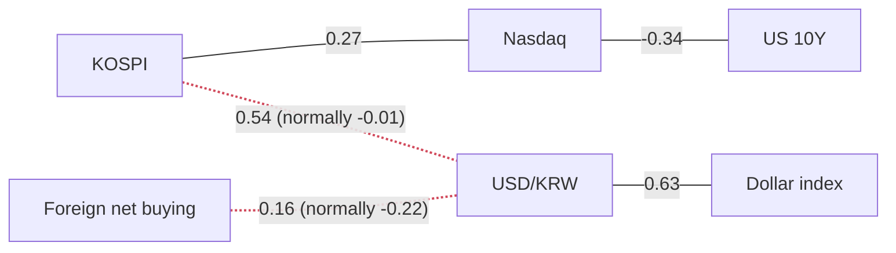

> **이 글의 숫자는 어디서 오는가.** 모든 수치는 FRED(미국 세인트루이스 연준의 공개 데이터)와 네이버 금융에서 자동으로 받아 계산한 것입니다. 기사에 나온 숫자는 **하나도** 쓰지 않았습니다. 기사는 "왜 그렇게 움직였는가"를 설명할 때만 인용합니다.

> **⚠️ 오늘 한국 숫자는 장중입니다.** 데이터를 읽은 시각이 **10:55 KST**이고 서울 시장은 15:30에 닫습니다. 아래 한국 지수·수익률·z·수급 숫자는 전부 **아직 움직일 수 있는 중간 스냅샷**입니다. 종가가 아닙니다.

---

## 오늘의 기준 시각과, 반드시 알아야 할 한 가지

작성 시각 **2026-09-17 10:55 KST** (뉴욕 **2026-09-16 21:55 ET**).

**어젯밤 FOMC가 금리를 올렸습니다.** 결정은 한국시간 오늘 새벽 **03:00**에 나왔습니다. 그런데 미국 데이터가 이 사건을 기준으로 **둘로 갈립니다.**

| 결정 당일(9/16)까지 발표된 것 | 결정 전날(9/15)에서 멈춘 것 |
|---|---|
| 장단기 금리차(2s10s), 10년 기대인플레이션, S&P 500 | 10년물, 2년물, 실질금리, 나스닥, VIX, WTI, 하이일드 스프레드 |

**즉 오늘 데이터로 "금리 인상에 시장이 어떻게 반응했나"를 볼 수 있는 창구는 왼쪽 세 개뿐입니다.** 이 사실을 모르고 오른쪽 숫자를 읽으면, 인상 이전의 시장을 인상 이후라고 착각하게 됩니다.

**추가로 4개 시계열이 지연 상태입니다(FRED 정상 시차, 고장 아님).** 원/달러, 달러 기준 코스피, 달러지수, 원화 기준 유가가 모두 **9월 11일**까지입니다. 엿새 전이라 이번 인상을 전혀 담고 있지 않습니다. 수집 오류는 없었습니다.

---

## 오늘의 한 가지

**연준이 금리를 올렸는데, 채권시장의 대답은 기대인플레이션을 강하게 끌어내리는 것이었습니다.**

10년 기대인플레이션이 결정 당일 **5bp 내려 2.33%**가 됐고, z는 **−2.18** — 오늘 보드 전체에서 절댓값이 가장 큰 값입니다. 데이터가 붙인 표현도 *"기대인플레이션이 내렸다"*입니다.

같은 날 **장단기 금리차(2s10s)는 6bp 줄어 0.27%**, z **−1.72**, 1년 범위 내 위치 **0.0%** — **1년 중 가장 납작합니다.**

시장이 "이 긴축은 먹힐 것"이라고 믿을 때 나타나는 모습이 정확히 이것입니다. 앞단 금리는 긴축을 반영해 오르고, 그 긴축이 겨냥하는 물가 기대는 내려갑니다.

> `bp`는 basis point, **0.01%포인트**입니다. 금리는 퍼센트가 아니라 bp로 읽습니다. "5bp 내렸다"는 0.05%포인트 내렸다는 뜻입니다.

---

## 어제의 세 가지 질문

### 1. "20일 분해에서 실질금리가 여전히 더 큰 조각인가?"

**그렇습니다. 어제 적어둔 '생각을 바꿀 조건'은 발동하지 않았습니다.**

9월 15일까지의 공통 날짜 기준으로 10년물의 20일 상승 **+28bp**는 **실질 +18bp + 기대인플레이션 +10bp**로 갈립니다. 항등식도 정확히 닫힙니다: **5.00% = 실질 2.62% + 기대인플레이션 2.38%**, 잔차 **+0.00%p**.

**다만 하루짜리 숫자는 반대를 가리킵니다.** 20일 창은 9월 15일에 끝나므로 어젯밤 결정을 볼 수 없습니다. 볼 수 있는 것은 기대인플레이션의 **하루 변화 −5bp, z −2.18**입니다.

**20일 분해와 하루 z는 서로 다른 질문에 답하는 서로 다른 통계입니다.** 20일 창은 "지난 한 달은 실질금리 이야기였다"고 말하고, 하루 숫자는 "어젯밤은 기대인플레이션 이야기였다"고 말합니다. 둘 다 참이고, 어느 쪽도 다른 쪽을 무효로 만들지 않습니다.

### 2. "결정 이후 2년물이 1년 범위 100%에서 내려왔나?"

**오늘은 답할 수 없습니다. 2년물이 결정 이후로 아직 발표되지 않았습니다.**

2년물 데이터는 **9월 15일** 기준, 즉 발표 **전날**입니다. 수준은 **4.67%**, 하루 **+2bp**, 20일 **+48bp**, 1년 범위 위치 여전히 **100%**. 이것은 인상 이전의 값이고 반응에 대해 아무것도 말해주지 않습니다.

**여기서 배울 점이 하나 있습니다. 장단기 금리차가 그것을 구성하는 두 금리보다 하루 더 최신입니다.** FRED는 2s10s를 별도 시계열로, 별도 일정에 따라 발표합니다. 옆에 있는 10년물·2년물 행에서 즉석에서 계산하는 것이 아닙니다. 그래서 오늘 밤의 답은 금리 수준이 아니라 **금리차**를 통해 들어옵니다.

### 3. "새 원/달러 발표가 코스피↔원화 상관을 평균으로 되돌렸나?"

**새 발표가 없었습니다.** 원/달러는 여전히 **9월 11일**, 어제와 같습니다. 상관계수는 **+0.54**(1년 평균 **−0.01**)로 어제와 자릿수까지 같습니다. 같은 데이터를 다시 계산했으니 당연합니다.

**그런데 이제 이 지연이 훨씬 중요해졌습니다.** 원화의 마지막 관측치가 FOMC보다 사흘 앞서므로, **이 파이프라인의 환율 그림 전체가 이번 창에서 가장 큰 사건을 보지 못하고 있습니다.** 아래 분야별 흐름에서 모델은 인상 이후 원화가 약해졌다고 말하는데, 데이터는 그것을 볼 수 없습니다.

---

## 한국 — 전부 장중 숫자입니다

| | 수준 | 1일 | 20일 | z | 고점 대비 | 기준 |
|---|---|---|---|---|---|---|
| 코스피 | 6,736.82 | ▲ +0.28% | −1.69% | +0.06 | −26.09% | 2026-09-17 |
| 코스닥 | 820.27 | ▲ +0.53% | −2.45% | +0.24 | −33.10% | 2026-09-17 |
| 원/달러 | 1,340.30 | ▼ −0.40% | −5.48% | −0.68 | −13.86% | 2026-09-11 |
| 코스닥/코스피 | 0.1218 | ▲ +0.24% | −0.78% | +0.25 | −52.11% | 2026-09-17 |

한국은 지금까지 미국 금리 인상을 담담하게 받아들이고 있습니다. 두 지수 모두 장중 소폭 상승, z는 **±0.25** 안쪽입니다.

**다만 이 z를 그대로 믿으면 안 됩니다.** z는 **절반쯤 끝난 하루**의 움직임을 **온전한 하루들**로 만든 분포에 대고 채점합니다. 구조적으로 과소평가될 수밖에 없고, "특별할 것 없는 날"이 이 숫자가 지탱할 수 있는 최대치입니다.

코스피는 연초 대비 **+59.86%**, 1년 범위에서 저점 대비 **59.8%** 지점, 252일 고점 대비 **−26.09%**입니다. 실현변동성은 연율 **31.9%**로 나스닥 **12.9%**의 약 2.5배 — 전망이 아니라 **투자 금액을 정할 때 쓰는 사실**입니다.

**20일 수익률이 마이너스로 바뀐 것은 시장이 떨어져서가 아닙니다.** 두 지수 모두 20일 기준 하락(**−1.69%**, **−2.45%**)인데, 어제 글에서는 코스피가 +3.81%였습니다. **강한 세션 하나가 20일 창 뒤로 빠져나갔을 뿐입니다.** 어제와 오늘 글을 나란히 읽는 분이 오해하기 쉬워 적어둡니다.

### 투자자별 순매수 (장중)

| 코스피 (억 원) | 오늘(부분) | 5일 | 20일 | z (지난 1년 기준) |
|---|---|---|---|---|
| 외국인 | −6,768 | −95,299 | −207,606 | +0.02 |
| 기관 | −626 | −22,013 | +7,106 | −0.20 |
| 개인 | +1,948 | +47,509 | −99,468 | −0.05 |

**세 주체의 z가 모두 ±0.25 안쪽** — 지난 1년 기준으로 아무 일도 없는 날이고, 그나마 절반만 지났습니다. 지속되는 숫자는 20일 외국인 합계 **−207,606억 원**으로, 어제보다 더 깊어졌습니다. 장중 사는 쪽은 개인뿐입니다.

> **"모두가 팔고 있다"고 쓸 수 없습니다.** 네이버가 주는 세 주체 합계는 0이 되지 않습니다. **기타법인**이 데이터에 없기 때문입니다. 누가 판 주식은 누군가 샀습니다.
>
> 이 표의 z만 **252일(1년)** 기준이고, 이 글의 나머지 z는 모두 3년 기준입니다.

### 종목별 상대강도 (장중)

| | 수준 | 1일 | 20일 | 지수 대비(20일) | 고점 대비 |
|---|---|---|---|---|---|
| SK하이닉스 | 1,750,000 | ▼ −0.40% | +3.49% | **+5.18%p** | −40.05% |
| POSCO홀딩스 | 327,500 | ▲ +0.15% | +1.87% | +3.56%p | −38.79% |
| LG화학 | 267,500 | ▼ −1.65% | +1.33% | +3.02%p | −37.72% |
| 삼성전자 | 252,750 | ▼ −0.30% | −6.73% | **−5.05%p** | −30.28% |
| 현대차 | 360,500 | ▼ −0.55% | −13.65% | **−11.96%p** | −51.93% |

**격차가 좁아졌고, 삼성전자가 편을 바꿨습니다.** 어제는 **+12.79%p ~ −16.37%p**였는데 오늘은 **+5.18%p ~ −11.96%p**입니다. 더 눈에 띄는 것은 삼성전자로, 어제 **−1.79%p**에서 오늘 **−5.05%p**, 20일 수익률 **−6.73%** — 지수를 따라가던 위치에서 뚜렷하게 뒤처지는 위치로 옮겨갔습니다. 지수와 마찬가지로 20일 창이 굴러간 효과가 섞여 있으니, 하루의 판정이 아니라 창의 변화로 읽으세요.

**"그래서 내가 실제로 돈을 벌었나?"** 원화로 사는 사람과 달러로 사는 사람은 같은 지수에서 다른 수익을 얻습니다. 9월 11일까지 **공통으로 존재하는 1,186거래일** 기준, 코스피 20일 수익률은 원화 **+5.03%**, 달러 **+10.98%**, 같은 날짜 원/달러는 **−5.37%**입니다.

**가져갈 값은 차이인 약 5.95%포인트(달러 기준 투자자가 더 벌었다)이지, 각각의 수준이 아닙니다.** 이 계산은 두 시계열이 함께 존재하는 날만 쓰므로, 위 표의 코스피 20일 **−1.69%**와 여기의 **+5.03%**는 서로 다른 기간을 봅니다. 그리고 이 전부가 연준이 움직이기 사흘 전에서 멈춰 있습니다.

---

## 미국

굵게 표시한 위 세 줄이 **결정 당일까지 발표된** 지표입니다.

| | 수준 | 1일 | 20일 | z | 1년 범위 위치 | 기준 |
|---|---|---|---|---|---|---|
| **10년 기대인플레이션** | 2.33% | **−5bp** | +3bp | **−2.18** | 46.9% | **2026-09-16** |
| **장단기 금리차(2s10s)** | 0.27% | **−6bp** | −25bp | **−1.72** | **0.0%** | **2026-09-16** |
| **S&P 500** | 7,551.81 | ▼ −0.45% | −1.82% | −0.55 | 83.0% | **2026-09-16** |
| 미국 10년물 | 5.00% | +3bp | +28bp | +0.54 | **100%** | 2026-09-15 |
| 미국 2년물 | 4.67% | +2bp | +48bp | +0.35 | **100%** | 2026-09-15 |
| 10년 실질금리 | 2.62% | +2bp | +18bp | +0.43 | **100%** | 2026-09-15 |
| 하이일드 스프레드 | 2.76% | +5bp | +1bp | +0.75 | 18.6% | 2026-09-15 |
| VIX | 17.20 | ▲ +0.58% | +8.59% | +0.03 | 21.2% | 2026-09-15 |
| 나스닥 | 25,981.57 | ▼ −0.78% | −2.49% | −0.68 | 82.3% | 2026-09-15 |
| WTI 유가 | $107.02 | ▲ +4.49% | +24.38% | **+1.74** | 87.2% | 2026-09-15 |
| 달러지수 | 118.21 | ▲ +0.11% | −0.82% | +0.39 | 17.3% | 2026-09-11 |
| 실효 연방기금금리 | 3.63% | 보합 | 보합 | +0.08 | 50.0% | 2026-09-15 |

**금리 곡선 위의 모든 점이 올랐는데, 곡선은 납작해졌습니다.** 2s10s가 결정 당일 **6bp**, 20일 **25bp** 줄었고 데이터가 붙인 표현은 두 구간 모두 *"곡선이 평탄해졌다"*입니다. **1년 범위 위치 0.0%는 "바닥 근처"가 아니라 "바닥"입니다.**

짧은 쪽이 긴 쪽보다 빠르게 오르면 곡선은 납작해집니다. 이것은 시장이 **지금의 긴축은 믿지만, 그 긴축 이후를 더 밝게 보지는 않는다**는 뜻입니다.

**실효 연방기금금리가 아직 3.63% 보합인 것은 오류가 아닙니다.** 이 시계열도 9월 15일 기준이라 인상이 아직 반영되지 않았습니다. **연준이 실제로 정하는 금리는 아직 인상을 찍지 않았고, 이 표에서 움직이는 것은 전부 시장의 예상입니다.**

### 10년물 분해

명목 금리는 **기대인플레이션**(채권시장이 예상하는 물가)과 **실질금리**(그것을 뺀 나머지)로 갈립니다. 9월 15일까지의 공통 날짜 기준:

**5.00% = 실질 2.62% + 기대인플레이션 2.38%**, 잔차 **+0.00%p**.
20일 변화: **+28bp = 실질 +18bp + 기대인플레이션 +10bp.**

한 달 상승분의 3분의 2가 실질금리이고, **주식 밸류에이션을 직접 누르는 쪽이 이쪽입니다.** 기대인플레이션이 올라서 금리가 오르면 기업 매출도 명목상 따라 올라 일부 상쇄되지만, 실질금리 상승은 미래 현금흐름을 깎는 비율만 순수하게 커지는 일이라 상쇄가 없습니다. 실질금리는 1년 범위 **100%** 자리에 있습니다.

나스닥은 20일 **−2.49%**이고 나스닥↔10년물 상관은 **−0.33**(평균 **−0.15**)으로 정상 작동 중입니다.

**그리고 이 분해도 어젯밤을 보지 못합니다.** 창이 9월 15일에 끝나기 때문입니다. 내일 데이터가 첫 인상 이후 분해를 줍니다.

### 신용·변동성·유가

**하이일드 스프레드**(위험한 회사채에 국채보다 얼마나 더 요구하는가, 넓으면 공포)는 하루 **+5bp** 벌어져 **2.76%**, z **+0.75**. 그런데 20일로는 **+1bp**로 제자리, 1년 범위 **18.6%**로 바닥권입니다.

이 z는 조심해서 읽어야 합니다. **관측치가 797개인데 채점 창이 756거래일**이라, "3년 분포"가 사실상 전체 역사이고 바깥 맥락이 거의 없습니다. 10년물의 **16,161개**와 같은 무게로 읽으면 안 됩니다.

VIX는 **17.20**, z **+0.03**, 범위 위치 **21.2%** — 낮고 평평합니다.

**신용시장도 변동성시장도 금리시장의 이야기를 뒷받침하지 않고 있습니다.** 다만 둘 다 결정 이전 데이터입니다.

**유가가 밀린 데이터를 따라잡았고, 오늘 두 번째로 큰 z입니다.** WTI **$107.02**, 하루 **+4.49%**, 20일 **+24.38%**, 연초 대비 **+86.90%**, z **+1.74**, 1년 범위 **87.2%**. 어제까지 9월 9일에 멈춰 있던 시계열이 9월 15일까지 왔습니다.

---

## 오늘 실제로 연결되어 있는 것

상관계수는 해당 기간의 측정값이며 인과관계 주장이 아닙니다. 빨간 점선은 1년 평균에서 관계가 끊어졌다는 뜻입니다.

정상인 연결 셋: 코스피↔나스닥 **+0.27**(평균 +0.13), 원/달러↔달러지수 **+0.63**(평균 +0.62), 나스닥↔10년물 **−0.33**(평균 −0.15).

**끊어진 두 연결은 어제와 자릿수까지 같고, 이유가 분명합니다 — 움직일 수가 없습니다.** 둘 다 원/달러가 들어가는데 그 마지막 관측치가 9월 11일입니다. 이 시계열이 발표될 때까지 두 선은 인상 이전 세계의 정지 화면입니다.

### 끊어진 연결 1 — 코스피 ↔ 원/달러: +0.54 (평균 −0.01)

**교과서.** 외국인이 한국 주식을 사려면 원화를 먼저 사야 하므로, 자금 유입은 지수와 원화를 함께 올립니다. 원/달러로 재면 **원/달러 상승 = 원화 약세**이므로 상관은 **음수**여야 정상입니다.

**지금은 성립하지 않습니다.** **+0.54**는 두 시계열의 **일간 변화**가 지난 60일 같은 방향으로 움직였다는 뜻입니다.

> **반드시 구분할 것.** 일간 변화의 상관은 "하루하루 같이 움직였나"이지 "기간 전체로 어디로 흘렀나"가 **아닙니다.** 실제로 원/달러는 20일간 **−5.48%**이고 데이터의 표현은 *"원화가 강해졌다"*입니다. 기간 중 원화는 강해졌고, **동시에** 지수와 양의 상관을 보였습니다. 둘 다 참입니다.

**가설.** 반도체 수출 호조 → 사상 최대 경상수지 흑자 → 수출기업의 달러 환전이라는 하나의 요인이 지수와 통화를 같은 방향으로 밀면, 자금 유출입 채널 위에 세운 상관은 뒤집힙니다. 다만 데이터가 재는 것은 상관이지 인과가 아닙니다.

### 끊어진 연결 2 — 외국인 순매수 ↔ 원/달러: +0.16 (평균 −0.22)

**교과서.** 외국인 순매수는 원화 매수를 동반하므로 원/달러를 낮춰야 합니다.

**지금은 부호가 뒤집혔습니다.** **+0.16** — 외국인이 **판** 날에 원화가 강해졌습니다. 20일 외국인 **−207,606억 원** 순매도와 1년 최강권의 원화가 정확히 그 모습입니다. **이 두 단절은 아마 두 개가 아니라 하나입니다.**

---

## 양쪽 모두의 논리

**한국 — 강세론.** 미국 금리 인상을 맞고도 흔들리지 않고 있습니다. 두 지수 모두 장중 상승, 수급 z는 전부 **±0.25** 안쪽, 코스피는 연초 대비 **+59.86%**. SK하이닉스가 20일 기준 지수를 **+5.18%p** 앞서고 POSCO홀딩스와 LG화학도 플러스로 올라와, 어제의 한 종목보다 주도주가 넓어졌습니다.

**한국 — 약세론.** 두 지수 모두 **20일 기준 마이너스**이고, 코스닥은 연초 대비 **−11.37%**인데 코스피는 **+59.86%**입니다. 외국인은 20일간 **−207,606억 원**을 빼갔고 어제보다 깊어졌습니다. 삼성전자가 **−5.05%p**로 밀렸고 현대차는 **−11.96%p**에 고점 대비 **−51.93%**입니다. **한국에서 가장 큰 회사가 지수에 뒤처지는 것은 사소한 일이 아닙니다.**

**미국 — 강세론.** 시장은 연준이 이길 것이라고 믿고 있습니다. 인상 당일 기대인플레이션이 z **−2.18**로 **5bp** 내렸다는 것은, 정책이 조여진 바로 그날 시장이 예상 물가를 **낮췄다**는 뜻입니다. 신용은 20일 **+1bp**로 조용하고 1년 범위 **18.6%**, VIX의 z는 **+0.03**입니다.

**미국 — 약세론.** 10년물·2년물·실질금리가 **동시에** 1년 범위 **100%**에 있고, 20일 분해는 **실질 +18bp 대 기대인플레이션 +10bp**입니다. 곡선은 **0.0%** — 1년 중 가장 납작합니다. 유가는 z **+1.74**, 20일 **+24.38%**로 **공급 측에서 오는 물가 압력**인데, 금리 인상이 가장 손대기 어려운 종류입니다.

---

## 사이클 상 위치

**판단: 여전히 기다린다. 다만 이유가 바뀌었고, 그게 중요합니다.**

어제의 기다림은 몇 시간 뒤 이분법적 사건을 앞둔 기다림이었습니다. 그 사건은 끝났습니다. 지금 기다리는 이유는 **정작 중요한 지표들이 아직 반응을 찍지 않았기 때문**입니다. 10년물·2년물·실질금리가 모두 결정 전날에서 멈췄고, 분해 창도 거기서 끝납니다. **동전 던지기를 기다리는 것과 내일 도착할 데이터를 기다리는 것은 다르고, 후자는 끝나는 시점이 정해져 있습니다.**

**저울을 기울인 숫자: 장단기 금리차 1년 범위 0.0%.** 결정을 실제로 본 지표 중 가장 정보량이 큽니다. 앞단이 범위 최상단에 있는 상태에서 곡선이 1년 최저로 납작해졌다는 것은 시장이 **긴축이 실제로 조일 것**이라고 본다는 뜻이고, 기대인플레이션 **−2.18** z는 시장이 **그 긴축이 먹힐 것**이라고 본다는 뜻입니다. 두 읽기가 서로 일치하고, 둘 다 지금 장기 듀레이션 주식을 향해 손을 뻗는 것에 반대합니다.

**생각을 바꿀 조건: 인상 이후 첫 분해가 뒤집힐 때.** 내일 데이터에 9월 16일 이후 날짜의 10년물·2년물·실질금리가 들어오면, 20일 분해에서 실질금리가 여전히 더 큰 조각인지 확인합니다. **기대인플레이션 조각이 실질금리를 넘어서면서 2년물이 1년 범위 100%에서 내려오면**, 이번 인상은 할인율 사건이 아니라 물가 사건으로 읽힌 것이고 판단은 미국 강세론으로 갑니다. 반대로 실질금리가 최상단에 머무는데 하이일드 스프레드가 **18.6%**에서 올라가기 시작하면, 신용이 더는 반대하지 않는다는 뜻이고 기다림은 길어집니다.

---

## 오늘의 용어 — 장단기 금리차 (yield curve)

정부가 만기별로 돈을 빌릴 때 내는 금리를 늘어놓은 것이 **수익률 곡선**이고, 이 글이 보는 숫자는 하나입니다.

> 2s10s = 10년물 금리 − 2년물 금리

보통은 **양수**입니다. 10년을 빌려주는 쪽이 2년을 빌려주는 쪽보다 위험을 더 오래 지므로 더 많은 이자를 요구합니다. 주택담보대출 고정금리와 같습니다 — 보통 10년 고정이 2년 고정보다 비쌉니다.

**양쪽 끝이 답하는 질문이 다릅니다.** 2년물은 주로 **정책**(향후 2년 기준금리가 어디로 갈 것인가)이고, 10년물은 **그 이후 전부**(장기 성장, 장기 물가)입니다. 그래서 둘의 차이는 대략 *"이번 정책 사이클이 끝난 뒤에 무슨 일이 일어난다고 보는가"*입니다.

- **평탄화(flattening)** — 차이가 줄어드는 것. 앞단이 뒷단보다 빨리 오를 때 나타나며, **시장이 믿는 긴축**의 전형적 모습입니다.
- **역전(inversion)** — 차이가 음수, 10년물이 2년물보다 **낮아지는** 것. 시장이 나중 금리가 지금보다 **낮을 것**이라고 본다는 뜻이고, 금리가 내려가는 이유는 보통 경기 둔화입니다. 지난 반세기 미국 경기침체 대부분에 선행했지만, 시차가 길고 일정하지 않습니다.

**실전 요령:** 차이와 수준을 같이 보세요. 둘 다 오르면서 평탄해지면 긴축 이야기, 둘 다 내리면서 평탄해지면 성장 걱정 이야기입니다. 같은 움직임, 반대 의미입니다. 그리고 **1년 범위 내 위치**를 보세요 — 0.27%라는 숫자 자체보다 "1년 중 가장 납작하다"가 정보입니다.

---

## 가격을 움직인 뉴스

**1. FOMC 금리 인상 → 기대인플레이션 하루 −5bp(z −2.18), 2s10s 6bp 축소해 1년 최저.** 결정은 만장일치였고 2023년 7월 이후 첫 인상입니다. 워시 의장은 물가가 5년 넘게 목표를 웃돌아 왔고 위원회의 주된 초점은 물가 안정에 있다고 말했으며, 위원 다수가 연내 추가 인상 가능성을 보고 있습니다. **시장의 반응은 물가를 더 높게 보는 것이 아니라 더 낮게 보는 것이었고, 그것이 오늘 보드 전체의 이야기입니다.**

**2. 걸프 공급 차질 → WTI 하루 +4.49%, 20일 +24.38%, z +1.74.** 9월 9일에 멈춰 있던 시계열이 9월 15일까지 따라잡자마자 오늘 두 번째로 큰 z가 됐습니다. 그 이후 사우디가 오만을 통해 우회 수출을 늘리며 가격이 다시 내렸다는 보도가 있는데, **이 데이터는 아직 그것을 볼 수 없습니다.**

**3. 한국 자동차에 대한 미국 관세 압박 → 현대차 20일 −13.65%, 지수 대비 −11.96%p.** 성격은 어제와 같고, 추적 종목 중 고점 대비 낙폭이 **−51.93%**로 여전히 가장 깊습니다.

---

## 분야별 흐름

> *이 섹션만 성격이 다릅니다.* 분야별 뉴스 헤드라인을 Google News RSS로 모아 **로컬에서 돌아가는 소형 모델(`qwen2.5:7b`)**이 요약한 것입니다. **주제만 읽으시고, 여기 나오는 어떤 것도 측정값으로 받아들이지 마세요.** 자동 검사를 통과하지 못한 분야는 숨기지 않고 사유와 함께 표시했습니다. **이 글에서 가장 신뢰도가 낮은 부분입니다.**

**금리** — *"미국의 기준금리 인상으로 인해 한국 금융당국과 시장은 주시하고 있으며, 국채 시장의 불안정성을 대비하고 있다."*
모델의 읽기와 데이터가 정면으로 일치하는 유일한 분야입니다. 1년 범위 **0.0%**의 곡선이 "국채 시장의 불안정성"을 숫자로 옮긴 모습입니다.

**환율** — *"미국의 기준금리 인상으로 원·달러 환율이 상승하고 있습니다."*
**이 문장은 데이터와 충돌하고, 아마 모델이 맞습니다.** 데이터의 표현은 *"원화가 강해졌다"*이지만 그 관측치는 **9월 11일**, 인상보다 사흘 앞섭니다. 헤드라인은 인상 **이후** 원화 약세를 말합니다. **틀린 요약이 아니라 늦은 데이터입니다.** 위 환율 숫자를 날짜와 함께 읽어야 하는 이유를 오늘 가장 분명하게 보여주는 사례입니다.

**유가** — *"국제유가가 하락하면서 국내 유가도 조정되었고, 정부는 국제유가 급등에 대응해 석유제품 최고가격을 동결하고 유류세 인하를 연장했다."*
환율과 같은 구조입니다. 데이터의 WTI는 9월 15일 기준 **+4.49%**인데 헤드라인은 그 이후의 하락을 말합니다. 최고가격 동결과 유류세 인하 연장은 파이프라인에 아예 없는 정보라 알아둘 가치가 있습니다.

한 가지 더. **이 한 문장 안에 모순이 있습니다** — 앞절은 가격이 **하락**한다고 하고, 뒷절은 정부가 **급등**에 대응한다고 합니다. 둘 다 헤드라인에 있지만 서로 다른 주간의 이야기이고, 모델은 그 전환을 표시하지 않은 채 한 문장으로 눌러버렸습니다. 자동 모순 검사는 이것을 잡았고, 형식 검사들은 잡지 못했습니다.

**자동차** — *"중국 자동차 수출의 폭증으로 인해 자동차 운반선 시장이 초호황을 누리고 있다."*
**이건 빗나갔습니다.** 자동 검사는 전부 통과했습니다 — 주제 하나, 주체 명시, 방향 분명, 숫자 없음. 그런데 내용이 **자동차 운반선 운임**이고, 이 글이 추적하는 한국 완성차와는 거의 상관이 없습니다. 이 헤드라인 묶음의 진짜 이야기는 현대차의 **−11.96%p** 상대 약세인데 모델은 그것을 찾지 못했습니다. **자동 검사는 형식을 보지 판단을 보지 못합니다.**

**반도체** — 요약 없음 — 모델 출력이 반려됨 (금지된 표현 사용). 헤드라인에서 직접 읽으면, 반복되는 항목은 SK하이닉스가 인텔과 함께 미국 생산을 검토한다는 내용이고, 이는 이 종목의 **+5.18%p** 상대 강세와 맞물립니다.

**2차전지** — 요약 없음 — 모델 출력이 반려됨 (금지된 표현 사용). 헤드라인은 ETF·펀드 자금 흐름 이야기가 대부분으로, 파이프라인이 재는 것과는 거리가 있습니다.

---

## 앞으로 확인할 일정

- [ ] **2026-09-18 데이터** — 결정 당일 이후 날짜가 붙은 첫 10년물·2년물·실질금리. 위 falsifier를 곧바로 판정합니다.
- [ ] **원/달러 다음 발표** — 현재 **9월 11일**, 엿새 지연이며 인상을 보지 못했습니다. 첫 새 관측치가 코스피↔원화 **+0.54**가 국면인지 정지 화면의 착시인지도 함께 판정합니다.
- [ ] **오늘 15:30 KST** — 서울 종가. 이 글의 모든 한국 숫자가 그때 확정됩니다.
- [ ] **연내 남은 FOMC** — 위원 다수가 추가 인상 가능성을 보고 있어, 앞단에는 가격에 넣을 사건이 하나 더 남아 있습니다.

---

## 내일 확인할 세 가지

1. **인상 이후 첫 20일 분해에서 실질금리가 여전히 더 큰 조각인가?** 오늘은 인상 이전 창 기준 **실질 +18bp 대 기대인플레이션 +10bp**입니다. 새 데이터에서 뒤집히면 판단은 미국 강세론으로 갑니다.
2. **장단기 금리차가 1년 범위 바닥에 머물렀나, 결정 당일의 경련이었나?** 오늘 **0.0%**를 찍었습니다. 거기 머무는 곡선과 하루 만에 되돌아오는 곡선은 전혀 다른 신호입니다.
3. **원/달러가 드디어 발표됐나, 그리고 헤드라인 말대로 원화가 약해졌나?** 오늘 데이터와 모델이 엇갈린 이유는 데이터가 늦었기 때문입니다. 첫 새 관측치가 어느 그림이 맞았는지 정리해줍니다.

---

## 출처

**(a) 데이터 — 이 글 모든 숫자의 유일한 출처.** `market-intelligence/pipeline/run.py`가 계산, `2026-09-17.json`에 저장, 생성 시각 2026-09-17T10:55:45+09:00. 수집 오류 없음.

| 항목 | 출처 |
|---|---|
| 코스피·코스닥·종목 주가·투자자별 순매수 | 네이버 금융 |
| 미국 국채 금리·기대인플레이션·실질금리·연방기금금리·장단기 금리차 | FRED |
| 나스닥·S&P500·VIX·하이일드 스프레드·WTI·달러지수 | FRED |
| 원/달러·달러 기준 코스피·원화 기준 유가·환율 정렬 블록 | FRED, 공통 거래일 기준 계산 |

**(b) 서술 — 직접 읽은 언론 보도, "왜"에만 사용.** [FOMC 결정과 기자회견](https://www.cnbc.com/2026/09/16/fed-meeting-today-live-updates.html) · [만장일치 결정과 위원 전망](https://www.investmentnews.com/equities/warsh-federal-reserve-september-rate-decision/268178)

**(c) 분야별 흐름 — 측정이 아니라 생성된 텍스트.** 로컬에서 실행한 **`qwen2.5:7b`**가 Google News RSS 헤드라인(검색어: 반도체 · 자동차 수출 · 미국 금리 · 국제 유가 · 원달러 환율 · 2차전지, 최근 36시간)으로 작성. 원본 헤드라인과 각 요약의 통과·반려 사유는 파이프라인 저장소에 남아 있습니다.

> **주의**
> 데이터는 FRED와 네이버 금융에서 수집했고, 언론 보도는 서술에만 사용했으며 수치로는 쓰지 않았습니다. `분야별 흐름`은 헤드라인에서 기계가 생성한 텍스트로 이 글에서 가장 신뢰도가 낮은 부분입니다. **한국 숫자는 장중이며 확정값이 아닙니다.** 투자 조언이 아닙니다. 행동하기 전에 모든 숫자를 직접 다시 확인하세요.
