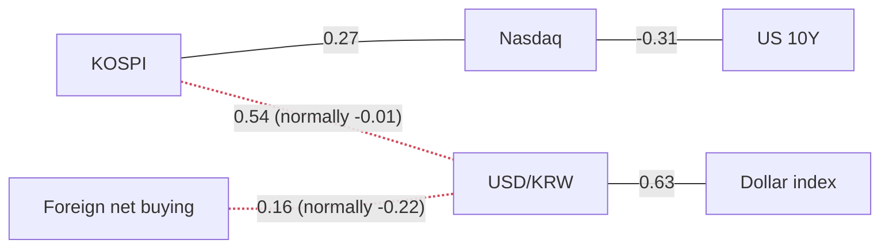

> **이 글의 숫자는 어디서 오는가.** 모든 수치는 FRED(미국 세인트루이스 연준의 공개 데이터)와 네이버 금융에서 자동으로 받아 계산한 것입니다. 기사에 나온 숫자는 **하나도** 쓰지 않았습니다. 기사는 "왜 그렇게 움직였는가"를 설명할 때만 인용합니다. 이 원칙을 지키는 이유는 단순합니다. 언론사 수치와 데이터 제공사 수치는 출처도 기준일도 다르기 때문에, 섞어 쓰면 글 안의 계산이 서로 맞지 않게 됩니다.

## 오늘의 기준 시각

작성 시각은 **2026-09-18 15:31 KST**(미국 동부 02:31 EDT)입니다.

- **한국 숫자는 종가지만, 겨우 종가입니다.** 서울 장은 15:30에 끝났고 이 글의 데이터는 1분 뒤에 받았습니다. 지수 수치는 장중 스냅샷이 아니라 종가입니다.
- **다만 투자자별 순매수 세 줄은 종가의 "첫 발표값"입니다.** 어제 외국인 순매도는 10:55에 읽은 값과 종가 사이에 세 배 이상으로 늘었습니다. 그래서 오늘의 순매수 숫자는 잠정치로 보시고, 내일 다시 확인하는 편이 안전합니다.
- **미국은 이미 다 닫혔습니다.** 가장 최근에 끝난 미국 정규장은 **9월 17일(목)** 장입니다. 오늘 밤 뉴욕 개장은 한국시간 **22:30**입니다. (한국은 UTC+9로 서머타임이 없고, 미국 동부는 지금 EDT(UTC−4)이므로 차이는 **13시간**입니다.)

### FOMC 이후 데이터가 드디어 들어왔습니다

어제 이 시리즈의 가장 큰 한계는 "금리를 올린 그날의 데이터가 아직 안 나왔다"는 것이었습니다. 오늘은 다릅니다. **10년물·2년물·실질금리가 모두 결정일인 2026-09-16 자로 발표**되었고, 장단기 금리차와 기대인플레이션은 **2026-09-17**까지 나왔습니다. 어제는 이 중 셋이 발표 전에 멈춰 있었습니다. 즉 **오늘이 "금리 인상이 무엇을 했는가"에 처음으로 답할 수 있는 데이터**입니다.

### 발표가 늦은 시리즈 (정상입니다)

FRED는 시리즈마다 발표 주기가 다릅니다. 목록이 길다고 해서 뭔가 고장 난 것이 아닙니다.

- **원/달러, 달러 기준 코스피, 광범위 달러지수, 원화 기준 WTI** — 모두 **2026-09-11** 기준, **7일 전**
- **WTI** — **2026-09-15** 기준
- 데이터 수집 오류는 없었습니다.

> **가장 중요한 단서입니다.** 원/달러의 마지막 관측치는 연준 결정 **이전**입니다. 그리고 오늘 환율 기사들이 전하는 움직임은 이 데이터와 **반대 방향**입니다 — 어느 쪽이 무엇을 말하는지는 아래 "어제의 세 가지 질문" 3번에서 그대로 비교해 두었습니다. **이 글의 환율 관련 수치를 현재 시점의 값으로 읽지 마십시오.**

## 오늘의 한 가지

**연준의 금리 인상은 거의 전부 "실질금리" 상승으로 소화되었고, 위험을 값으로 매기는 쪽은 아무 반응도 하지 않았습니다.**

10년물 국채금리의 20일 상승폭 **+30bp** 중 **+27bp**가 실질금리 몫입니다. 어제는 같은 계산이 3분의 2였는데, 오늘은 10분의 9로 늘었습니다. 실질금리·10년물·2년물이 **셋 다 1년 범위의 100%** 지점에 함께 있습니다.

그런데 같은 날 하이일드 신용스프레드는 오히려 **좁아져** 1년 범위의 **11.6%**로 내려갔고, VIX는 **24.1%** 자리에 있고, 나스닥은 **+1.69%** 올라 범위의 **89.3%**에 있습니다. 할인율이 1년 중 최고 수준이라는 것은 교과서적으로 바로 그 자산들을 압박하는 조건입니다. 그런데 신용과 변동성은 어제보다 위험을 **더 싸게** 매겼습니다.

## 어제의 세 가지 질문

### 1. "FOMC 이후 첫 20일 분해에서도 실질금리가 기대인플레이션보다 큰 조각인가?"

**그렇습니다. 그것도 압도적으로 — 어제 걸어둔 반증 조건은 발동하지 않았습니다.** 오히려 반대 방향으로 벌어졌습니다.

2026-09-16 기준 공통 달력에서 **+30bp = 실질 +27bp + 기대인플레 +3bp**이고, 항등식이 정확히 닫힙니다(잔차 **−0.00pp**). 어제는 인상 전 구간에서 **+28bp = 실질 +18bp + 기대인플레 +10bp**였습니다. 기대인플레이션 조각이 **+10bp에서 +3bp로** 쪼그라드는 동안 실질금리 조각은 커졌습니다.

어제 정한 "미국 강세론으로 갈아타는 조건"은 *2년물이 범위 최상단에서 내려오면서* 기대인플레이션이 실질을 추월하는 것이었습니다. 둘 다 일어나지 않았습니다. 2년물은 결정일에 **+7bp** 올랐고 1년 범위 위치는 여전히 **100%**입니다.

### 2. "장단기 금리차가 1년 최저에 머물렀나, 아니면 결정일 하루의 경련이었나?"

**그대로 머물렀습니다.** 장단기 금리차는 **0.27%**, 1년 범위 위치 **0.0%**, 그리고 **당일 보합**입니다. 데이터의 일간 방향 부호가 `flat`으로 찍혀 있는데, 이것은 값이 없다는 뜻이 아니라 **"움직이지 않았다"는 답**입니다. 20일로는 **−19bp**이고 데이터가 붙여준 표현은 "곡선이 납작해졌다"입니다.

이 시리즈는 이제 결정일을 지나 **2026-09-17**까지 발표되었으므로, 이 답은 오래된 데이터 때문에 생긴 착시가 아닙니다. 이틀 연속 1년 최저면 더 이상 하루의 경련이 아닙니다.

### 3. "원/달러가 드디어 발표되었나? 기사들이 말하는 대로 원화가 약해졌나?"

**아닙니다. 원/달러는 여전히 2026-09-11입니다** — 이걸로 세 번째 글 연속이고, 7일 전이며, 연준 결정을 보지 못한 값입니다. 데이터는 **1,340.30**, 20일 **−5.48%**, 모든 구간의 표현이 **"원화가 강해졌다"**, 1년 범위 위치 **0.2%** — 사실상 범위의 바닥입니다.

**그런데 불일치가 더 커졌고, 이제는 애매한 수준이 아닙니다.** 오늘 환율 기사 묶음에는 *"원·달러 환율 6거래일간 46.1원 급등"*, *"달러-원 환율 일주일 새 50원 급반등"*, *"FOMC 충격에 원·달러 1380원대"*가 들어 있습니다. 이 숫자들은 기사의 것이고 **이 글은 채택하지 않습니다.** 다만 기사 방향은 하나같이 데이터의 모든 구간과 반대입니다.

**정직하게 읽으면 이렇습니다.** 파이프라인의 원화 값은 FOMC 이전 관측치이고, 거기 붙은 "원화가 강해졌다"는 표현은 그 뒤에 되돌려진 한 주를 설명하고 있습니다. 달러 기준 코스피, 달러지수, 원화 기준 WTI, 그리고 환율 정합 블록 두 개가 모두 이 한계를 그대로 물려받습니다.

## 한국 — 종가 기준

| | 종가 | 전일비 | 20일 | z | 고점대비 | 기준일 |
|---|---|---|---|---|---|---|
| 코스피 | 6,895.55 | ▲ **+2.68%** | −0.25% | **+1.16** | −24.35% | 2026-09-18 |
| 코스닥 | 827.11 | ▲ +0.60% | +3.14% | +0.28 | −32.55% | 2026-09-18 |
| 원/달러 | 1,340.30 | ▼ −0.40% | −5.48% | −0.68 | −13.86% | **2026-09-11** |
| 코스닥/코스피 | 0.1199 | ▼ −2.03% | +3.40% | **−1.26** | −52.82% | 2026-09-18 |

**한국의 대답은 이틀 늦게 왔고, 상승이었습니다.** 오늘 코스피의 +2.68%는 한·미 양쪽 통틀어 오늘 표에서 가장 큰 하루 변동입니다. 어제는 −0.04%로 마감했습니다. 지수는 1년 범위의 **62.4%** 지점에 있고 연초 대비 **+63.63%**이며, 252일 고점 대비로는 **−24.35%** 내려와 있습니다. 20일 수익률은 **−2.00%에서 −0.25%로** 개선됐는데, 이건 옛날 데이터가 바뀐 게 아니라 오늘 하루가 만든 변화입니다.

**대형주가 끌었습니다.** 코스닥/코스피 비율에 데이터가 붙여준 표현은 "대형주가 소형주를 앞섰다"입니다. 어제 종가는 z +0.62로 정반대를 말했으니 하루 만에 뒤집힌 것입니다. 실현 변동성은 코스피 **33.2%** 대 나스닥 **13.5%** — 대략 두 배 반입니다. 이건 견해이기 전에 **투자 규모를 정할 때 쓰는 입력값**입니다.

### 투자자별 순매수 (종가 첫 발표값, 억 원)

| | 오늘 | 5일 누적 | 20일 누적 | z (최근 1년 대비) |
|---|---|---|---|---|
| 외국인 | **+4,317** | −83,776 | **−217,307** | +0.57 |
| 기관 | **+15,020** | +8,297 | +22,751 | **+1.01** |
| 개인 | **−35,940** | −6,034 | −122,684 | **−1.56** |

**외국인이 매도를 멈추고, 개인이 그 반대편을 받았습니다.** 어제 외국인은 **−22,760억**을 팔았습니다. 개인의 z **−1.56**은 오늘 표에서 절대값이 가장 큰 수급 수치이고, **+2.68%** 오른 장에 팔았다는 점이 눈에 띕니다. 다만 "전환"이라 부르기 전에 20일 칼럼을 보십시오. 하루로 **−217,307억**이 지워지지는 않습니다.

> **"모두가 팔고 있다"는 표현은 쓰지 않습니다.** 네이버가 공개하는 주체는 외국인·기관·개인 세 가지인데, **기타법인**이 빠져 있습니다. 그래서 이 세 숫자는 0으로 합산되지 않고, 20일 칼럼이 남기는 큰 순액은 누군가가 받아냈다는 뜻입니다. 팔린 주식은 전부 누군가가 산 것입니다.

> **수급 z만 기준이 다릅니다.** 수급 z는 **252일(약 1년), 당일 포함** 구간으로 계산합니다. 이 글의 다른 모든 z는 **756일(약 3년), 당일 제외**입니다. "최근 1년 대비"와 "최근 3년 대비"를 섞어 읽지 마십시오.

### 종목별 상대강도 (종가)

| | 종가 | 전일비 | 20일 | 지수 대비(20일) | z | 고점대비 |
|---|---|---|---|---|---|---|
| SK하이닉스 | 1,857,000 | ▲ **+5.15%** | +7.34% | **+7.59pp** | +1.15 | −36.38% |
| LG화학 | 267,000 | ▼ −1.11% | +5.74% | +5.99pp | −0.33 | −37.83% |
| POSCO홀딩스 | 323,000 | ▼ −1.52% | +4.19% | +4.45pp | −0.52 | −39.63% |
| 삼성전자 | 261,000 | ▲ +1.95% | −7.28% | **−7.03pp** | +0.55 | −28.00% |
| 현대차 | 365,000 | ▲ +0.14% | −12.05% | **−11.80pp** | +0.00 | −51.33% |

**격차는 좁혀지지 않고 벌어졌고, 가장 큰 두 종목이 양 끝에 있습니다.** 분포는 **+7.59pp에서 −11.80pp**까지로, 어제의 **+5.73pp ~ −11.17pp**보다 넓어졌습니다. 삼성전자는 **+1.95%** 올랐는데도 지수 대비로는 **어제 −4.27pp에서 오늘 −7.03pp로** 밀렸습니다. 지수가 더 많이 올랐기 때문입니다. 반도체 두 종목이 같이 올랐는데 둘 사이 격차는 커졌습니다. 현대차는 1년 범위의 **28.2%** 자리에서 여전히 최하위입니다.

> 이 표의 "지수 대비"는 **수익률 차이(%p)**이고, 지수 상승에 대한 **기여도가 아닙니다.** 데이터에 시가총액 가중치가 없으므로 기여도는 계산할 수 없습니다.

**"그래서 나는 실제로 돈을 벌었나?"** 이 질문에 답하려면 원화 수익률과 달러 수익률을 **같은 날짜 집합에서** 비교해야 합니다. 2026-09-11까지의 **공통 거래일 1,186일** 기준으로, 20일 동안 코스피는 원화로 **+5.03%**, 달러로 **+10.98%**, 같은 날들의 원/달러는 **−5.37%**였습니다. 세 값은 정확히 맞물립니다.

> **여기서 읽어야 할 것은 두 수익률의 "차이"(약 5.96%p)이고, 어느 한쪽의 수준이 아닙니다.** 정합 구간은 표준 구간보다 달력상 더 뒤로 뻗기 때문에, 위 표의 20일이 **−0.25%**인데 정합 블록의 원화 수익률은 **+5.03%**입니다. 같은 지수, 다른 구간, 둘 다 맞습니다. 그리고 이 블록 전체가 7일 전에서 멈춰 있습니다.

## 미국

| | 수준 | 전일비 | 20일 | z | 1년 범위 위치 | 기준일 |
|---|---|---|---|---|---|---|
| **10년 TIPS 실질금리** | 2.68% | **+6bp** | **+27bp** | **+1.33** | **100%** | **2026-09-16** |
| **미 2년물** | 4.74% | **+7bp** | +55bp | **+1.23** | **100%** | **2026-09-16** |
| **미 10년물** | 5.01% | +1bp | +30bp | +0.17 | **100%** | **2026-09-16** |
| 장단기 금리차(10Y−2Y) | 0.27% | 보합 | −19bp | −0.04 | **0.0%** | 2026-09-17 |
| 10년 기대인플레이션 | 2.33% | 보합 | +3bp | −0.00 | 46.9% | 2026-09-17 |
| 하이일드 신용스프레드 | 2.70% | **−6bp** | −3bp | **−0.83** | **11.6%** | 2026-09-16 |
| VIX | 17.71 | ▲ +2.97% | +18.94% | +0.32 | 24.1% | 2026-09-16 |
| 나스닥 종합 | 26,418.30 | ▲ +1.69% | +0.33% | **+1.25** | 89.3% | 2026-09-17 |
| S&P 500 | 7,637.76 | ▲ +1.14% | −0.91% | +1.12 | 88.9% | 2026-09-17 |
| WTI 유가 | $107.02 | ▲ +4.49% | +24.38% | **+1.74** | 87.2% | 2026-09-15 |
| 광범위 달러지수 | 118.21 | ▲ +0.11% | −0.82% | +0.39 | 17.3% | **2026-09-11** |
| 실효 연방기금금리 | 3.63% | 보합 | 보합 | +0.08 | 50.0% | 2026-09-16 |

> **단위를 반드시 구분하십시오.** 금리·스프레드는 **bp(베이시스포인트, 0.01%p)** 단위이고, 주식·유가·달러는 **%** 단위입니다. 금리 데이터의 `0.06`은 **+6bp**이지 +6%가 아닙니다. 백 배 차이입니다.

> **"1년 범위 위치"는 백분위가 아닙니다.** 최근 252거래일의 최저~최고 구간에서 현재 값이 **밑에서부터** 몇 % 지점인지입니다. 3년 기준도 아니고, 분포상 백분위도 아닙니다.

위쪽 굵은 세 줄이 어제의 질문에 답한 줄입니다. 미국 주식은 양 지수 모두 올랐고, 20일로는 나스닥이 S&P를 **+1.24%p** 앞섭니다.

**실효 연방기금금리는 아직 3.63% 보합인데, 이것은 오류가 아닙니다.** 오늘 금리 기사 묶음은 9월 FOMC에서 3년여 만에 처음으로 0.25%p 인상이 있었다고 전합니다 — 이것은 **기사의 숫자이고 이 글은 데이터로 채택하지 않습니다.** 연준이 실제로 "운영하는" 금리는 아직 그 인상을 찍지 않았습니다. 시리즈 기준일이 2026-09-16이고, 새 목표범위는 결정 이후에 효력이 생기기 때문입니다. 이 줄에서 보합이 아닌 구간은 연초 대비 **−1bp**뿐이고 표현은 "정책금리가 내렸다"입니다 — 2026년 전체로는 맞고, 이번 주에 대해서는 오해를 부르는 말입니다. **표의 나머지는 모두 시장의 반응이고, 이 줄만 아직 따라오는 중인 실물 금리입니다.**

### 10년물 분해 — 같은 금리 상승이 정반대를 뜻할 때

명목 국채금리는 정확히 두 조각으로 쪼개집니다. **기대인플레이션**은 채권시장이 만기까지 평균 물가상승률을 얼마로 보는지이고, **실질금리**는 거기서 그걸 뺀 나머지입니다.

2026-09-16 공통 달력 기준: **5.01% = 실질 2.68% + 기대인플레 2.33%**, 잔차 **−0.00pp**.

20일 변화: **+30bp = 실질 +27bp + 기대인플레 +3bp**.

**왜 이 구분이 중요한가.** 기대인플레이션이 올라서 금리가 오른 것이면, 물가가 오르는 만큼 기업 매출도 일부 따라 오르므로 주식에 주는 타격이 상대적으로 덜합니다. 반대로 **실질금리가 올라서 금리가 오른 것이면, 미래 이익을 현재가치로 깎는 할인율이 그대로 올라간 것**이므로 멀리 있는 이익에 기대는 주식(장기 성장주)의 밸류에이션을 직접 압축합니다. 오늘은 한 달 상승분의 10분의 9가 실질금리 몫이고, 데이터는 실질금리에만 "장기 듀레이션 주식의 직접적인 멀티플 압축"이라는 결과를 달아 두었습니다. 기대인플레이션에는 아무 결과도 달려 있지 않습니다.

상관관계에도 이 메커니즘의 흔적이 있습니다. 나스닥↔10년물은 평균 **−0.15** 대비 **−0.31**로 유지되고 있습니다. 없는 것은 나스닥 자체의 가격에서 보이는 흔적입니다 — **+1.69%** 올라 범위의 **89.3%**에 있습니다.

> 이 세 숫자는 반드시 분해 블록에서만 읽어야 합니다. 10년물·실질금리·기대인플레이션을 각각의 개별 시리즈에서 따와 더하면, 세 시리즈의 발표 달력이 달라서 합이 맞지 않습니다.

### 신용·변동성·유가

**하이일드 신용스프레드**는 위험한 기업 부채를 들고 있는 대가로 대주(貸主)가 국채보다 얼마를 더 요구하는지입니다. **넓으면 공포, 좁으면 자신감**입니다. 오늘은 **6bp 좁아져 2.70%**, z **−0.83**, 1년 범위 위치는 어제 **18.6%**에서 **11.6%**로 내려갔습니다. 실질금리가 범위 최상단을 찍은 날에 대주들은 부도 위험을 **더 싸게** 매긴 것입니다.

> **이 z는 무게를 깎아서 읽어야 합니다.** 이 시리즈는 756일 채점 구간에 대해 관측치가 **798개**뿐입니다. 즉 "3년 분포"가 사실상 시리즈의 전 생애라서, 구간 밖 맥락이 거의 없습니다. 10년물의 **16,162개**와 비교하면 같은 756일 구간이 얇은 한 조각에 불과합니다. **관측치 수가 다른 두 z를 같은 신뢰도로 놓지 마십시오.**

VIX는 **17.71**, z **+0.32**, 범위의 **24.1%** — 20일로는 **+18.94%** 올랐지만 수준 자체는 낮습니다. **신용도 변동성도 금리 쪽 이야기를 뒷받침하지 않고, 오늘은 오히려 더 멀어졌습니다.**

**유가는 어제 글과 같은데, 시리즈 자체가 그대로이기 때문입니다.** 여전히 2026-09-15 기준 **$107.02**, z **+1.74**로 표에서 절대값이 가장 큰 z이고, 범위의 **87.2%**입니다. 오늘 유가 기사들은 국제유가 100달러 돌파와 유류세 인하 연장을 전하는데, 방향은 데이터와 일치하고 숫자의 출처는 아닙니다. 정합 블록은 아직 2026-09-11의 **$101.27**에서 멈춰 있습니다 — 달력이 다른 것이지 모순이 아니고, 두 값을 짝지어 쓰면 안 됩니다.

## 오늘 실제로 연결되어 있는 것

상관계수는 해당 구간에서 **측정된 값**이며 인과관계 주장이 아닙니다. 붉은 점선은 1년 평균에서 관계가 끊어졌다는 표시입니다.

선에 화살표가 없는 것은 의도한 것입니다. 상관관계에는 방향이 없습니다 — 두 값이 같이 움직였다는 말일 뿐, 어느 쪽이 먼저인지는 말해주지 않습니다.

유지되는 연결 셋: 코스피↔나스닥 **+0.27**(평균 +0.13), 원/달러↔달러지수 **+0.63**(평균 +0.62), 나스닥↔10년물 **−0.31**(평균 −0.15).

**끊어진 두 연결은 어제와 소수점 둘째 자리까지 똑같고, 이유는 이제 사흘째 같습니다 — 움직일 수가 없습니다.** 둘 다 원/달러가 들어가는데 그 값이 2026-09-11에 멈춰 있습니다. 같은 관측치를 다시 계산하는 것이므로, 그 시리즈가 발표될 때까지 이 두 선은 얼어 있습니다.

### 끊어진 연결 1 — 코스피 ↔ 원/달러: +0.54 (평균 −0.01)

**교과서 메커니즘.** 외국인이 한국 주식을 사려면 먼저 원화를 사야 합니다. 그래서 자금이 들어오면 지수와 원화가 함께 오릅니다. 코스피와 원/달러로 측정하면 — **원/달러가 오르는 것은 원화가 약해지는 것**이므로 — 상관은 **음수**여야 합니다. 평균 **−0.01**은 평소에도 이 관계가 약하다는 뜻이지만, 양수는 아닙니다.

**현재는 성립하지 않습니다.** **+0.54**는 최근 60일 동안 두 시리즈의 **일간 변화**가 같은 방향으로 움직였다는 뜻입니다. 이것은 각각이 그 기간에 어느 쪽으로 흘렀는지는 말해주지 않습니다. 20일 동안 원/달러는 **−5.48%**이고 데이터의 표현은 **"원화가 강해졌다"**입니다. 두 문장이 동시에 참이며, 이걸 하나로 뭉개는 것은 이 시리즈가 이미 한 번 저지른 실수입니다.

**가설, 그리고 어제보다 약해진 근거.** 반도체 수출 호조가 만든 큰 무역흑자라면 지수와 원화를 같이 밀어올려, 주식 자금 경로에 기반한 상관을 뒤집을 수 있습니다. 원화가 1년 범위의 **0.2%**에 있는 것과도 맞습니다. 그런데 이 이야기의 통화 쪽 절반은 오늘 기사들이 반박하는 7일 전 관측치입니다. **이 선은 유용한 정보가 아니라 "판정 보류"로 취급하는 것이 맞습니다.**

### 끊어진 연결 2 — 외국인 순매수 ↔ 원/달러: +0.16 (평균 −0.22)

**교과서 메커니즘.** 외국인 순매수는 원화 매수를 수반하므로 원/달러를 낮추는 쪽으로 작용해야 합니다. 음수가 기대 부호이고 평균은 **−0.22**입니다.

**성립하지 않습니다.** **+0.16**은 부호가 뒤집힌 것입니다 — 외국인이 파는 날에 원화가 강해졌다는 뜻입니다. 20일 외국인 순매도 **−217,307억**과 1년 중 가장 강한 수준에 가까운 원화가 겹친 모양은, 수출기업의 달러 환전이 주식 자금 경로를 압도할 때 나오는 그림입니다. **끊어진 두 연결은 아마 두 개가 아니라 하나의 현상입니다** — 같은 얼어붙은 시리즈를 두 각도에서 본 것이고, 같은 이유로 검증이 안 됩니다.

## 양쪽 모두의 논리

같은 데이터가 두 가지 읽기를 동시에 지지할 때가 많습니다. 결론으로 건너뛰기 전에, 양쪽에서 **가장 강한** 주장을 각각 세워 봅니다. 그리고 원화는 포트폴리오의 양쪽을 반대로 건드리기 때문에, 한국과 미국을 따로 봅니다.

**한국 — 강세론.** 미국의 금리 인상을 받고 이틀 뒤에 z **+1.16**의 상승으로 답했습니다. 외국인이 순매수로 돌아섰고 기관은 z **+1.01**로 **+15,020억**을 담았습니다. SK하이닉스는 20일 기준 지수를 **+7.59%p** 앞서고, 코스닥도 같은 구간 **+3.14%**입니다 — 한 지수, 한 종목의 힘이 아닙니다.

**한국 — 약세론.** 이 상승이 한 달을 되돌린 것은 아닙니다. 외국인은 20일 누적 **−217,307억**이고, 252일 고점 대비로는 **−24.35%** 아래입니다. 삼성전자는 당일 올랐는데도 지수 대비 **−7.03%p**로 밀렸고, 현대차는 1년 범위 **28.2%** 자리에서 **−11.80%p** 뒤처져 있습니다. **가장 큰 한국 기업이 오르는 날에 뒤처진다는 것이 약세론의 한 줄 요약입니다.**

**미국 — 강세론.** 위험 가격이 금리 쪽 이야기를 도저히 확인해주지 않습니다. 결정을 지나며 스프레드는 오히려 **좁아졌고**, VIX는 범위의 **24.1%**, 기대인플레이션은 당일 **보합**에 z **−0.00**입니다. 정책이 긴축으로 돌아섰는데 기대 물가를 올려 매기지 않는 채권시장은, 그 긴축이 통할 것이라고 믿는 채권시장입니다. 두 주식 지수 모두 올랐고 나스닥의 z는 **+1.25**입니다.

**미국 — 약세론.** 실질금리·10년물·2년물이 **한꺼번에 1년 범위 100%**에 있고, 금리차는 범위의 **0.0%** — 1년 중 가장 납작합니다. z **+1.74**의 유가는 공급 측에서 오는 물가 압력이고, 통화 긴축이 가장 손을 쓰기 어려운 종류입니다. **이만큼 거의 전부 실질금리로 이루어진 할인율 상승은 주식 멀티플에 기계적인 결과를 가지며, 그것이 아직 주가에 도달하지 않았을 뿐입니다.** "아직 아니다"는 "아니다"가 아닙니다.

## 사이클 상 위치

**판단: 여전히 기다림. 그런데 이번 주 처음으로, 데이터가 없어서가 아닙니다.** FOMC 이후 수치가 도착했고, 분명했고, 그런데도 질문을 해소하지 못했습니다 — 같은 시장의 두 부분 사이의 **불일치**로 날카로워졌을 뿐입니다. 증거를 기다리는 것과 증거가 서로 어긋나서 기다리는 것은 다른 자리이고, 지금은 후자입니다. **기다림도 하나의 포지션입니다.**

**판단을 기울인 수치: +30bp 중 +27bp의 실질금리 조각, 그리고 1년 범위 100%의 실질금리.** 결정일을 찍은 것들 중에서 이게 가장 중요한데, 데이터가 유일하게 **기계적인 결과를 명시해 붙여 둔** 수치이기 때문입니다. 강세론은 신용과 변동성이 반응을 거부한다는 데 기대고 있지만, 그 스프레드 수치는 위에서 말한 이유로 근거가 얇고 실질금리는 그렇지 않습니다. 둘은 틀렸을 때 치르는 대가가 대칭이 아닙니다.

**반증 조건.** 하이일드 스프레드가 범위 **11.6%**에서 넓어지기 시작하는데 실질금리가 **100%**에 머문다면, 신용이 금리에 동의한 것이고 기다림은 약세 방향으로 끝납니다. 반대로 **20일 실질 조각이 새 구간에서 기대인플레이션 조각 아래로 다시 내려가면**, 이번 움직임은 자본의 실질 비용이 아니라 정책 경로의 재평가였다는 뜻이고 판단은 미국 강세론으로 옮겨갑니다. 둘 다 내일 데이터가 답해줄 관측입니다.

**어떤 종목을 사라거나 팔라는 이야기는 하지 않습니다.** 이 글은 틀과 메커니즘까지입니다.

## 오늘의 용어 — 신용스프레드 (credit spread)

**신용스프레드**는 같은 만기 국채 대신 위험한 회사채를 들고 있는 대가로 대주가 더 요구하는 금리입니다. 설명을 위한 가상의 예로, 10년 국채가 5%를 주고 하이일드 회사채 묶음이 7.7%를 준다면 스프레드는 **2.7%p**이고, 그 2.7%p 전체가 "이 회사들 중 일부가 못 갚을 위험"의 값입니다. (앞의 두 숫자는 예시이며 오늘의 데이터가 아닙니다. 오늘의 실제 스프레드는 아래에 있습니다.)

돈을 빌려달라는 이웃 두 사람을 생각해 보십시오. 한 명은 공무원이고 한 번도 연체가 없습니다. 다른 한 명은 작년에 잘 되던 식당을 합니다. 둘 다에게 빌려주겠지만 같은 금리로는 아닐 것이고, **두 금리의 차이가 식당의 승산에 대한 당신의 솔직한 견해**입니다. 입으로 말할 필요가 없습니다. 숫자에 들어 있습니다.

그래서 회사채를 살 일이 없어도 볼 가치가 있습니다. **신용스프레드는 돈을 걸고 있는 사람들이 매일 갱신하는, 부도에 대한 시장 전체의 견해**이고, 전망도 해설도 붙어 있지 않습니다.

**실전에서 읽는 법.** 수준과 방향을 따로 보고, 반드시 할인율과 같이 보십시오.

- **금리가 오르는데 좁고 더 좁아지는 중** — 대주들이 긴축의 대가에 대해 채권시장과 다르게 보고 있다는 뜻입니다. 한쪽은 틀립니다. 그리고 범위 바닥에 붙은 스프레드는 더 좁아질 여지는 거의 없고 넓어질 여지는 아주 많습니다. **오늘이 정확히 이 경우입니다.**
- **넓고 더 넓어지는 중** — 위의 연쇄가 실제로 돌고 있습니다. 이 단계면 보통 주가는 이미 알고 있습니다.
- **넓지만 좁아지는 중** — 공포가 지나가고 있다는 가장 이른 신호일 때가 많고, 주식보다 앞서는 경향이 있습니다.

그리고 **이 시리즈에는 역사가 얼마나 있는지를 꼭 확인하십시오.** z는 최근 3년 구간과 오늘을 비교하는데, 시리즈가 그 구간보다 의미 있게 긴 역사를 가질 때만 "이례적"이라는 말이 성립합니다. 오늘의 **798개** 관측치가 그렇지 않은 경우입니다.

## 가격을 움직인 뉴스

**1. 9월 FOMC의 정책금리 인상, 그리고 그 움직임을 실질금리가 가져갔습니다 (결정일 2026-09-16).** 오늘 금리 기사 묶음은 사건 자체에 대해 매체들이 일치합니다 — *"미국 기준금리 3년 2개월 만에 인상"*, *"트럼프 반대에도 금리 인상"*, 그리고 위원 다수가 연내 추가 인상을 시사했다는 보도. **기사는 "왜"를 주고, 크기는 데이터에서 옵니다.** *움직인 가격:* 2년물 **+7bp**로 **4.74%**(z **+1.23**), 실질금리 **+6bp**로 **2.68%**(z **+1.33**), 둘 다 1년 범위 **100%**. *메커니즘:* 단기 구간이 기대 정책 경로를 다시 매기는데, 기대 물가가 함께 움직이지 않았으므로 상승분 전체가 자본의 실질 비용에 얹힙니다.

**2. 한국 반도체가 지수 전반의 상승을 끌었습니다 (2026-09-18).** 반도체 기사 묶음에는 미국 반도체주 강세와 엔비디아 최고경영자의 칩 수요 전망이 들어 있습니다. *움직인 가격:* SK하이닉스 **+5.15%**(z **+1.15**), 삼성전자 **+1.95%**, 코스피 **+2.68%**(z **+1.16**), 그리고 코스닥/코스피 비율 **−2.03%**이 대형주 주도를 확인해 줍니다.

두 건입니다. 오늘의 나머지 움직임은 기계적이거나 얼어 있습니다 — 유가와 환율 시리즈는 발표되지 않았습니다.

## 분야별 흐름

로컬에서 돌리는 언어모델(`qwen2.5:14b`)이 기사 제목을 요약한 것으로, **주제만** 읽습니다 — 이 절의 어떤 숫자도 요약에서 오지 않았습니다. 일곱 분야 중 다섯이 사용 가능한 요약을 냈고, 둘은 검증에서 반려됐습니다.

**반도체** — *"삼성전자와 SK하이닉스의 주가가 상승하면서 반도체 업종 전체가 강세를 보이고 있다."* 데이터와 깔끔하게 맞습니다. 두 종목 모두 올랐고 SK하이닉스는 20일 기준 지수를 **+7.59%p** 앞섭니다.

**자동차** — *"현대차와 기아의 미국 시장 점유율과 수익성이 위협받고 있다. 엔화의 강세로 일본 자동차의 경쟁력이 높아지면서 두 회사의 비상 경보가 울리고 있다."* 주제는 한국 표에서 가장 나쁜 수치인 현대차 **−11.80%p**와 맞습니다. **그런데 메커니즘 부분은 뒤집혀 있어 신뢰하면 안 됩니다:** 출처 기사 제목은 *"엔저에 웃는 일본차"* — **약한** 엔화가 일본 업체를 돕는다는 것인데, 모델은 엔화의 **강세**라고 썼습니다. 강한 엔화는 반대로 작용합니다. 검증 장치는 형식을 보고 경제 논리를 보지 않습니다.

**금리** — *"미국 연준이 기준금리를 인상함으로써 긴축 정책을 다시 시작헀다. 이 결정은 연준의 인플레이션 억제 의지를 보여주며, 시장은 연내 추가 인상 가능성에 주목하고 있다."* 세상에 대해서는 맞고 기사 묶음과도 일치하지만, **데이터의 유일한 비(非)보합 구간과는 어긋납니다** — 연초 대비 **−1bp**, "정책금리가 내렸다" — 운영 금리가 아직 인상을 찍지 않았기 때문입니다. 모델은 결정을 말하고, 데이터는 시리즈를 말합니다. 오타는 모델의 것입니다.

**환율** — *"미국의 금리 인상이 장기화되면서 한국의 환율이 상승 압력을 받고 있다."* **이 문장은 데이터와 정면으로 어긋납니다.** 데이터는 모든 구간에서 **"원화가 강해졌다"**고 말합니다. 그리고 여기서는 **모델이 맞고 데이터가 낡았을 가능성이 높습니다.** 원/달러가 2026-09-11 이후 발표되지 않았기 때문입니다. 지우지 않고 표시해 둡니다 — 위의 세 번째 질문을 보십시오.

**포스코홀딩스** — *"장인화 포스코그룹 회장이 빠른 실행력을 강조하며 '트리플코어' 전략의 실행 속도를 높이고 있다."* 기업 전략이고, 측정된 수치와 정직하게 연결할 고리가 없습니다.

**유가** — 요약 없음 — 모델 출력이 반려됨 (근거 없는 수치: `01`). 기사 제목에서 직접 읽으면: 국제유가 100달러 돌파, 유류세 인하 11월까지 연장, 그리고 이란 사태 장기화로 JP모건이 유가 모델링이 불가능하다고 밝힌 것.

**LG화학** — 요약 없음 — 모델 출력이 반려됨 (금지된 표현: `영향을 미`). LG화학은 그럼에도 20일 기준 지수를 **+5.99%p** 앞서 있습니다.

> **이 절은 이 글에서 가장 신뢰도가 낮습니다.** 검증 장치는 형식만 봅니다 — 숫자를 지어내지 않았는지, 얼버무리지 않았는지, 한국어를 유지했는지. **어떤 이야기를 골랐는지, 그 논리가 맞는지는 보지 않습니다.** 7B가 아니라 14B 모델이지만, 오늘 두 요약이 각각 그 한계를 보여줬습니다. 로컬 모델이 실제로 무엇을 내놓는지 보여드리기 위해 문장을 손보지 않고 그대로 실었습니다.

## 앞으로 확인할 일정

- [ ] **다음 원/달러 발표** — 현재 **2026-09-11**, 7일 전. 세 번째 질문을 해소하고, 끊어진 두 상관을 녹이고, **+0.54**라는 코스피↔원화 수치가 국면 변화인지 데이터 아티팩트인지 판정합니다. 이 글에서 가장 값어치 있는 미결 관측입니다.
- [ ] **오늘 밤 22:30 KST (미 동부 2026-09-18 09:30 EDT)** — 뉴욕 개장. 이 글의 미국 수치는 9/16~9/17 종가이고, 오늘 밤 장은 이 글이 전혀 보지 못한 첫 장입니다.
- [ ] **다음 신용스프레드·실질금리 발표 (월요일 데이터)** — 이 글의 반증 조건을 직접 판정합니다. 실질금리가 **100%**에 머무는 동안 신용스프레드가 **11.6%**에서 넓어지기 시작하는가?
- [ ] **월요일 서울 장, 09:00–15:30 KST (2026-09-21)** — 외국인 순매수 전환이 진짜 전환이었는지, 20일 흐름에 맞선 하루였는지.
- [ ] **2026년 남은 FOMC** — 기사들은 위원 다수가 연내 추가 인상을 시사했고 적어도 한 곳은 10월 회의 인상을 예상한다고 전합니다. 데이터가 아니라 전망입니다.

## 내일 확인할 세 가지

1. **실질금리가 범위 최상단에 머무는 동안, 하이일드 스프레드가 1년 범위 바닥에서 넓어지기 시작했는가?** 이것이 오늘의 반증 조건입니다. 신용이 금리에 동의하면 기다림은 약세로 끝나고, 더 좁아지면 불일치가 길어집니다.
2. **원/달러가 발표되었는가, 그리고 새 값은 데이터 쪽인가 기사 쪽인가?** 세 번째 글 연속 미뤄진 질문입니다. 2026-09-11 이후 첫 관측치가 방향 논쟁과 "끊어진 두 상관이 국면이었는지"를 함께 판정합니다.
3. **종가 수급 숫자가 재확인을 통과했는가?** 오늘 수치는 종이 울린 지 1분 뒤에 발표된 값입니다. 어제 외국인 수급은 장중 값과 확정 종가 사이에 세 배 이상으로 늘었으므로, 외국인 **+4,317억**과 개인 **−35,940억**이 확정 데이터에서도 그대로인지 확인해야 합니다.

## 출처

**(a) 데이터 — 이 글의 모든 숫자는 여기서만 나옵니다.**

| 항목 | 출처 | 기준일 |
|---|---|---|
| 코스피, 코스닥, 코스닥/코스피, 추적 5종목 | 네이버 금융 | 2026-09-18 |
| 코스피·코스닥 투자자별 순매수 | 네이버 금융 | 2026-09-18 (첫 발표값) |
| 미 10년물, 2년물, 실질금리, 실효연방기금금리, 하이일드 스프레드, VIX | FRED (DGS10, DGS2, DFII10, DFF, BAMLH0A0HYM2, VIXCLS) | 2026-09-16 |
| 장단기 금리차, 10년 기대인플레이션, 나스닥, S&P 500 | FRED (T10Y2Y, T10YIE), 나스닥·S&P 지수 | 2026-09-17 |
| WTI 유가 | FRED (DCOILWTICO) | 2026-09-15 |
| 원/달러, 달러 기준 코스피, 광범위 달러지수, 원화 기준 WTI | FRED (DEXKOUS, DTWEXBGS) / 네이버 | **2026-09-11** |

**(b) 해설 — "왜"를 위해서만 읽은 기사이고, 숫자의 출처가 아닙니다.** 분야별 기사 제목 묶음: 9월 FOMC 결정(머니투데이, MBC, NBN 등), 한국 반도체 강세, 현대차·기아의 미국 시장 점유율, FOMC 이후 원화 움직임, 국제유가 100달러 돌파.

**(c) 분야별 요약** — 위 "분야별 흐름"은 Ollama로 로컬에서 돌린 **`qwen2.5:14b`**가 구글 뉴스 RSS에서 분야별 한 개 질의로 받은 제목을 요약한 것입니다. 질의어: `반도체 삼성전자 하이닉스`, `현대차 기아`, `연준 FOMC 기준금리`, `국제 유가`, `원달러 환율`, `포스코홀딩스`, `LG화학`. 네 가지 검증(근거 없는 수치 금지, 얼버무림 금지, 한국어 유지, 금지 표현)이 **형식만** 확인하며, 요약이 맞는 이야기를 골랐는지는 확인하지 않습니다.

> **주의**
> 이 글의 데이터는 FRED와 네이버 금융에서 자동 수집한 것이고, 기사는 해설에만 쓰였으며 숫자로는 쓰이지 않았습니다. 분야별 요약은 로컬 언어모델이 생성한 것으로 이 글에서 가장 신뢰도가 낮은 부분입니다. **투자 조언이 아닙니다.** 행동에 옮기기 전에 모든 수치를 직접 다시 확인하십시오. 그리고 이 글의 네 개 시리즈는 7일 전 데이터이며, 그중 환율은 오늘 기사들이 정면으로 반박하고 있습니다.
