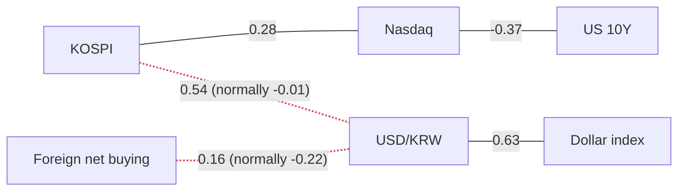

> **이 글의 숫자는 어디서 오는가.** 모든 수치는 FRED(미국 세인트루이스 연준의 공개 데이터)와 네이버 금융에서 자동으로 받아 계산한 것입니다. 기사에 나온 숫자는 **하나도** 쓰지 않았습니다. 기사는 "왜 그렇게 움직였는가"를 설명할 때만 인용합니다. 언론사 수치와 데이터 제공사 수치는 출처도 기준일도 다르기 때문에, 섞어 쓰면 글 안의 계산이 서로 맞지 않게 됩니다.

## 이 글은 장중 버전을 다시 쓴 것입니다

작성 시각은 **2026-09-21 15:35 KST**(미국 동부 02:35 EDT)입니다. 서울 장이 15:30에 끝난 직후입니다.

이 글은 처음에 **13:25 장중 데이터**로 작성했고, 종가가 나온 뒤 다시 썼습니다. 그리고 **장중 버전의 한국 시장 요약은 종가에서 뒤집혔습니다.**

| | 13:25 장중 | 15:30 종가 |
|---|---|---|
| **외국인 순매수** | **+288억** | **−1,719억** (부호가 바뀜) |
| 기관 | +12,349억 | **+14,924억** |
| 개인 | −24,693억 | **−29,790억** |
| 코스피 | 7,024.03 (+1.88%) | **7,007.72 (+1.65%)** |

장중 버전은 외국인 순매수 **+288억**을 두고 "1.88% 오른 장에서 0과 구별하기 어려운 숫자이고, 종가에 가장 달라질 가능성이 큰 값"이라고 적었습니다. 실제로 그렇게 됐습니다. **외국인은 오른 장에서 순매도로 마쳤고, 이 상승은 처음부터 끝까지 기관이 만든 것입니다.**

이것이 장중 숫자에 경고를 붙이는 이유입니다. 서울 장은 09:00–15:30이고, 그 사이에 읽은 값은 결과가 아니라 스냅샷입니다.

### 발표가 늦은 시리즈 (정상입니다)

FRED는 시리즈마다 발표 주기가 다릅니다. 목록이 길다고 뭔가 고장 난 것이 아닙니다.

- **원/달러, 달러 기준 코스피, 광범위 달러지수, 원화 기준 WTI** — **2026-09-11** 기준, **10일 전**
- **WTI** — **2026-09-15** 기준
- **미 10년물·2년물·실질금리·VIX·하이일드 스프레드·S&P 500·실효 연방기금금리** — **2026-09-17** 기준
- **장단기 금리차·기대인플레이션·나스닥** — **2026-09-18** 기준
- 데이터 수집 오류는 없었습니다.

미국은 아직 월요일 장이 열리지 않았습니다(오늘 밤 **22:30 KST** 개장). 그래서 미국 수치는 전부 지난 금요일 종가 또는 그 이전입니다.

> **환율은 특히 주의하십시오.** 원/달러의 마지막 관측치는 10일 전이고, 오늘 환율 기사들은 *"원·달러 환율 8거래일째 오름세"*라고 전합니다. **이 글의 환율 관련 수치는 현재 시점의 값이 아니라 기록으로 읽으십시오.**

## 오늘의 한 가지

**연준이 실제로 운영하는 금리가 드디어 움직였고, 시장이 정하는 금리는 전부 반대로 움직였습니다.**

실효 연방기금금리가 **3.88%**, **+25bp**로 찍혔습니다. 9월 FOMC 결정이 실제 운영 금리에 반영된 첫 기록이고, 이 시리즈는 직전 세 번의 글에서 계속 "보합"이었습니다.

그런데 **같은 날** 미 10년물은 **7bp 내려** 4.94%, 2년물도 **7bp 내려** 4.67%, 실질금리는 **7bp 내려** 2.61%(z **−1.59**), VIX는 **12.82% 급락**해 15.44가 됐습니다.

연준이 쓰는 도구는 올라갔고, 금리 곡선과 할인율과 공포 지수는 모두 내려갔습니다. **발표에 하락하고 실행에 반등하는 시장은, 그 실행이 끝이라고 보는 시장입니다.**

## 어제의 세 가지 질문

### 1. "실질금리가 1년 범위 최상단에 머무는 동안 하이일드 스프레드가 넓어지기 시작했나?"

**둘 다 아닙니다. 그리고 움직인 쪽은 약세론에 불리하게 움직였습니다.**

하이일드 스프레드는 당일 **보합**(일간 부호가 `flat`), **2.70%**, z **+0.03**, 1년 범위 위치 **11.6%** 그대로입니다. 신용은 금리 쪽 이야기에 동의하기 시작하지 않았습니다.

그런데 조건의 다른 절반도 깨졌고 그게 더 중요합니다. **실질금리가 범위 최상단에 머물지 못했습니다.** **7bp 내려** 2.61%가 됐고(z **−1.59**), 범위 위치는 금요일의 **100%**에서 **93.1%**로 내려왔습니다. 금요일의 판단은 최상단에 고정된 실질금리 위에 서 있었는데, 그 못이 빠졌습니다.

### 2. "원/달러가 발표되었나?"

**아닙니다. 네 번째 글 연속입니다.** 여전히 **2026-09-11**, 이제 10일 전입니다. 데이터는 **1,340.30**, 20일 **−5.48%**, 모든 구간의 표현이 **"원화가 강해졌다"**, 1년 범위 위치 **0.2%**입니다.

**데이터와 기사의 간격은 이제 의견 차이가 아닙니다.** 오늘 환율 기사 제목에는 *"원·달러 환율 8거래일째 오름세"*와 *"환율 오르자 美주식으로…개인, 일주일새 1.5조 순매수"*가 그대로 들어 있습니다. 기사의 숫자는 이 글이 채택하지 않습니다. 다만 데이터의 마지막 관측치는 그 제목들이 다루는 기간을 **전혀 보지 못한 값**입니다. 어느 쪽이 맞는지는 다음 발표가 판정합니다.

### 3. "금요일 종가 수급 숫자가 재확인을 통과했나?"

**통과했습니다. 그리고 그 사실이 오늘 중요해졌습니다.**

금요일 15:31에 읽은 첫 발표값은 외국인 **+4,317억**, 개인 **−35,940억**, 기관 **+15,020억**이었습니다. 확정값은 외국인 **+4,486억**, 개인 **−36,359억**, 기관 **+15,322억** — 각각 수백억 단위, 2% 미만의 차이이고 부호는 바뀌지 않았습니다. *(이 세 숫자는 오늘의 `metrics.json`이 아니라 파이프라인이 직접 저장한 2026-09-18 수급 파일에서 읽은 것입니다. 같은 수집기, 다른 파일 — 이 글의 다른 모든 숫자는 당일 payload에서 나오므로 밝혀 둡니다.)*

**그런데 세 번의 장이 같은 규칙을 말합니다.** 9월 17일 10:55에 읽은 외국인 순매도는 종가까지 **세 배 이상**으로 늘었습니다. 9월 18일 15:31에 읽은 값은 2% 안에서 유지됐습니다. 그리고 오늘 13:25에 읽은 값은 **부호가 바뀌었습니다.** 즉 **종이 울리기 전에 읽은 한국 수급 숫자는 그 날에 대한 증거가 아니고**, 15:30에 가까울수록 값어치가 올라갑니다.

## 한국 — 종가 기준

| | 종가 | 전일비 | 20일 | z | 고점대비 | 기준일 |
|---|---|---|---|---|---|---|
| 코스피 | 7,007.72 | ▲ **+1.65%** | +4.64% | +0.68 | −23.12% | 2026-09-21 |
| 코스닥 | 836.27 | ▲ +1.11% | +2.82% | +0.52 | −31.80% | 2026-09-21 |
| 원/달러 | 1,340.30 | ▼ −0.40% | −5.48% | −0.68 | −13.86% | **2026-09-11** |
| 코스닥/코스피 | 0.1193 | ▼ −0.53% | −1.74% | −0.27 | −52.83% | 2026-09-21 |

**코스피가 7,000을 넘어 마감했습니다** — 7,007.72, **+1.65%**, 연초 대비 **+66.29%**.

> **다만 7,000을 "사상 최고"로 읽지 마십시오.** 고점 대비 **−23.12%**이고 1년 범위 위치는 **64.0%**입니다. 두 숫자를 같이 보면, 지수는 최근 1년 안에 지금보다 훨씬 높았고 아직 그 고점에서 한참 아래에 있습니다. 7,000은 회복해 올라가는 중인 동그란 숫자일 뿐, 새로 만든 기록이 아닙니다.

대형주가 또 앞섰습니다. 코스닥/코스피 비율에 데이터가 붙인 표현은 "대형주가 소형주를 앞섰다"이고, 사흘 연속입니다. 실현 변동성은 **31.4%**입니다.

### 투자자별 순매수 (종가, 억 원)

| | 오늘 | 5일 누적 | 20일 누적 | z (최근 1년 대비) |
|---|---|---|---|---|
| 외국인 | **−1,719** | −51,963 | **−182,166** | +0.27 |
| 기관 | **+14,924** | +35,392 | +50,878 | **+1.00** |
| 개인 | **−29,790** | −66,594 | −186,110 | **−1.30** |

**여기가 종가에서 이야기가 완전히 바뀐 지점입니다.** 기관이 **+14,924억**을 z **+1.00**으로 담아 이 장을 혼자 끌었습니다. 외국인은 두 시간 전 **+288억**에서 **−1,719억** 순매도로 마쳤고, 개인은 **−29,790억**을 z **−1.30**으로 팔았습니다 — 오늘 표에서 절대값이 가장 큰 수급 수치입니다.

**외국인이 팔면서 1.65% 오른 장은, 외국인이 사면서 1.65% 오른 장과 전혀 다른 사건입니다.** 20일 누적 외국인 순매도는 **−182,166억**으로 더 깊어졌습니다.

> **"모두 팔고 있다"는 표현은 쓰지 않습니다.** 네이버가 공개하는 주체는 외국인·기관·개인 세 가지이고 **기타법인**이 빠져 있습니다. 그래서 이 세 숫자는 0으로 합산되지 않고, 20일 칼럼이 남기는 큰 순액은 누군가가 받아냈다는 뜻입니다. 팔린 주식은 전부 누군가가 산 것입니다.

> **수급 z만 기준이 다릅니다.** 수급 z는 **252일(약 1년), 당일 포함** 구간입니다. 이 글의 다른 모든 z는 **756일(약 3년), 당일 제외**입니다.

### 종목별 상대강도 (종가)

| | 종가 | 전일비 | 20일 | 지수 대비(20일) | z | 고점대비 |
|---|---|---|---|---|---|---|
| SK하이닉스 | 1,868,000 | ▲ +1.03% | +11.79% | **+7.15pp** | +0.14 | −36.01% |
| 삼성전자 | 274,000 | ▲ **+5.38%** | +6.61% | +1.97pp | **+1.65** | −24.41% |
| POSCO홀딩스 | 317,000 | ▼ −2.61% | −3.21% | −7.85pp | −0.89 | −40.75% |
| LG화학 | 258,500 | ▼ **−3.54%** | −5.31% | −9.95pp | −1.09 | −39.81% |
| 현대차 | 359,000 | ▼ −2.05% | −13.29% | **−17.93pp** | −0.72 | −52.13% |

**삼성전자가 +5.38%, z +1.65로 마쳤습니다** — 오늘 정책금리를 제외하면 판 전체에서 절대값이 가장 큰 z입니다. 금요일에는 지수보다 **−7.03%p** 뒤처져 있었는데 오늘은 **+1.97%p** 앞섰습니다. 한 장에서 9%p가 움직인 것이고, 이 시리즈가 기록한 종목 최대 변동입니다.

**격차는 극단적입니다: +7.15%p에서 −17.93%p까지.** 금요일은 +7.59%p ~ −11.80%p였습니다. 넓어진 쪽은 위가 아니라 아래입니다 — 현대차가 **−17.93%p**, 고점 대비 **−52.13%**이고, LG화학이 오늘 최악인 **−3.54%**입니다. 반도체 두 종목이 지수를 끌어올리는 동안 나머지 셋은 내렸고, **세 종목 모두 13:25보다 더 낮게 마쳤습니다.**

> 이 표의 "지수 대비"는 **수익률 차이(%p)**이고 지수 상승에 대한 **기여도가 아닙니다.** 데이터에 시가총액 가중치가 없으므로 기여도는 계산할 수 없습니다.

**"그래서 나는 실제로 돈을 벌었나?"** 원화 수익률과 달러 수익률은 **같은 날짜 집합**에서 비교해야 합니다. 2026-09-11까지 **공통 거래일 1,186일** 기준으로, 20일 동안 코스피는 원화로 **+5.03%**, 달러로 **+10.98%**, 같은 날들의 원/달러는 **−5.37%**였습니다.

> **읽어야 할 것은 두 수익률의 "차이"(약 5.96%p)이고 어느 한쪽의 수준이 아닙니다.** 정합 구간은 표준 구간보다 달력상 더 뒤로 뻗기 때문에, 위 표의 20일이 **+4.64%**인데 정합 블록의 원화 수익률은 **+5.03%**입니다. 같은 지수, 다른 구간, 둘 다 맞습니다. 그리고 이 블록 전체가 10일 전에서 멈춰 있습니다.

## 미국

| | 수준 | 전일비 | 20일 | z | 1년 범위 위치 | 기준일 |
|---|---|---|---|---|---|---|
| **실효 연방기금금리** | 3.88% | **+25bp** | **+25bp** | **+9.26** | **100%** | 2026-09-17 |
| 10년 TIPS 실질금리 | 2.61% | **−7bp** | +26bp | **−1.59** | 93.1% | 2026-09-17 |
| 미 10년물 | 4.94% | **−7bp** | +29bp | −1.31 | 93.3% | 2026-09-17 |
| 미 2년물 | 4.67% | **−7bp** | +48bp | −1.21 | 94.9% | 2026-09-17 |
| 장단기 금리차(10Y−2Y) | 0.25% | −2bp | −25bp | −0.60 | **0.0%** | 2026-09-18 |
| 10년 기대인플레이션 | 2.33% | 보합 | −1bp | −0.00 | 46.9% | 2026-09-18 |
| 하이일드 신용스프레드 | 2.70% | 보합 | −5bp | +0.03 | 11.6% | 2026-09-17 |
| VIX | 15.44 | ▼ **−12.82%** | −3.56% | **−1.57** | 11.2% | 2026-09-17 |
| 나스닥 종합 | 26,522.55 | ▲ +0.39% | +1.75% | +0.23 | 90.9% | 2026-09-18 |
| S&P 500 | 7,637.76 | ▲ +1.14% | −0.91% | +1.12 | 88.9% | 2026-09-17 |
| WTI 유가 | $107.02 | ▲ +4.49% | +24.38% | +1.74 | 87.2% | 2026-09-15 |
| 광범위 달러지수 | 118.21 | ▲ +0.11% | −0.82% | +0.39 | 17.3% | **2026-09-11** |

> **단위를 반드시 구분하십시오.** 금리·스프레드는 **bp(0.01%p)**, 주식·유가·달러는 **%**입니다. 금리 데이터의 `0.06`은 **+6bp**이지 +6%가 아닙니다. 백 배 차이입니다.

> **"1년 범위 위치"는 백분위가 아닙니다.** 최근 252거래일의 최저~최고 구간에서 현재 값이 **밑에서부터** 몇 % 지점인지입니다.

나스닥과 S&P 행은 **기준일이 하루 다릅니다**(09-18 대 09-17). 그래서 나스닥이 20일 기준 S&P를 **+2.66%p** 앞선다는 수치에는 하루치 달력 차이가 섞여 있습니다. 여러 %p의 격차에 하루 차이는 작지만, 없는 것은 아닙니다.

### 왜 +9.26이라는 z를 무시해야 하는가

실효 연방기금금리의 z **+9.26**은 이 시리즈가 만들어낸 가장 큰 값이고, **거의 아무 의미가 없습니다.**

정책금리는 몇 달씩 완전히 평평하게 있다가 25bp씩 계단으로 움직입니다. 그래서 과거 분포가 대부분 0이고, 표준편차가 극히 작습니다. 이런 시리즈에서는 **어떤 움직임이든** 엄청난 점수가 나옵니다. 9시그마 사건이 아니라, 형태가 맞지 않는 시리즈에 통계를 적용한 결과입니다. 아래 "오늘의 용어"에서 더 다룹니다.

### 10년물 분해 — 같은 금리 상승이 정반대를 뜻할 때

명목 국채금리는 정확히 두 조각으로 쪼개집니다. **기대인플레이션**은 채권시장이 만기까지 평균 물가상승률을 얼마로 보는지이고, **실질금리**는 거기서 그걸 뺀 나머지입니다.

2026-09-17 공통 달력 기준: **4.94% = 실질 2.61% + 기대인플레 2.33%**, 잔차 **+0.00pp**.

20일 변화: **+29bp = 실질 +26bp + 기대인플레 +3bp**.

**왜 이 구분이 중요한가.** 기대인플레이션이 올라서 금리가 오른 것이면, 물가가 오르는 만큼 기업 매출도 일부 따라 오르므로 주식에 주는 타격이 덜합니다. 반대로 **실질금리가 올라서 오른 것이면, 미래 이익을 현재가치로 깎는 할인율이 그대로 올라간 것**이므로 멀리 있는 이익에 기대는 주식의 밸류에이션을 직접 압축합니다.

한 달로 보면 여전히 압도적으로 실질금리 이야기입니다. 그런데 **당일 흐름은 반대**입니다 — 실질금리가 7bp 내렸고(z **−1.59**) 기대인플레이션은 **보합**이었습니다. 20일 분해와 하루 z는 다른 질문에 답하는 통계이고, 오늘은 서로 엇갈립니다. 나스닥↔10년물 상관은 평균 **−0.16** 대비 **−0.37**로 이번 달 중 가장 단단합니다. 메커니즘은 작동하고 있고, 오늘은 그게 도움 되는 방향으로 돌았을 뿐입니다.

### 신용·변동성·유가

**하이일드 신용스프레드**는 위험한 회사채를 국채 대신 들고 있는 대가로 대주가 더 요구하는 금리입니다. **넓으면 공포, 좁으면 자신감.** 오늘은 **보합**, **2.70%**, 1년 범위의 **11.6%**입니다.

> **이 z는 무게를 깎아서 읽어야 합니다.** 이 시리즈는 756일 채점 구간에 대해 관측치가 **799개**뿐입니다. "3년 분포"가 사실상 시리즈의 전 생애라서 구간 밖 맥락이 거의 없습니다. 10년물의 **16,163개**와 비교하면 같은 756일이 얇은 한 조각입니다. **관측치 수가 다른 두 z를 같은 신뢰도로 놓지 마십시오.**

**오늘의 진짜 위험 신호는 VIX입니다: −12.82%, 15.44**, z **−1.57**, 1년 범위의 **11.2%**. 금리 인상이 실제로 발효된 날에 변동성이 무너졌습니다. 신용은 움직이지 않았고 변동성은 크게 내렸습니다 — **둘 다 긴축 이야기를 뒷받침하지 않고, 변동성은 이제 적극적으로 반박합니다.**

유가는 금요일 글과 같습니다. 시리즈 자체가 그대로이기 때문입니다: **2026-09-15**, **$107.02**, z **+1.74**. 오늘 유가 기사들은 이 데이터와 **반대 방향**의 움직임을 전하고, 근거는 미·이란 외교입니다. 데이터보다 6일 새로운 보도이고, 데이터는 그 기간을 볼 수 없습니다.

## 오늘 실제로 연결되어 있는 것

상관계수는 해당 구간에서 **측정된 값**이며 인과관계 주장이 아닙니다. 붉은 점선은 1년 평균에서 관계가 끊어졌다는 표시입니다.

선에 화살표가 없는 것은 의도한 것입니다. 상관관계에는 방향이 없습니다 — 두 값이 같이 움직였다는 말일 뿐, 어느 쪽이 먼저인지는 말해주지 않습니다.

유지되는 연결 셋: 코스피↔나스닥 **+0.28**(평균 +0.13), 원/달러↔달러지수 **+0.63**(평균 +0.62), 나스닥↔10년물 **−0.37**(평균 −0.16).

**끊어진 두 연결은 네 번째 글 연속으로 소수점 둘째 자리까지 똑같습니다. 둘 다 원/달러가 들어가고, 그 시리즈가 2026-09-11 이후 발표되지 않았기 때문입니다.** 같은 관측치를 다시 계산하는 것이니 값이 변할 수가 없습니다.

### 끊어진 연결 1 — 코스피 ↔ 원/달러: +0.54 (평균 −0.01)

**교과서 메커니즘.** 외국인이 한국 주식을 사려면 먼저 원화를 사야 합니다. 그래서 자금이 들어오면 지수와 원화가 함께 오릅니다. 코스피와 원/달러로 측정하면 — **원/달러가 오르는 것은 원화가 약해지는 것**이므로 — 상관은 **음수**여야 합니다. 평균 **−0.01**은 평소에도 관계가 약하다는 뜻이지만, 양수는 아닙니다.

**현재는 성립하지 않습니다.** **+0.54**는 최근 60일 동안 두 시리즈의 **일간 변화**가 같은 방향으로 움직였다는 뜻입니다. 이것은 각각이 그 기간에 어느 쪽으로 흘렀는지는 말해주지 않습니다. 20일 동안 원/달러는 **−5.48%**이고 데이터의 표현은 **"원화가 강해졌다"**입니다. 두 문장이 동시에 참이며, 하나로 뭉개는 것은 이 시리즈가 이미 한 번 저지른 실수입니다.

**가설은 지금 기사에 의해 반박되고 있습니다.** 반도체 수출 호조가 만든 무역흑자라면 지수와 원화를 같이 밀어올려 상관을 뒤집을 수 있고, 원화가 1년 범위 **0.2%**에 있는 것과도 맞습니다. 그러나 그 관측치는 10일 전 값이고, 오늘 기사 제목들은 그 이후 기간을 정반대로 서술합니다. **아직 발표되지 않은 구간의 데이터로는 계산할 수 없는 상관은 현재 국면에 대한 증거가 아닙니다.** 이 선은 판정 보류입니다.

### 끊어진 연결 2 — 외국인 순매수 ↔ 원/달러: +0.16 (평균 −0.22)

**교과서 메커니즘.** 외국인 순매수는 원화 매수를 수반하므로 원/달러를 낮추는 쪽으로 작용해야 합니다. 음수가 기대 부호이고 평균은 **−0.22**입니다.

**성립하지 않습니다.** **+0.16**은 부호가 뒤집힌 것입니다 — 외국인이 파는 날에 원화가 강해졌다는 뜻이고, 20일 외국인 순매도는 **−182,166억**입니다. **끊어진 두 연결은 두 개가 아니라 하나의 현상을 두 각도에서 본 것**이고, 같은 이유로 검증이 안 됩니다.

## 양쪽 모두의 논리

같은 데이터가 두 가지 읽기를 동시에 지지할 때가 많습니다. 결론으로 건너뛰기 전에 양쪽에서 **가장 강한** 주장을 각각 세워 봅니다. 원화는 포트폴리오의 양쪽을 반대로 건드리기 때문에 한국과 미국을 따로 봅니다.

**한국 — 강세론.** 지수가 **7,000**을 넘어 마감했고, 20일 **+4.64%**, 연초 대비 **+66.29%**입니다. 기관이 z **+1.00**으로 **+14,924억**을 담았고, 이는 오늘 판에서 가장 강한 수급 수치입니다. 삼성전자는 **+5.38%**, z **+1.65**로 마치며 금요일의 **−7.03%p**에서 **+1.97%p**로 돌아섰습니다. 코스닥도 20일 **+2.82%**로 참여했습니다.

**한국 — 약세론.** 폭이 두 종목뿐이고, 산 쪽은 국내였습니다. 현대차는 20일 기준 지수 대비 **−17.93%p**, 고점 대비 **−52.13%**이고, POSCO홀딩스 **−7.85%p**, LG화학 **−9.95%p** — 셋 다 지수가 오른 날에 내렸습니다. **외국인은 −1,719억 순매도로 마쳤고** 20일로는 **−182,166억**, 개인은 z **−1.30**으로 **−29,790억**을 팔았습니다. **기관 혼자 끌어올리고 외국인이 떠나고 개인이 더 빨리 떠나는 상승은, 지수 수준이 시사하는 것보다 좁은 현상입니다.**

**미국 — 강세론.** 위험 가격이 금리 이야기를 뒷받침하지 않습니다. 인상이 발효되는 국면에서 스프레드는 **보합**이었고, VIX는 1년 범위의 **11.2%**로 내려갔고, 기대인플레이션은 당일 **보합**(z **−0.00**)이었습니다. 인플레 공포가 붙지 않았습니다. 두 주식 지수 모두 올랐습니다. **"긴축은 끝났다"가 가격으로 표현되면 이런 모습입니다.**

**미국 — 약세론.** 하루가 한 달을 지우지는 않습니다. 20일 분해는 여전히 **실질 +26bp** 대 **기대인플레 +3bp**이고, 10년물과 2년물은 1년 범위의 **93%** 위에 있으며, 장단기 금리차는 범위의 **0.0%** — 1년 중 가장 납작하고 20일로 **−25bp**입니다. z **+1.74**의 유가는 데이터가 6일간 보지 못한 공급 측 압력입니다. 1년 범위 **11.2%**의 VIX는 안심의 근거가 아니라 **보험료가 싸다는 사실**입니다.

## 사이클 상 위치

**판단: 여전히 기다림 — 그런데 이번 달 처음으로, 판단을 떠받치던 수치가 움직였습니다.** 금요일의 판단은 1년 범위 **100%**에 고정된 실질금리와 **+30bp 중 +27bp**라는 분해 위에 서 있었습니다. 오늘 실질금리는 **93.1%**에 있고 당일 **7bp** 내렸습니다(z **−1.59**). 한 달짜리 그림은 그대로지만, 논리가 올라서 있던 한 개의 수치는 그렇지 않습니다.

**판단을 기울이는 새 수치: 12.82% 급락 후 1년 범위 11.2%에 있는 VIX.** 찍힌 것들 중에서 "시장이 이 인상의 비용을 얼마로 보는가"에 가장 깨끗하게 답하는 값이고, 답은 "없다"입니다. 그것은 맞는 판단이거나 안일함이고, **어느 쪽인지 아직 구분할 수 없을 때 하는 것이 기다림입니다.** 기다림도 하나의 포지션입니다.

**반증 조건(금요일 것이 낡았으므로 다시 씁니다).** 실질금리가 1년 범위 **100%**로 돌아가는 동안 VIX가 자기 범위의 **20%** 아래에 머문다면, 할인율이 다시 오르는데 시장이 그것을 값으로 매기기를 거부하는 것이고 약세론이 더 선명해집니다. **반대로**, 새 구간에서 20일 실질 조각이 기대인플레 조각 아래로 내려가면 이번 달은 자본의 실질 비용 상승이 아니라 정책 경로 재평가였다는 뜻이고 판단은 미국 강세론으로 옮겨갑니다.

**어떤 종목을 사라거나 팔라는 이야기는 하지 않습니다.** 이 글은 틀과 메커니즘까지입니다.

## 오늘의 용어 — z-점수 (z-score)

**z-점수**는 하나의 질문에 답합니다. *이 값이 평소 움직이는 크기에 비해, 오늘 움직임은 얼마나 큰가?*

최근 3년치 일간 변동을 모아 "보통 한 번의 움직임 크기"(표준편차)를 구하고, 오늘 움직임이 그 크기의 몇 배인지 셉니다. z **+1**은 평범한 하루 정도, z **+2**는 그 두 배로 대략 20일에 한 번, z **−1.5**는 꽤 큰 하락입니다.

핵심은 **비교 가능성**입니다. 채권금리의 7bp와 주식지수의 1.65%는 원래 숫자로는 비교가 안 되지만, "1.3시그마"와 "0.8시그마"는 비교가 됩니다.

**그런데 두 가지를 먼저 물어야 합니다.**

**1. 이 값이 실제로 매일 변하는가?** z는 비교할 분포가 있다고 가정합니다. 가격·금리·스프레드는 해당됩니다. **정책금리는 아닙니다** — 몇 달 평평하다가 정해진 폭으로 계단을 밟습니다. 과거 분포가 거의 전부 0이니 **어떤 움직임이든** 거대한 점수가 나옵니다. 오늘의 **+9.26**이 정확히 그 경우입니다. 산수는 맞고 정보는 없습니다.

구별법은 쉽습니다. **그 값이 "작은 0이 아닌 움직임"을 찍는 모습을 상상할 수 없다면, 그 z는 놀라움을 재고 있지 않습니다.**

**2. 채점 구간 밖에 역사가 얼마나 있는가?** 일부 FRED 시리즈는 제한된 기간만 제공되어 756일 채점 구간보다 관측치가 조금 많을 뿐입니다. 그런 시리즈의 "3년 분포"는 사실상 전 생애라서 구간 밖 맥락이 없습니다. 오늘 하이일드 스프레드의 **799개**가 그렇고, 10년물의 **16,163개**는 정반대입니다. **크기가 같은 두 z도 관측치 수가 자릿수 단위로 다르면 신뢰도가 같지 않습니다.**

**그리고 장중에 계산한 z는 체계적으로 과소평가됩니다** — 끝나지 않은 하루를 끝난 하루들과 비교하기 때문입니다. 이 글의 장중 버전이 바로 그 상태였습니다.

## 가격을 움직인 뉴스

**1. 9월 인상이 발효되고, 금리 곡선은 내렸습니다 (2026-09-17).** *움직인 가격:* 실효 연방기금금리 **+25bp**로 **3.88%**, 이번 달 이 시리즈의 첫 움직임. 10년물·2년물·실질금리 각각 **−7bp**. VIX **−12.82%**로 **15.44**. *메커니즘:* 운영 금리는 전망이 아니라 도구입니다. 결정 며칠 뒤 새 목표범위가 발효될 때 움직입니다. 표의 나머지는 이미 결정을 반영해 두었으므로 이 발표 자체는 새 정보가 아니었고, 시장은 그 세션을 위험 프리미엄 되돌리기에 썼습니다.

**2. 반도체가 코스피를 7,000 위로 끌어올렸습니다 (2026-09-21).** 반도체 기사 묶음은 외국인이 삼성전자와 SK하이닉스를 사들였다고 전합니다. *움직인 가격:* 삼성전자 **+5.38%**(z **+1.65**), SK하이닉스 **+1.03%**, 코스피 **+1.65%**로 **7,007.72**, 코스닥/코스피 비율 **−0.53%**가 대형주 주도를 확인. *그러나 귀속은 종가에서 무너집니다:* 전체 외국인 수급은 **−1,719억** 순매도로 끝났습니다. 외국인이 이 두 종목에서 무엇을 했든, 다른 곳에서 더 많이 팔았습니다. **반도체의 얼굴을 한 기관 장세였습니다.**

## 분야별 흐름

로컬에서 돌리는 언어모델(`qwen2.5:14b`)이 기사 제목을 요약한 것으로, **주제만** 읽습니다 — 이 절의 어떤 숫자도 요약에서 오지 않았습니다. 일곱 분야 중 다섯이 사용 가능한 요약을 냈습니다.

**반도체** — *"외국인 투자자들이 삼성전자와 SK하이닉스를 중심으로 매수세를 보이면서 반도체 대형주가 강세를 나타냈다."* 가격 쪽 절반은 맞습니다. 두 종목 모두 올랐고 삼성전자가 오늘 주식 중 가장 큰 z를 냈습니다. **그런데 귀속은 데이터로 확인되지 않습니다:** 전체 외국인 수급은 **−1,719억** 순매도였습니다. 두 종목은 사고 다른 곳에서 더 팔았을 수 있고, 요약도 수급 데이터도 종목별로 구분해주지 않습니다. 주제로 읽고 원인으로 읽지 마십시오.

**자동차** — *"현대차그룹이 데이터 플라이휠을 본격 가동하면서 그룹 내 데이터 활용과 디지털 전환에 속도를 내고 있다."* 기업 전략 기사이고, 정작 중요한 측정치와는 연결이 없습니다 — 현대차는 지수 대비 **−17.93%p**이고 **−2.05%**로 마쳤습니다. **모델이 가격보다 보도자료를 골랐습니다.** 검증 장치가 볼 수 없는 실패 유형입니다.

**유가** — *"미국과 이란의 외교 협상 기대감이 고조되면서 국제유가가 하락세를 이어가고 있습니다."* **데이터의 방향과 어긋납니다.** 데이터는 유가가 **+4.49%** 올랐다고 말하지만 6일 전 기준이고, 여기서는 모델이 맞을 가능성이 높습니다. 해결하지 않고 표시만 해 둡니다.

**포스코홀딩스** — *"포스코홀딩스가 미국 증권거래위원회(SEC)에 자원개발 정부 지급내역을 공시하면서 투명경영을 강화하고 있다."* 공시 사안이고, 당일 **−2.61%**와 정직하게 연결할 고리가 없습니다.

**LG화학** — *"LG화학이 석유화학업계의 담합 의혹으로 수사받게 되면서 업계 전체가 긴장하고 있다."* 담합 수사 건입니다. LG화학은 오늘 최악인 **−3.54%**로 마쳤고 20일 기준 지수 대비 **−9.95%p**입니다. 연결은 그럴듯하지만, 시점을 잇는 것은 모델의 주장이고 데이터의 주장은 아닙니다.

**금리** — 요약 없음 — **36시간 윈도우 내 기사 0건**. 그 자체가 특이합니다. 지난주를 지배했던 금리 이야기가, 정작 인상이 발효된 세션에 윈도우에서 완전히 사라졌습니다.

**환율** — 요약 없음 — 모델 출력이 반려됨(너무 짧아 요약으로 불충분). 기사 제목에서 직접 읽으면: *"원·달러 환율 8거래일째 오름세"*, *"'원화약세 당분간 지속' vs '수출기업 환전이 방패'"*, 그리고 개인이 일주일 만에 1.5조를 미국 주식으로 옮긴 것.

> **이 절은 이 글에서 가장 신뢰도가 낮습니다.** 검증 장치는 형식만 봅니다 — 숫자를 지어냈는지, 얼버무렸는지, 한국어를 유지했는지. **어떤 이야기를 골랐는지, 논리가 맞는지는 보지 않습니다.** 로컬 모델이 실제로 무엇을 내놓는지 보여드리기 위해 문장을 손보지 않고 그대로 실었습니다.

## 앞으로 확인할 일정

- [ ] **오늘 밤 22:30 KST (미 동부 2026-09-21 09:30 EDT)** — 뉴욕 개장. 이 글이 전혀 보지 못한 첫 미국 장입니다.
- [ ] **다음 원/달러 발표** — 현재 **2026-09-11**, 10일 전. 끊어진 두 상관을 녹이고, 8거래일째 이어지는 방향 논쟁을 판정합니다. 여전히 가장 값어치 있는 미결 관측입니다.
- [ ] **다음 하이일드 스프레드·실질금리 발표** — 이 글의 반증 조건을 직접 판정합니다.
- [ ] **한국은행 다음 금리 결정** — 이 저장소의 과거 메모는 한·미 정책금리 **차이가 좁혀진 것**을 원화 움직임의 근거 중 하나로 들었습니다. 연준이 그 차이를 다시 25bp 벌렸습니다. 데이터가 아니라 전망입니다.

## 내일 확인할 세 가지

1. **실질금리가 1년 범위 최상단으로 다시 올라가는 동안 VIX는 바닥 근처에 머물렀는가?** 이것이 오늘의 반증 조건입니다. 오늘 실질금리는 **93.1%**로 내려왔고 VIX는 **11.2%**에 있습니다. 둘이 다시 벌어지면 약세 쪽 읽기이고, 새 20일 구간에서 실질 조각이 기대인플레 조각 아래로 내려가면 강세 쪽 읽기입니다.
2. **기관은 계속 사고 외국인은 계속 떠났는가?** 오늘은 기관 **+14,924억**(z **+1.00**) 대 외국인 **−1,719억**, 20일 외국인 **−182,166억**으로 끝났습니다. 같은 구도가 한 번 더 나오면 패턴이고, 기관이 물러나는데 외국인이 돌아오지 않으면 **7,000**이 위태로워집니다.
3. **원/달러가 발표되었는가?** 네 번째 글에서 같은 질문입니다.

## 출처

**(a) 데이터 — 이 글의 모든 숫자는 여기서만 나옵니다.**

| 항목 | 출처 | 기준일 |
|---|---|---|
| 코스피, 코스닥, 코스닥/코스피, 추적 5종목, 투자자별 순매수 | 네이버 금융 | 2026-09-21 (**종가**) |
| 장단기 금리차, 10년 기대인플레이션, 나스닥 | FRED (T10Y2Y, T10YIE), 나스닥 지수 | 2026-09-18 |
| 미 10년물·2년물·실질금리·실효연방기금금리·하이일드 스프레드·VIX·S&P 500 | FRED (DGS10, DGS2, DFII10, DFF, BAMLH0A0HYM2, VIXCLS) | 2026-09-17 |
| WTI 유가 | FRED (DCOILWTICO) | 2026-09-15 |
| 원/달러, 달러 기준 코스피, 광범위 달러지수, 원화 기준 WTI | FRED (DEXKOUS, DTWEXBGS) / 네이버 | **2026-09-11** |

**(b) 해설 — "왜"를 위해서만 읽은 기사이고 숫자의 출처가 아닙니다.** 분야별 기사 제목 묶음: 한국 반도체 외국인 매수, 현대차그룹 데이터 전략, 미·이란 외교와 유가, 석유화학 담합 수사, 원/달러 환율의 8거래일 연속 흐름.

**(c) 분야별 요약** — 위 "분야별 흐름"은 Ollama로 로컬에서 돌린 **`qwen2.5:14b`**가 구글 뉴스 RSS의 분야별 질의 결과를 요약한 것입니다. 네 가지 검증(근거 없는 수치 금지, 얼버무림 금지, 한국어 유지, 금지 표현)이 **형식만** 확인합니다.

> **주의**
> 이 글의 데이터는 FRED와 네이버 금융에서 자동 수집한 것이고, 기사는 해설에만 쓰였으며 숫자로는 쓰이지 않았습니다. **한국 수치는 종가이며, 이 글은 13:25 장중 버전을 대체합니다. 그 장중 버전의 외국인 수급 수치는 종가에서 부호가 바뀌었습니다.** 분야별 요약은 로컬 언어모델이 생성한 것으로 이 글에서 가장 신뢰도가 낮은 부분입니다. **투자 조언이 아닙니다.** 행동에 옮기기 전에 모든 수치를 직접 다시 확인하십시오. 그리고 열두 개 시리즈가 지연 데이터이며, 그중 환율은 10일 전 기준으로 오늘 기사들이 정면으로 반박하고 있습니다.
