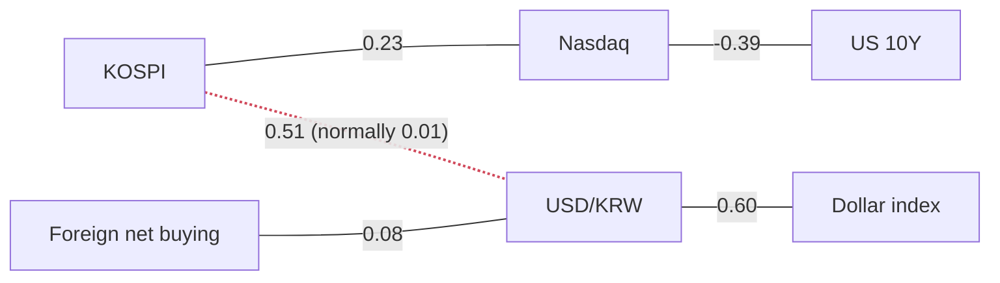

> **이 글의 숫자는 어디서 오는가.** 모든 수치는 FRED(미국 세인트루이스 연준의 공개 데이터)와 네이버 금융에서 자동으로 받아 계산한 것입니다. 기사에 나온 숫자는 **하나도** 쓰지 않았습니다. 기사는 "왜 그렇게 움직였는가"를 설명할 때만 인용합니다. 언론사 수치와 데이터 제공사 수치는 출처도 기준일도 다르기 때문에, 섞어 쓰면 글 안의 계산이 서로 맞지 않게 됩니다.

## 언제 쓴 글이고, 데이터는 어디까지인가

작성 시각은 **2026-09-22 17:54 KST**(미국 동부 04:54 EDT)입니다. 서울 장이 15:30에 끝난 뒤이므로 **한국 수치는 전부 종가**입니다. 어제처럼 장중에 읽고 나중에 다시 써야 하는 글이 아닙니다.

미국 쪽은 날짜가 셋으로 갈립니다.

| 구간 | 기준일 |
|---|---|
| 나스닥, S&P 500, 2s10s 스프레드, 10년 기대인플레이션 | **2026-09-21** (월요일 종가) |
| 미 10년물, 2년물, 실질금리, VIX, 하이일드 스프레드, 실효 연방기금금리, 달러지수 | **2026-09-18** |
| WTI 유가, 원화환산 WTI | **2026-09-15** |

뉴욕 장은 오늘 밤 **22:30 KST**(현지 09:30 EDT)에 열립니다. 서머타임 기간이라 한국 시간은 미 동부보다 **13시간** 빠릅니다.

**원/달러 환율이 2026-09-11 이후 처음으로 새 값을 냈습니다.** 이제 **2026-09-18**을 가리킵니다. 네 번의 리포트가 이 값을 기다렸고, 나온 결과는 아래 3번에서 다룹니다.

> **지연된 시계열 목록은 고장이 아닙니다.** FRED는 지표마다 공표 일정이 다르고, 며칠씩 늦는 것이 정상입니다. 오늘 기준으로 지연된 것은 원/달러, 달러환산 코스피, 미 10년물·2년물·실질금리, 달러지수, VIX, 하이일드 스프레드, 실효 연방기금금리(**2026-09-18**), WTI 유가와 원화환산 WTI(**2026-09-15**)입니다. 수집 오류는 없었습니다.
>
> **파이프라인 결함 하나 — 이 글을 쓰다가 발견했고, 지금은 고쳤습니다.** 개별 종목 다섯 개의 방향 블록이 부호(`up`/`down`)는 내면서 설명 문구는 비워 두고 있었습니다. "움직이지 않았다"는 뜻으로 읽힐 수 있는 모양입니다.
>
> **처음 적었던 원인 설명은 틀렸습니다.** 키가 빠진 것이 아니라, 종목 코드로 키는 제대로 붙어 있었고 문구 테이블에 항목이 없었던 것입니다. "개별 종목은 정해진 문구가 필요 없다"는 판단이 있었는데, **그 판단 자체가 결함이었습니다.** 데이터 구조상 "의도적으로 비웠음"과 "버그로 빠졌음"을 구분할 방법이 없기 때문입니다. 지금은 다섯 종목 모두 종목명에서 문구를 만들어 붙이고, 방향 검증 장치에도 종목별 별칭을 넣어 개별 종목 문장까지 다른 지표와 똑같이 검사합니다.
>
> **이 글의 숫자는 하나도 바뀌지 않았습니다.** 같은 원본 데이터로 다시 계산했고 수준·수익률·z·레인지 위치·수급 값이 전부 동일합니다.

## 오늘의 한 가지

**어제 글이 "이 조건이 나오면 내 판단을 뒤집는다"고 미리 적어둔 관측이, 하루 만에 두 다리 모두 그대로 나왔습니다.**

어제의 조건은 이랬습니다 — *실질금리가 1년 레인지의 꼭대기로 돌아가는데 VIX는 바닥 근처에 머문다면, 그것은 약세 쪽 해석이 맞다는 뜻이다.*

2026-09-18 장에서 **10년 물가연동국채 실질금리가 7bp 올라 2.68%**가 되었고(z **+1.55**), **1년 레인지의 100%** 지점으로 돌아갔습니다. 같은 날 **VIX는 4.08% 내려 14.81**, 자기 1년 레인지의 **7.6%** 지점입니다. 그리고 한 세션 뒤인 2026-09-21, **나스닥이 27,122.09로 2.26% 올라 사상 최고가로 마감**했습니다(고점 대비 하락률 **0.00%**).

**할인율이 1년 중 가장 비싼 자리로 돌아갔는데, 시장은 신고가로 답했습니다.**

미리 조건을 적어두는 이유가 여기 있습니다. 나중에 아무 숫자나 골라 "거봐라"라고 말하는 것과, 하루 전에 이름을 붙여둔 숫자가 그대로 나오는 것은 완전히 다른 종류의 증거입니다.

## 어제 던진 세 가지 질문

### 1. "실질금리가 1년 레인지 꼭대기로 다시 올라가고, VIX는 바닥에 머물렀는가?"

**둘 다 그렇습니다.** 실질금리는 **2.68%**, 1년 레인지의 **100%**, 당일 **+7bp**, z **+1.55**. VIX는 **14.81**, 1년 레인지의 **7.6%**, 당일 **−4.08%**, z **−0.52**.

강세 쪽 반대 조건 — *20일 실질금리 상승분이 기대인플레이션 상승분 아래로 내려가는 것* — 은 오히려 반대 방향으로 더 갔습니다. 공통 달력 기준 분해는 **실질 +33bp 대 기대인플레이션 −1bp**, 명목 상승분은 **+32bp**입니다.

### 2. "기관은 계속 사고, 외국인은 계속 나갔는가?"

**둘 다 뒤집혔고, 뒤집힌 폭은 작습니다.** 코스피에서 **외국인은 +654억 순매수**(z **+0.39**), **기관은 −1,299억 순매도**(z **−0.27**)로 끝났습니다. 어제와 정확히 반대입니다. 즉 어제 것은 추세가 아니라 하루짜리였습니다.

다만 **부호보다 크기를 먼저 보세요.** 오늘의 두 값은 개인의 **−15,860억**에 비하면 존재감이 거의 없습니다. **아무도 별로 움직이지 않은 날**이고, 지수도 같은 말을 합니다 — 코스피 z가 **−0.00**입니다.

### 3. "원/달러 환율은 새 값을 냈는가?"

**냈습니다. 11일 만입니다. 그리고 결론은, 기사가 맞았고 데이터가 틀렸습니다.**

원/달러는 이제 **2026-09-18** 기준 **1,387.97**입니다. 5거래일로 **+3.56%**, 방향 문구는 *"원화가 약해졌다"*이고, 데이터가 스스로 붙여둔 의미는 *"미국 자산의 원화 가치는 올라가고, 한국 수출기업의 원화 환산 이익은 부풀려진다"*입니다.

네 번의 리포트가 2026-09-11에 멈춘 값 위에서 돌아갔습니다. 그 값은 *원화가 강해졌다*고 말했고, 같은 기간 모든 기사는 정반대를 말했습니다. 새 값은 기사 손을 들어줬습니다.

**여기서 배울 것은 방향이 아니라 시차입니다.** 멈춘 데이터는 서서히 틀려지지 않습니다. 자기가 설명하는 그 날짜에 대해서는 끝까지 정확하고, 대신 **다른 주에 관한 문서**가 되어버립니다. 실제로 20일 구간은 지금도 **−0.39%**, *"원화가 강해졌다"*입니다. 그 창이 반전 이전까지 거슬러 올라가기 때문입니다. 두 값 모두 맞고, 서로 다른 주를 설명합니다.

## 한국 시장 (종가)

| | 종가 | 전일 대비 | 20일 | z | 고점 대비 | 기준일 |
|---|---|---|---|---|---|---|
| 코스피 | 7,017.91 | ▲ +0.15% | +4.08% | **−0.00** | −23.00% | 2026-09-22 |
| 코스닥 | 834.38 | ▼ −0.23% | +0.87% | −0.11 | −31.95% | 2026-09-22 |
| 원/달러 | 1,387.97 | ▲ +0.54% | −0.39% | +0.91 | −10.80% | **2026-09-18** |
| 코스닥/코스피 비율 | 0.1189 | ▼ −0.37% | −3.08% | −0.16 | −52.83% | 2026-09-22 |

코스피는 7,000선을 지켰고, 그 외에는 사실상 아무것도 하지 않았습니다. **+0.15%**, z **−0.00** — 이 시계열이 기록한 가장 밋밋한 값입니다. 연초 대비 **+66.53%**, 1년 레인지의 **63.9%** 지점이며 고점 대비로는 **−23.00%**입니다. 즉 7,000은 새로 세운 기록이 아니라 **되돌아오는 길에 통과하는 숫자**입니다. 20일 실현 변동성은 **31.4%**.

코스닥/코스피 비율의 방향 문구는 **4거래일 연속** *"대형주가 소형주를 앞섰다"*입니다. 이 비율은 지금 1년 레인지의 **12.8%**, 고점 대비 **−52.83%**입니다. **소형주는 이번 회복에 아예 참여하지 못하고 있습니다.**

> **z 점수와 "1년 레인지 위치"는 다른 질문에 답합니다.** z는 *오늘의 움직임이 얼마나 이례적인가*를 최근 3년(756거래일) 분포와 비교해 말합니다. 1년 레인지 위치는 *지금 수준이 얼마나 극단인가*를 최근 1년(252거래일) 최저·최고 사이 어디인지로 말합니다. **레인지 위치는 백분위가 아닙니다.** 그 기간 동안 어디서 얼마나 오래 머물렀는지는 전혀 반영하지 않고, 오직 1년 최저와 최고 두 점만 씁니다. 항상 **최저점에서 위로 센 값**으로 읽으세요.

### 투자자별 순매수 (종가, 억 원)

| 코스피 순매수 | 당일 | 5일 | 20일 | z (최근 1년 기준) |
|---|---|---|---|---|
| 외국인 | **+654** | −34,015 | −141,536 | +0.39 |
| 기관 | **−1,299** | +43,916 | +38,106 | −0.27 |
| 개인 | −15,860 | −93,110 | **−214,539** | −0.75 |

오늘 유일하게 큰 숫자는 개인의 **−15,860억**이고, 20일 누적 **−214,539억**은 표에서 가장 깊은 값입니다. 외국인과 기관은 둘 다 부호가 바뀌었지만 금액은 작습니다.

> **"모두가 팔고 있다"는 표현은 쓰지 않습니다.** 네이버가 제공하는 것은 외국인·기관·개인 세 주체뿐이고, **기타법인**은 빠져 있습니다. 그래서 세 값의 합은 0이 되지 않으며, 20일 누적이 남기는 큰 음수를 누군가가 받아냈습니다. 팔린 주식은 전부 누군가가 산 것입니다.
>
> 수급의 z만 예외적으로 **252거래일 자기 포함** 창을 씁니다("최근 1년 기준"). 이 글의 다른 모든 z는 **756거래일**, 즉 "최근 3년 기준"입니다.

### 개별 종목 — 지수 대비 상대 강도 (종가)

20일 수익률을 지수의 **+4.08%**와 비교한 것입니다. 이것은 **수익률 격차(%p)**이지 지수 상승에 대한 기여도가 아닙니다. 시가총액 가중치가 데이터에 없으므로 기여도는 계산할 수 없습니다.

| | 종가 | 전일 대비 | 20일 | 지수 대비 (20일) | z | 고점 대비 |
|---|---|---|---|---|---|---|
| SK하이닉스 | 1,833,000 | ▼ −2.45% | +9.24% | **+5.16%p** | −0.71 | −37.20% |
| 삼성전자 | 275,000 | 보합 | +7.00% | +2.92%p | −0.07 | −24.14% |
| LG화학 | 254,500 | ▼ **−2.68%** | −3.23% | −7.31%p | −0.82 | −40.75% |
| POSCO홀딩스 | 316,500 | ▼ −0.94% | −4.67% | −8.75%p | −0.31 | −40.84% |
| 현대차 | 360,500 | ▼ −0.28% | −14.37% | **−18.45%p** | −0.14 | −51.93% |

20일 그림의 모양은 그대로이고 격차는 더 벌어졌습니다 — **+5.16%p에서 −18.45%p까지**. 반도체 둘이 지수를 앞서고 나머지 셋이 뒤지며, 현대차 혼자 그 격차의 대부분을 만듭니다(고점 대비 **−51.93%**).

그런데 **당일 열은 20일 열과 반대**입니다. SK하이닉스가 **−2.45%**, 삼성전자는 **보합**인데 지수는 올랐습니다. **주도주가 쉬었는데 지수가 버텼습니다.**

**"그래서 내가 실제로 번 돈은?"** — 원화 기준 수익률과 달러 기준 수익률은 다릅니다. 이 차이는 **환율 정렬 블록**으로만 봐야 합니다. 두 다리와 환율 다리를 **공통 거래일에서만** 계산하기 때문에 세 숫자가 정확히 맞아떨어집니다.

**2026-09-18 기준, 공통 거래일 1,191일**: 20개 공통 구간에서 코스피는 원화로 **+0.61%**, 달러로 **+1.00%**, 원/달러는 **−0.39%**.

**여기서 가져가야 할 값은 두 수익률의 차이인 0.39%p(달러 보유자 우위)이지, 각각의 수준이 아닙니다.** 위 표의 단독 코스피 20일이 **+4.08%**인 것과 다른 이유는 정렬 때문입니다. 한쪽에 값이 없는 날을 전부 버리므로, 정렬된 20칸은 달력상 더 뒤로 거슬러 올라갑니다. 같은 지수, 다른 창, 둘 다 맞습니다.

## 미국 시장

| | 수준 | 전일 대비 | 20일 | z | 1년 레인지 위치 | 기준일 |
|---|---|---|---|---|---|---|
| **10년 실질금리** | 2.68% | **+7bp** | **+33bp** | **+1.55** | **100%** | 2026-09-18 |
| 미 10년물 | 5.01% | +7bp | +32bp | +1.28 | **100%** | 2026-09-18 |
| 미 2년물 | 4.76% | **+9bp** | **+57bp** | **+1.58** | **100%** | 2026-09-18 |
| 2s10s 스프레드 | 0.20% | −5bp | −30bp | −1.44 | **0.0%** | 2026-09-21 |
| 10년 기대인플레이션 | 2.34% | +1bp | 변동 없음 | +0.43 | 50.0% | 2026-09-21 |
| 실효 연방기금금리 | 3.88% | 변동 없음 | +25bp | +0.07 | 100% | 2026-09-18 |
| 하이일드 스프레드 | 2.68% | −2bp | −2bp | −0.25 | 9.3% | 2026-09-18 |
| VIX | 14.81 | ▼ −4.08% | −2.12% | −0.52 | **7.6%** | 2026-09-18 |
| 나스닥 종합 | 27,122.09 | ▲ **+2.26%** | +3.60% | **+1.69** | **100%** | 2026-09-21 |
| S&P 500 | 7,764.70 | ▲ +1.49% | +1.18% | +1.50 | 97.6% | 2026-09-21 |
| 달러지수 | 119.51 | ▲ +0.14% | +1.06% | +0.47 | 46.3% | 2026-09-18 |
| WTI 유가 | $107.02 | ▲ +4.49% | +24.38% | +1.74 | 87.2% | 2026-09-15 |

> **금리는 bp, 가격은 %입니다.** 금리 블록에서 `0.06`은 **6bp**이지 6%가 아닙니다. 100배 차이이고 이 프로젝트에서 실제로 한 번 틀렸던 부분입니다. 그래서 금리 행은 전부 bp로, 주가·유가·VIX·달러지수는 %로 적었습니다.

주식 행은 금리 행보다 **한 세션 앞섭니다**(2026-09-21 대 2026-09-18). 그래서 "오늘의 한 가지"에서 말한 *할인율 상승 → 신고가*는 같은 날 동시에 벌어진 일이 아니라 **순서대로** 벌어진 일입니다. 나스닥이 S&P를 20일 기준 **+2.42%p** 앞선 것은 같은 달력 안의 비교라 문제없습니다.

**네 개 시계열이 1년 레인지의 100%에, 하나가 0.0%에 있습니다.** 실질금리·10년물·2년물·나스닥이 1년 최고 자리, 2s10s 스프레드가 1년 최저 자리(20일 **−30bp**, z **−1.44**)입니다. 하나가 100%면 사실이고, 넷이 동시에 100%인데 다섯 번째가 0%면 그건 국면입니다.

### 10년물 금리를 두 조각으로 나누기

이게 오늘 글에서 가장 중요한 개념입니다.

명목 국채 금리는 두 조각으로 나뉩니다.

- **기대인플레이션(breakeven)** — 채권시장이 앞으로 물가가 평균 몇 %일 거라고 보는지. 일반 국채와 물가연동국채의 금리 차이로 읽습니다.
- **실질금리(real yield)** — 나머지. 물가를 뺀 뒤 돈을 빌려주는 쪽이 요구하는 수익률, 즉 **진짜 자본 조달 비용**입니다.

2026-09-18 공통 달력 기준: **5.01% = 실질 2.68% + 기대인플레이션 2.33%**, 잔차 **−0.00%p**. 딱 맞습니다.

20일 변화: **명목 +32bp = 실질 +33bp − 기대인플레이션 1bp.**

**20일 상승분 전부가 실질금리이고, 오히려 그보다 더 많습니다.** 기대인플레이션이 1bp를 깎았기 때문에 실질 쪽이 전체 몫보다 더 해야 했습니다.

*(위 표에서 단독 기대인플레이션 20일은 "변동 없음"인데, 두 값 모두 맞습니다. 단독 항목은 그 지표 자체의 공표 일정으로 2026-09-21까지 가고, 분해는 세 시계열이 겹치는 날만 써서 2026-09-18에서 멈춥니다. **서로 더할 수 있는 것은 분해 쪽 세 숫자뿐**이라서 분해에서 읽습니다.)*

**6~24개월 보유를 생각하는 사람에게 이 구분이 왜 중요한가.** 기대인플레이션이 올라서 금리가 오른 것이라면, 기업 매출도 물가를 따라 어느 정도 같이 올라갑니다. 반면 실질금리가 올라서 오른 것이라면 그런 완충이 없고, **미래 현금흐름의 현재가치가 그냥 깎입니다.** 데이터가 실질금리 블록에 붙여둔 설명 자체가 *"장기 듀레이션 주식의 밸류에이션 직접 압축"*입니다.

나스닥↔10년물 연결은 **−0.39**(평시 **−0.16**)로 평소보다 오히려 더 강하게 유지되고 있습니다. 메커니즘은 살아 있습니다. 아직 물지 않았을 뿐입니다.

### 신용과 변동성

**하이일드 스프레드**는 위험한 회사채를 들고 있는 대가로 대출자가 국채보다 얼마나 더 요구하는지입니다. 넓으면 공포, 좁으면 안심(혹은 방심)입니다. 오늘 **2bp 좁아져 2.68%**, 1년 레인지의 **9.3%** — 거의 바닥입니다. **올해 들어 가장 적게 부도 위험을 매기고 있다**는 뜻입니다.

> **다만 이 z는 다른 z보다 덜 믿어야 합니다.** 이 시계열은 전체 길이가 **800개**뿐인데 z를 매기는 창이 756거래일입니다. 즉 "3년 분포"가 사실상 전체 역사와 거의 같아서, 비교할 바깥 맥락이 거의 없습니다. 10년물은 **16,164개**입니다. 같은 756일 창을 쓰더라도 그 창 바깥에 남는 역사의 양이 이만큼 다릅니다.

**신용과 변동성은 한쪽을 말하고, 금리는 정반대를 말합니다** — 하이일드 스프레드와 VIX는 바닥 근처, 실질금리는 천장. 이 불일치가 오늘 글의 전부입니다.

## 오늘 실제로 연결돼 있는 것

상관계수는 해당 구간에서 함께 움직인 정도를 잰 것이지 인과관계가 아닙니다. 빨간 점선은 그 관계가 1년 평시 수준에서 벗어났다는 뜻입니다. 화살표가 없는 것은 의도된 것입니다 — 상관에는 방향이 없습니다.

유지되는 연결이 넷입니다: 코스피↔나스닥 **+0.23**(평시 **+0.13**), 원/달러↔달러지수 **+0.60**(평시 **+0.62**), 나스닥↔미 10년물 **−0.39**(평시 **−0.16**), 그리고 일주일 만에 처음으로 외국인 수급↔원/달러가 **+0.08**(평시 **−0.21**)로 임계치 0.35 안에 들어왔습니다. **이 선이 정상으로 돌아온 이유는 원/달러가 드디어 새 값을 냈기 때문이지, 한국 시장에 무슨 변화가 있어서가 아닙니다.** 깨진 연결은 하나 남았습니다.

### 깨진 연결 — 코스피 ↔ 원/달러: +0.51 (평시 +0.01)

**교과서가 말하는 메커니즘.** 외국인이 한국 주식을 사려면 먼저 원화를 사야 합니다. 그래서 자금이 들어오면 지수와 원화가 함께 올라야 합니다. 이것을 코스피 대 원/달러로 재면 — 원/달러가 **오른다 = 원화가 약해진다** — 상관은 **음수**여야 합니다. 평시 **+0.01**은 이 관계가 평소에도 약하다는 뜻이지만, 양수여야 한다는 뜻은 아닙니다.

**지금은 성립하지 않습니다.** **+0.51**은 최근 60거래일 동안 두 시계열의 일간 변화가 같이 움직였다는 뜻입니다. 즉 **원/달러가 오른 날(= 원화가 약해진 날) 코스피가 올랐습니다.** 그리고 지난 네 번의 리포트와 달리, 이번 값은 환율 반전 구간을 포함한 데이터로 계산된 **살아 있는 관측**입니다.

**가설 하나 (확정이 아닙니다).** 오늘 수급이 이유를 짐작하게 합니다. 외국인은 20일 누적 **−141,536억**입니다. 즉 **코스피를 움직인 통로가 외국인 자금이 아니었습니다.** 지수와 원화가 각각 제3의 요인 — 글로벌 위험선호나 미국 반도체 업황 — 에 반응하고 있다면, 둘 사이에 환전이라는 연결고리가 없어도 같이 움직일 수 있습니다.

> **상관과 추세는 전혀 다른 이야기입니다.** 상관은 "어제에서 오늘로 같이 움직였나"를 말할 뿐, 기간 전체로 어느 쪽으로 흘렀는지는 말하지 않습니다. 실제로 같은 블록에서 20일 문구는 *"원화가 강해졌다"*, 5일 문구는 *"원화가 약해졌다"*이고 둘 다 동시에 참입니다. 상관 하나를 보고 방향을 추론하면 안 됩니다.

## 양쪽 모두의 논리

같은 데이터로 정반대 결론을 세울 수 있습니다. 한쪽만 읽으면 그건 분석이 아니라 기분입니다.

**한국 — 강세 논리.** 지수는 20일 **+4.08%**, 연초 대비 **+66.53%**이고, 오늘은 반도체 주도주 둘이 쉰 날(SK하이닉스 **−2.45%**, 삼성전자 보합)에도 7,000선을 지켰습니다. 외국인은 오랜 매도 끝에 **+654억** 순매수로 돌아섰습니다. 주도주가 멈췄는데도 안 빠지는 시장은 다른 매수 주체를 찾았다는 뜻입니다.

**한국 — 약세 논리.** 그 폭 이야기는 20일로 보면 반대로 작동합니다. 추적 종목 다섯 중 셋이 지수에 뒤지고, 현대차는 **−18.45%p**에 고점 대비 **−51.93%**입니다. 코스닥/코스피 비율은 1년 레인지의 **12.8%**, 20일 **−3.08%** — 소형주는 바닥에 붙어 있습니다. 그리고 **원화 환산 유가가 20일 +19.90%, z +2.07**로 오늘 표 전체에서 절댓값이 가장 큰 z이고, 데이터가 붙인 의미는 *"한국의 에너지 수입 부담 증가"*입니다.

**미국 — 강세 논리.** 나스닥이 **27,122.09**, **+2.26%**, z **+1.69**, 고점 대비 **0.00%**로 사상 최고 마감했고 S&P는 1년 레인지의 **97.6%**입니다. 위험을 직접 가격에 매기는 두 지표는 둘 다 바닥 근처입니다 — 하이일드 스프레드 **9.3%**, VIX **7.6%**. **신용시장도 옵션시장도 이 금리 상승에 대해 대가를 요구하지 않고 있습니다.**

**미국 — 약세 논리.** 2s10s 스프레드가 1년 레인지의 **0.0%**, 20일 **−30bp**, z **−1.44** — 1년 중 가장 평평한 곡선입니다. 2년물이 20일 **+57bp**인데 10년물은 **+32bp**이니 단기 쪽이 평탄화를 주도했습니다. 그리고 20일 10년물 상승은 **실질 +33bp 대 기대인플레이션 −1bp** — 순수한 자본비용이고, 매출이 따라 오를 인플레이션 스토리가 없습니다. **사상 최고가를 사상 최고 수준의 실질 할인율에 사는 것은 20일 전과 같은 거래가 아닙니다.**

## 현재 판단과, 그것을 뒤집을 조건

**판단: 여전히 기다림. 다만 미국 금리 쪽은 애매함에서 한쪽으로 기울었고, 이게 새로운 부분입니다.**

어제의 논리는 "실질금리가 천장에서 내려왔다"에 기대고 있었습니다. 그것이 곧바로 **1년 레인지의 100%**로 돌아갔고, 20일 분해는 **실질 +33bp 대 기대인플레이션 −1bp**로 더 굳어졌습니다.

**판단을 기울인 숫자는 이 분해입니다.** 미래 현금흐름에 대해 더 비싼 실질 가격을 치르고 있는데 인플레이션 완충은 없고, 그 상태에서 나스닥은 신고가이고 VIX는 자기 레인지의 **7.6%**에 있습니다. 여기서 싸다고 말해주는 숫자는 하나도 없습니다.

**기다리는 것도 포지션입니다.** 아무것도 안 하는 것과 다릅니다.

**그리고 이 판단을 뒤집을 조건.** 새로 나온 구간에서 **20일 실질금리 상승분이 20일 기대인플레이션 상승분 아래로 내려가고, 동시에 실질금리가 1년 레인지 100%에서 내려오는 것**입니다. 그러면 이번 달은 자본비용 상승이 아니라 정책 경로 재평가였다는 뜻이 되고, 판단은 미국 강세 쪽으로 옮겨갑니다.

**이건 생각보다 가깝습니다.** 2026-09-21 장에 대한 기사들은 미 국채 금리가 되밀렸다고 보도하고 있는데, 이 글의 금리 행은 2026-09-18에서 멈춰 있어 그 세션을 보지 못합니다. 다음 두 번의 공표가 결판을 냅니다.

> 특정 종목을 사라거나 팔라고 말하지 않습니다. 이 글이 다루는 것은 판단의 틀과 그것을 검증하는 방법입니다.

## 오늘의 용어 — 1년 레인지 위치

오늘 표에서 네 개가 **100%**, 하나가 **0.0%**를 찍었고, 어제의 뒤집기 조건이 통째로 이 개념으로 쓰여 있었습니다.

**1년 레인지 위치는 한 가지만 답합니다: 지금 수준이 최근 1년의 최저와 최고 사이 어디쯤인가.** 0이면 1년 최저, 100이면 1년 최고이고, 항상 **최저에서 위로** 셉니다.

**백분위가 아닙니다.** 백분위라면 "지난 1년 중 90%의 날보다 높다"는, 시간에 관한 말이 됩니다. 레인지 위치는 오직 두 숫자 — 1년 최고와 1년 최저 — 만 씁니다. 그래서 하루짜리 극단적인 값 하나가 천장이나 바닥을 다시 그으면, 그 뒤 1년 내내 모든 값이 새 잣대로 측정됩니다. **시계열이 안 움직여도 이 숫자는 움직일 수 있습니다.**

또 **100%와 0%는 잘 달라붙습니다.** 신고가를 계속 쓰는 시계열은 자기가 천장이므로 매일 100%를 찍습니다. "1년 레인지의 100%"는 희귀한 사건이 아니라 **추세가 이 통계로 보일 때의 모습**입니다.

**실전에서는 이렇게 읽으세요.** 극단을 평균회귀 신호로 쓰지 마세요 — 100%는 매도 신호가 아닙니다. 대신 z 점수와 같이 보세요. 레인지 위치가 100%인데 z가 0이면 조용히 천장까지 올라온 것이고, 레인지 위치가 50%인데 z가 +2면 한가운데에서 갑자기 크게 움직인 것입니다. 그리고 **여러 시계열을 함께 볼 때 가장 유용합니다** — 오늘처럼 넷이 천장이고 하나가 바닥이면, 그건 개별 숫자가 할 수 없는 말을 합니다.

## 가격을 움직인 뉴스

**1. AI·반도체 랠리가 나스닥을 사상 최고가로 끌어올렸습니다 (2026-09-21).**
*움직인 가격:* 나스닥 **+2.26%**, **27,122.09**, 고점 대비 **0.00%**, z **+1.69**. S&P 500 **+1.49%**, **7,764.70**.
*메커니즘:* 보도는 AI 하드웨어 투자에 대한 신뢰 회복을 이유로 듭니다 — 메타의 AI 어시스턴트 출시, AMD와 인텔의 큰 움직임, 미·중 AI 안전 협의에 대한 기대. 일주일 전 글로벌 기술주 매도 이후의 반등입니다. **새 이익이 생긴 게 아니라 같은 이익 전망을 더 비싸게 쳐준 것**이고, 이것이 바로 실질금리 상승이 결국 시비를 거는 종류의 움직임입니다.

**2. 미·이란 대화 기대가 원화를 반대 방향으로 밀었습니다 (2026-09-22).**
*움직인 가격:* **이 데이터가 볼 수 있는 것은 없습니다 — 그게 핵심입니다.** 원/달러의 최신 값은 **2026-09-18**의 **1,387.97**, 5거래일 **+3.56%**, *"원화가 약해졌다"*입니다. 오늘 보도는 추석 앞 수출기업의 달러 매도와 유엔총회에서의 트럼프–페제시키안 회담 가능성을 이유로 이틀에 걸친 반전을 전합니다. **그 수치들은 기사 것이고 이 글은 쓰지 않습니다.** 데이터가 환율 이야기를 따라잡은 바로 다음 날, 다시 뒤처졌습니다.

## 분야별 흐름

> 이 섹션은 **로컬에서 돌아가는 소형 언어모델(`qwen2.5:14b`)이 뉴스 헤드라인을 요약한 것**입니다. **주제만** 읽으십시오. 이 글의 어떤 숫자도 여기서 나오지 않습니다. 일곱 개 분야 중 **넷**이 통과했습니다. 통과하지 못한 분야도 이유와 함께 그대로 남겨둡니다 — 7B~14B급 모델이 실제로 어떤 결과물을 내는지 보여주는 것이 이 섹션의 목적 중 하나이기 때문입니다.

**반도체** — 요약 없음 — 모델 출력이 반려됨 (금지된 표현: "영향을 미"). 원본 헤드라인에서: 투톱이 엇갈렸고, 삼성전자는 상승·SK하이닉스는 약세로 보도됩니다. **데이터는 "엇갈렸다"에는 동의하고 삼성전자에는 동의하지 않습니다** — 삼성전자는 **275,000원 보합**, SK하이닉스는 **−2.45%**입니다. 이번 묶음에는 오늘 종가보다 훨씬 높은 코스피 수치를 언급한 헤드라인도 섞여 있어, 수집 창이 한 세션 이상을 걸치고 있습니다.

**자동차** — *"현대차와 기아의 주가는 대통령의 멕시코 순방으로 인해 반등의 시그널을 받았으나, 미중 정상회담의 방향성에 따라 향후 변동성이 예상된다."* 반등 신호는 측정값이 말하는 바가 아닙니다. 현대차는 오늘 **−0.28%**, 20일 지수 대비 **−18.45%p**로 표에서 가장 나쁜 상대 성적입니다. 가격 묘사가 아니라 정책에 관한 전망으로 읽으십시오.

**유가** — *"국제유가의 급등과 급락이 글로벌 금융시장, 특히 코스피와 국고채 금리에 혼조세를 일으키고 있다."* 양방향 변동성을 인정한 점은 정직하고, 데이터는 이를 판정할 수 없습니다 — WTI의 최신 값은 **2026-09-15**의 당일 **+4.49%**로, 이 요약이 읽은 헤드라인보다 이레 뒤처져 있습니다.

**포스코홀딩스** — *"포스코홀딩스와 RIST가 엔포러스와 함께 아시아 최초로 제철소 내 고온수전해 실증을 시작함으로써 친환경 기술 개발이 본격화되고 있습니다."* 기술 실증 소식이며, 오늘의 **−0.94%**나 20일 **−8.75%p**와 정직하게 연결할 근거는 없습니다.

**LG화학** — *"수은과 LG화학이 국내 최초의 지속가능 항공유 전용 설비 구축에 협력하면서 친환경 에너지 시장이 확대되고 있습니다."* **모델이 금융 지원 기사를 고르고 수사 기사를 놓쳤습니다.** 같은 헤드라인 묶음에는 담합 수사로 임원 2명이 구속됐다는 보도가 들어 있습니다. LG화학은 오늘 **−2.68%**로 종목 중 가장 많이 빠졌고 z는 **−0.82**입니다. 둘 중 하나가 가격을 움직였다면 두 번째 쪽일 가능성이 큽니다. **검증 장치는 형식만 보고 내용의 타당성은 보지 못합니다.** 오늘 사례가 정확히 그 한계입니다.

**금리** — 요약 없음 — **헤드라인 0개** (36시간 수집 창 안에 기사 없음). 금리가 전부였던 이틀 동안 금리 피드가 두 번 연속 비었습니다.

**환율** — 요약 없음 — 모델 출력이 반려됨 (근거 없는 수치: "0135"). 숫자 검증 장치가 제 역할을 했습니다. 원본 헤드라인에서: 이틀 연속 원화 강세이며, 추석 앞 수출기업 달러 매도와 미·이란 대화 재개 기대가 이유로 꼽힙니다. **이것은 기사가 말하는 2026-09-21~22 구간이고, 이 글의 환율 데이터(2026-09-18)는 그 기간을 보지 못합니다.** 데이터가 보는 5거래일 구간의 방향은 반대로 *"원화가 약해졌다"*입니다.

## 예정된 것

- [ ] **오늘 밤 22:30 KST** (현지 09:30 EDT, 2026-09-22) — 뉴욕 개장. 이 글이 보지 못한 첫 미국 세션이고, 월요일의 신고가가 이어지는지 가장 먼저 답합니다.
- [ ] **다음 10년물·실질금리·기대인플레이션 공표** — 앞 둘은 현재 2026-09-18. 이 글의 뒤집기 조건을 판정합니다.
- [ ] **다음 원/달러 공표** — 현재 **2026-09-18**. 기사가 말하는 이틀간의 반전이 실제인지, 그리고 코스피↔원/달러 상관이 반전 이후 데이터만으로 계산되면 어떻게 되는지를 봅니다.
- [ ] **다음 WTI 공표** — 현재 **2026-09-15**로 일주일 뒤처져 있습니다. 원화 환산 유가는 표에서 가장 큰 z인데 데이터가 해당 기간을 보지 못합니다.
- [ ] **추석 연휴 일정** — 연휴 전 수출기업 달러 환전이 기사가 드는 환율 이유입니다. 전망이지 데이터가 아닙니다.

## 내일 확인할 세 가지

1. **20일 실질금리 상승분이 기대인플레이션 상승분 아래로 내려갔는가, 그리고 실질금리가 1년 레인지 꼭대기에서 내려왔는가?** 오늘의 뒤집기 조건입니다.
2. **새로 나온 원/달러 값이 기사가 말한 반전을 확인해 주는가, 그리고 코스피↔원/달러 상관이 깨진 상태에서 벗어났는가?** 반전 이후 데이터만으로 계산되는 첫 창이 진짜 값입니다.
3. **외국인 순매수가 이틀 연속 플러스였는가?** 오늘의 **+654억**은 노이즈라고 봐도 될 크기입니다. 이틀이면 한 달 만의 첫 지속적 매수이고, 다시 매도로 돌아서면 오늘 것은 반올림 오차입니다.

## 출처

**(가) 데이터 — 이 글 모든 숫자의 유일한 출처**

| 항목 | 출처 | 기준일 |
|---|---|---|
| 코스피, 코스닥, 코스닥/코스피, 개별 5종목, 투자자별 수급 | 네이버 금융 | 2026-09-22 (**종가**) |
| 나스닥, S&P 500, 2s10s 스프레드, 10년 기대인플레이션 | FRED (NASDAQCOM, SP500, T10Y2Y, T10YIE) | 2026-09-21 |
| 미 10년물·2년물, 실질금리, 실효 연방기금금리, 하이일드 스프레드, VIX, 달러지수, 원/달러, 달러환산 코스피 | FRED (DGS10, DGS2, DFII10, DFF, BAMLH0A0HYM2, VIXCLS, DTWEXBGS, DEXKOUS) / 네이버 | 2026-09-18 |
| WTI 유가, 원화환산 WTI | FRED (DCOILWTICO, DCOILWTICO × DEXKOUS) | 2026-09-15 |

**(나) 기사 — "왜"를 위해서만 읽었고, 숫자는 가져오지 않았습니다.** 나스닥 사상 최고 마감과 AI·반도체 해석: [Motley Fool](https://www.fool.com/coverage/stock-market-today/2026/09/21/stock-market-today-sept-21-tech-strength-powers-nasdaq-to-record-close/), [Virginia Business](https://virginiabusiness.com/nasdaq-record-high-ai-stocks-treasury-yields-fall/). 원화의 이틀간 반전, 추석 앞 수출기업 달러 매도, 트럼프–페제시키안 회담 가능성: [아시아경제](https://view.asiae.co.kr/article/2026092216553626491), [서울경제](https://m.sedaily.com/article/20094090), [SBS Biz](https://biz.sbs.co.kr/article/20000336302).

**(다) 분야별 흐름 요약** — 로컬 Ollama에서 돌아가는 **`qwen2.5:14b`**가 구글 뉴스 RSS 헤드라인을 요약한 것입니다. 분야마다 검색어가 하나씩 지정돼 있고, 네 개의 검증 장치가 **형식만** 봅니다(근거 없는 수치 금지, 얼버무림 금지, 한국어만, 금지 표현 없음). **요약이 올바른 이야기를 다루고 있는지는 검사하지 않으며**, 오늘 LG화학 항목이 그 한계를 그대로 보여줬습니다.

> **주의.** 이 글의 데이터는 FRED와 네이버 금융에서 자동 수집한 것이고, 기사는 해석에만 쓰였습니다. 열한 개 시계열이 FRED의 통상적인 공표 지연으로 늦어져 있으며(넷은 일주일), 환율과 유가는 기사 쪽이 데이터보다 확실히 최신입니다. 분야별 흐름은 로컬 언어모델이 생성한 것으로 이 글에서 가장 신뢰도가 낮은 부분입니다. **투자 조언이 아닙니다.** 행동하기 전에 모든 수치를 직접 다시 확인하십시오.
