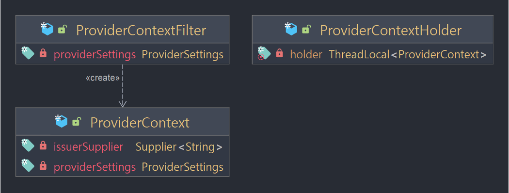
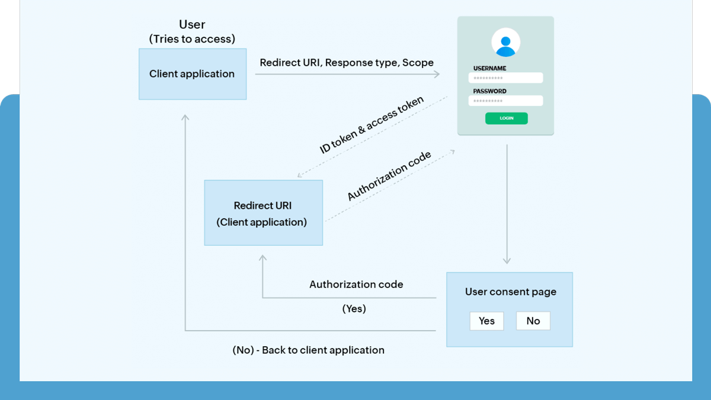

# Introduction

> 공급자에 대한 정보를 저장한다. <br/>
> 공급자 설정 및 현재 Issuer 에 대한 접근을 할 수 있다.
{: .prompt-info }

`AuthorizationServerContextHolder`, `AuthorizationServerContextFilter` 를 사용한다. 




## 설정

최소한의 코드로 동작 원리를 알아본다. `.yml` 파일에서 ***포트는 9000*** 으로 지정했다.


> 전체 코드
{: .prompt-info }

```java
@Configuration(proxyBeanMethods = false)
public class AuthorizationServerConfig {

	@Bean
	@Order(Ordered.HIGHEST_PRECEDENCE)
	public SecurityFilterChain authorizationServerSecurityFilterChain(HttpSecurity http) throws Exception {
		OAuth2AuthorizationServerConfiguration.applyDefaultSecurity(http);
		return http.build();
	}

	@Bean
	public ProviderSettings providerSettings() {
		return ProviderSettings.builder().issuer("http://localhost:9000").build();
	}

	@Bean
	public RegisteredClientRepository registeredClientRepository() {
		RegisteredClient registeredClient = RegisteredClient.withId(UUID.randomUUID().toString())
				.clientId("oauth2-client-app")
				.clientSecret("{noop}secret")
				.clientAuthenticationMethod(ClientAuthenticationMethod.CLIENT_SECRET_BASIC)
				.clientAuthenticationMethod(ClientAuthenticationMethod.NONE)
				.authorizationGrantType(AuthorizationGrantType.AUTHORIZATION_CODE)
				.authorizationGrantType(AuthorizationGrantType.REFRESH_TOKEN)
				.authorizationGrantType(AuthorizationGrantType.CLIENT_CREDENTIALS)
				.redirectUri("http://127.0.0.1:8081/login/oauth2/code/oauth2-client-app")
				.redirectUri("http://127.0.0.1:8081")
				.scope(OidcScopes.OPENID)
				.scope("read")
				.scope("write")
				.clientSettings(ClientSettings.builder().requireAuthorizationConsent(true).build())
				.build();

		InMemoryRegisteredClientRepository registeredClientRepository = new InMemoryRegisteredClientRepository(registeredClient);
		return registeredClientRepository;
	}
}
```

`http://localhost:9000/.well-known/openid-configuration` 으로 접속해보면 다음과 같은 정보를 알 수 있다.



<!-- ```javscript
{
    "issuer": "http://localhost:9000",
    "authorization_endpoint": "http://localhost:9000/oauth2/authorize",
    "token_endpoint": "http://localhost:9000/oauth2/token",
    "token_endpoint_auth_methods_supported": [
        "client_secret_basic",
        "client_secret_post",
        "client_secret_jwt",
        "private_key_jwt"
    ],
    "jwks_uri": "http://localhost:9000/oauth2/jwks",
    "userinfo_endpoint": "http://localhost:9000/userinfo",
    "response_types_supported": [
        "code"
    ],
    "grant_types_supported": [
        "authorization_code",
        "client_credentials",
        "refresh_token"
    ],
    "revocation_endpoint": "http://localhost:9000/oauth2/revoke",
        "revocation_endpoint_auth_methods_supported": [
        "client_secret_basic",
        "client_secret_post",
        "client_secret_jwt",
        "private_key_jwt"
    ],
    "introspection_endpoint": "http://localhost:9000/oauth2/introspect",
        "introspection_endpoint_auth_methods_supported": [
        "client_secret_basic",
        "client_secret_post",
        "client_secret_jwt",
        "private_key_jwt"
    ],
    "subject_types_supported": [
        "public"
    ],
    "id_token_signing_alg_values_supported": [
        "RS256"
    ],
    "scopes_supported": [
        "openid"
    ]
}
``` -->

